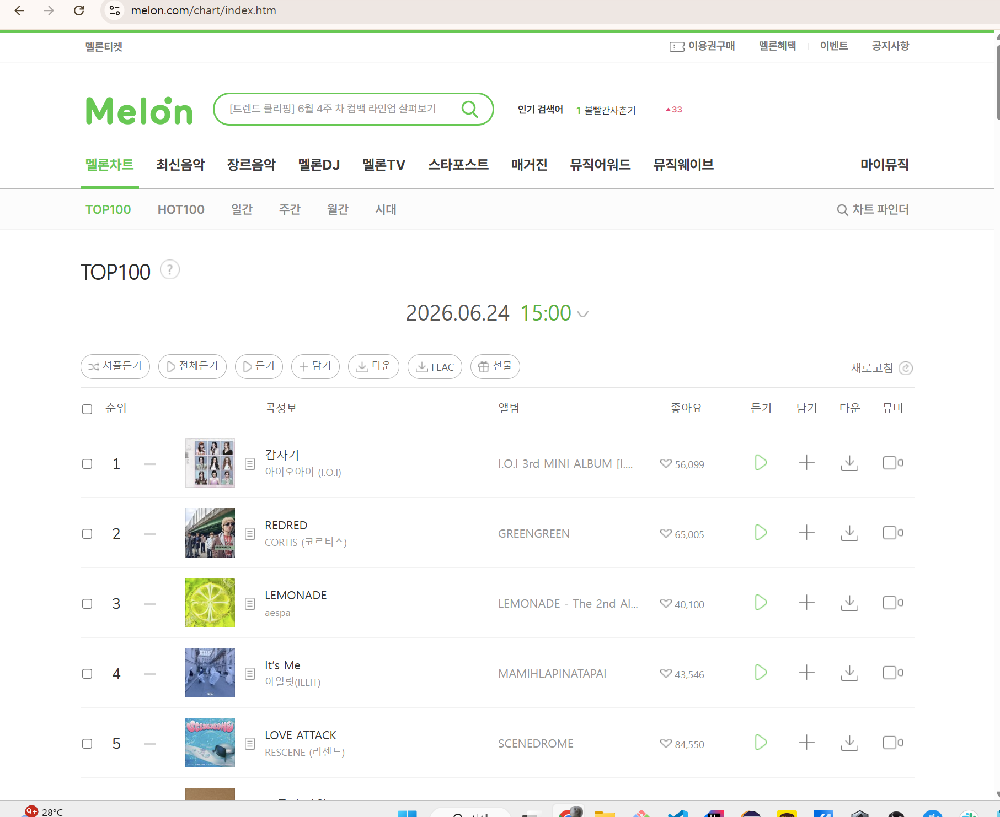

# 과제
[링크](https://www.melon.com/chart/index.htm)

멜론차트 100위 데이터를 DF로 받은 다음에 `csv`로 뽑기

# 페이지 html 분석

멜론 차트 

1. tbody 존재 `div.service_list_song.type02.d_song_list > table > tbody > tr`
2. 그 안에 있는 `tr`이 총 100개 있음

- `tr`안에는 12개의 `td`가 존재하는데 
  1. 체크박스
  2. 번호
  3. 기호(의미없어보임)
  4. 이미지
  5. 자세히보기 버튼
  6. 제목`td > div.ellipsis.rank01 > span > a`의 텍스트/작곡가(같은거) `td > div.ellipsis.rank02 > span > a`의 텍스트
  7. 앨범명
  8. 좋아요 수
  9. 듣기
  10. 담기
  11. 다운
  12. 뮤비