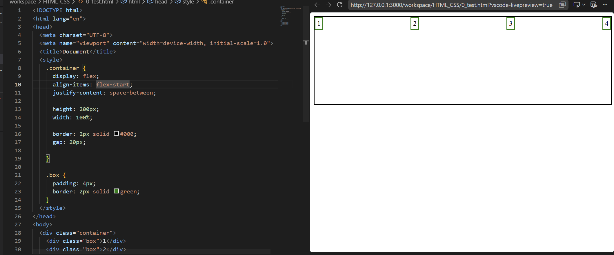

# CSS 정리
> 이번에는 `CSS`에 대해서 사용방법을 정리할 목적으로 정리를 하였습니다.

## flex와 grid
`flex`와 `grid`는 화면의 레이아웃을 결정하는 속성이며, 부모 컨테이너에서 레이아웃의 형태를 정렬하게 됩니다.

### flex
`flex`는 한 방향으로 요소들을 정렬하기 위해 사용됩니다. 부모 컨테이너에 `display: flex;` 속성을 부여하면 기본적으로 가로 정렬이 되며 `flex-direction: column;`을 통해 세로로 방향을 조절할 수 있습니다.

주요 보조 속성으로는
- `gap`: 자식간의 간격 조절
- `justify-content`: 주축 방향 정렬로 예를 들어 가로 `flex`에 `center`을 주게 된다면 아이템들이 중앙에 정렬되게 됩니다.
- `align-items`: 교차축 방향 정렬로 `flex-start`속성을 준다면 가로 방향 정렬 시 위쪽으로 요소가 붙게 됩니다.
- `flex-wrap`: `wrap`를 통해 한줄에 넣지 못하는 요소를 다음줄로 넘깁니다.
- 자식의 `flex`: 비율을 통해 남는 공간을 비율별로 나눠갖게 할 수 있습니다.



### grid
`grid`는 핀터레스트의 갤러리 모습과 유사하게 레이아웃을 짤 수 있습니다. 또한 열과 행들의 비율을 자유롭게 조절 가능합니다.

- `grid-template-columns`: `1번째열 길이`, `2번째열 길이`, `3번째열 길이`... 과 같이 순서대로 나열하여 열의 길이들을 조정 가능합니다. `[숫자]fr`을 통해 프레임크기만큼 너비를 줄 수 있습니다. `fr`은 남은 공간을 비율로 나누는 것을 뜻합니다.
- `grid-template-rows`: 위와 동일하게 행별 크기 비율을 설정해줄 수 있습니다.

> 추가로 `repeat(반복, 크기)` 또는 `repeat(auto-fit, minmax(200px, 1fr))`을 통해 반응형으로 제작이 가능합니다.

영역 지정의 경우에는 `grid-template-areas`에 표 형태로 값을 넣어주면 설정 가능합니다.

```css
.container {
  display: grid;
  grid-template-columns: 200px 1fr;
  grid-template-rows: 80px 1fr 80px;
  grid-template-areas:
    "header header"
    "sidebar main"
    "footer footer";
  gap: 16px;
}

.header {
  grid-area: header;
}

.sidebar {
  grid-area: sidebar;
}

.main {
  grid-area: main;
}

.footer {
  grid-area: footer;
}
```

## @media
`@media`는 화면 크기, 기기 종류, 방향 등에 따라 `CSS`를 다르게 적용할 수 있게 해주는 문법입니다. 기본적으로 
```css
@media (태블릿 조건) {
  /* 조건 충족시 적용될 css */
}

@media (데스크탑 조건) or (핸드폰 조건) {
  /* 조건 충족시 적용될 css */
}

/* ... */
```
방식으로 사용합니다.

조건에는 `max-width`, `min-width`, `max-height`, `min-height` 등을 주로 사용하며 조건은 `and`, `or`을 통해 정확한 조건을 부여할 수 있습니다.

`orientation`의 `portrait`와 `landscape`를 통해 세로/가로를 설정할 수 있습니다.

### 반응형으로 만들기 위한 방법들
화면에 따라 크기를 자유자재로 고려하기 위해서는 위에서 언급한 `@media`와 `auto-fit`, `fr` 외에도 몇가지 방안들디 존재합니다. 대표적으로 단위중 하나인 `%`, 직접 설정 가능한 `rem` 단위, 화면 크기 기준의 `vw`, `vh` 등과 변수를 조합하여 사용이 가능합니다.

함수의 경우에는 `clamp(최소값, 기본 값, 최댓값)`, `calc(계산식)`, `minmax()`, `aspect-raito: 가로 / 세로` 등을 이용할 수 있습니다.

## transform과 transition
`transform`은 요소의 애니메이션(속성의 변경)을 만들어주는 속성이고, `transition`은 그 변화 과정을 부드럽게 만들어주는 속성입니다. 예시를 보여드리면 아래와 같습니다.

```css
.box {
  transition: transform 0.3s ease;
}

.box:hover {
  transform: scale(1.1);
}
```

`transition`의 값은 `속성 시간 변화방식 지연시간`을 순서대로 줄 수 있습니다. `속성` 위치에는 `all`을 통해 일괄 지정 또한 가능합니다.

`transform`은 요소를 변형해주며, 속성 값들로는 이동시켜주는 `translateX`와 `translateY`가 있고, 크기를 변경시키는 `scaleX`, `scaleY` (모두 `translate`, `scale` 그대로 사용 가능합니다.), `rotate`, `skew` 등을 사용할 수 있습니다.

또한 `transform-origin`을 통해 변형 기준점을 설정할 수 있습니다.