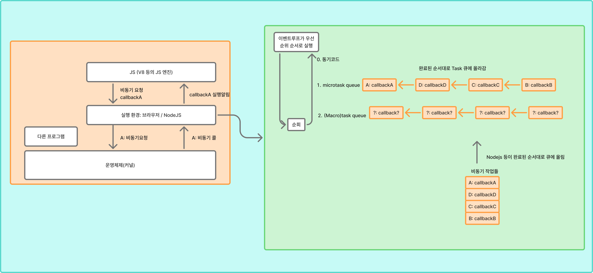

# Promise와 비동기
> 자바스크립트는 클라이언트단의 여러 로직 또는 인터렉트를 관리하기 위해 만들어진 언어입니다. 특히 서버에 대한 요청 및 대기를 오래 해야하기 때문에 비동기 작업을 많이 사용하게 되었습니다. 이에 따라 함수형 프로그래밍, `Promise`, `await`, `async`와 같은 비동기를 위한 기능들이 존재합니다.

## JavaScript의 실행 환경
`JavaScript`는 JS 엔진 (V8 등) 위에서 돌아갑니다. 이는 브라우저 또는 `Node.js` 위에서 돌아가게 되며 여기에서 발생하는 네트워크 또는 시스템 콜 등을 운영체제의 커널 등에 요청하게 됩니다.

JS는 보통 메인 스레드 하나에서 실행되며 비동기 작업은 JS 엔진 밖의 실행 환경에 맡기는 방식을 사용하게 됩니다.

가장 간단한 비동기 작업 예시는 다음과 같습니다.

```javascript
console.log("A");

setTimeout(() => {
  console.log("B");
}, 1000);

console.log("C");
```
여기에서 `setTimeout`는 지정된 시간(`1000ms`) 뒤에 등록한 함수를 실행하는 비동기 함수입니다. 여기에서 등록할 함수는 실행 환경에 등록되게 되고 `1000ms`뒤에 실행 환경이 콜백을 큐에 넣어 이벤트 루프가 콜백을 실행하는 형태가 됩니다.

다른 작업 또한 비동기 종류가 다를 수 있어도 비슷한 실행 방식으로 동작하게 됩니다.

#### 비동기 실행 방식 예시


## Promise 객체
`Promise` 객체는 나중에 결과를 알려주겠다는 의미를 나타내는 객체입니다. 상태는 `Pending`, `Fulfilled`, `Rejected`가 존재하며 각각 대기, 완료, 실패를 의미합니다.

`Promise`는 개발자가 직접 만들 수 있으며 함수 사용 시 반환하는 경우도 굉장히 많습니다. (대표적으로 `fetch()`, `axios` 등이 있습니다.)

`Promise`의 경우에는 아래와 같이 사용이 가능합니다.

```javascript
function func10() {
  async function f() {

    const pro = new Promise((resolve, reject) => {
      let success = true;

      if(success) {
        resolve(() => {
          console.log("hello"); 
          return "result";
        })
      }
      else {
        reject(() => {
          console.log("go away"); 
          return "bye";
        })
      }
    })
  
    const result = await pro
    console.log("---------")
    console.log(result())
  }

  f()
}

func10();
```

## async와 await
`async`는 언제 끝날지 예측할 수 없는 비동기 작업이 들어있는 함수를 만들 때 사용하는 키워드입니다. 일반적으로 `async function 함수명() {}` 형태로 사용하게 됩니다. `async`가 붙은 함수의 반환값은 반드시 `Promise` 객체가 됩니다.

`async`의 다른 특징은 내부에서 `await` 키워드를 사용할 수 있다는 점입니다. `await (비동기 작업)`는 비동기 작업이 끝날 때까지 기다려라 라는 의미입니다. 예를 들어 아래와 같은 코드가 있습니다.

```javascript
function func11() {

  function waitfunc() {
    return new Promise((resolve) => {
      setTimeout(() => {
        resolve("1초 경과");
      }, 1000 ); // 1초 뒤 반환
    })
  }

  async function canWait() {
    const result = waitfunc();

    console.log(`await 전: ${result}`);
    console.log(`await 후: ${await result}`);

  }
  canWait()
}

func11()
```

위와 같이 특정 작업을 기다려야 할 때 사용 가능합니다. 또한 여러 작업을 동시에 실행할 때는 `[a, b, c, ...] = await Promise.all([a_async(), b_async(), c_async(), ...])` 와 같이 사용 가능합니다. 구체적인 코드는 아래와 같습니다.

```javascript
// 여러 비동기 함수 동시에 돌리기
async function func8() {
  function delay(ms) {
    return new Promise((resolve) => {
      setTimeout(resolve, ms);
    })
  }

  async function countingFunc(name, term) {
    let c = 5;
    while(c >= 1) {
      console.log(`${name}: ${c}`);
      c--;

      await delay(term);
    }

    return `${name} end`;
  }


  console.log(" --- 개별 시작 및 처리 --- ");
  let r1 = countingFunc("first", 800);
  let r2 = countingFunc("second", 1000);
  let r3 = countingFunc("third", 500);

  // console.log(await r1);

  setTimeout(async () => {
    console.log("---------")
    console.log(await r1);
    console.log(await r2);
    console.log(await r3);
    // console.log(r3.then((result) => console.log(result)));
    // console.log(r1.then((result) => console.log(result)));
    // console.log(r2.then((result) => console.log(result)));

    console.log(" --- 병렬 시작 및 처리 --- ");

    const [a, b, c] = await Promise.all([
      countingFunc("first", 800),
      countingFunc("second", 1000),
      countingFunc("third", 500)
    ])

    console.log(a)
    console.log(b)
    console.log(c)
  }, 9000);
}

// func8()
```
