# 힙

## 힙의 규칙
힙은 2가지 규칙이 존재하는 트리 형태의 자료구조입니다.
- 완전이진트리: 위에서 아래로, 왼쪽에서 오른쪽으로 빈칸 없이 채워져가는 트리
- 부모 자식 간 크기 관계가 동일한 규칙: 최대 힙의 경우에는 부모가 항상 자식보다 커야하며 최소힙의 경우에는 항상 그 반대의 조건을 유지해야합니다.

최소힙을 예로 들면

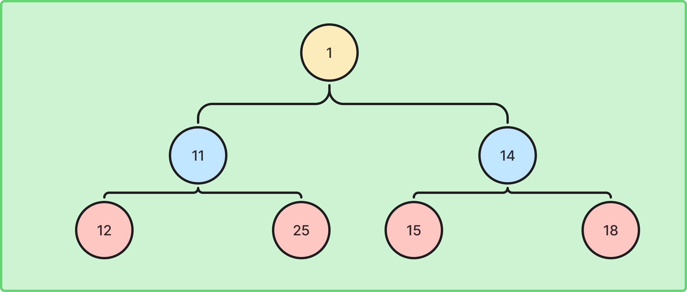

위와같은 모습의 트리가 규칙을 완성한다고 볼 수 있습니다. 여기에서 10, 15 순서대로 값이 사라지면 완전이진 트리를 유지한다고 볼 수 있지만 `12`와 같은 노드가 먼저 제거되는 경우에는 완전이진 트리 규칙이 깨졌다고 볼 수 있습니다.

## 힙의 삽입과 삭제
힙은 언제나 위 규칙을 지키며 값을 삽입 또는 삭제해야합니다.

### 삽입
이때, 항상 값을 넣을 때 마다 모든 값을 순서대로 정렬하여 넣는것은 비효율적이기 때문에 힙은 특정한 규칙을 통해 언제나 부모/자식간의 크기 규칙을 지키게 됩니다.

앞서 보여드렸던 최소힙 예시에서 `0`을 넣는 경우를 보여드리면, 가장 먼저 맨 아래의 왼쪽에 값을 추가하게 됩니다.

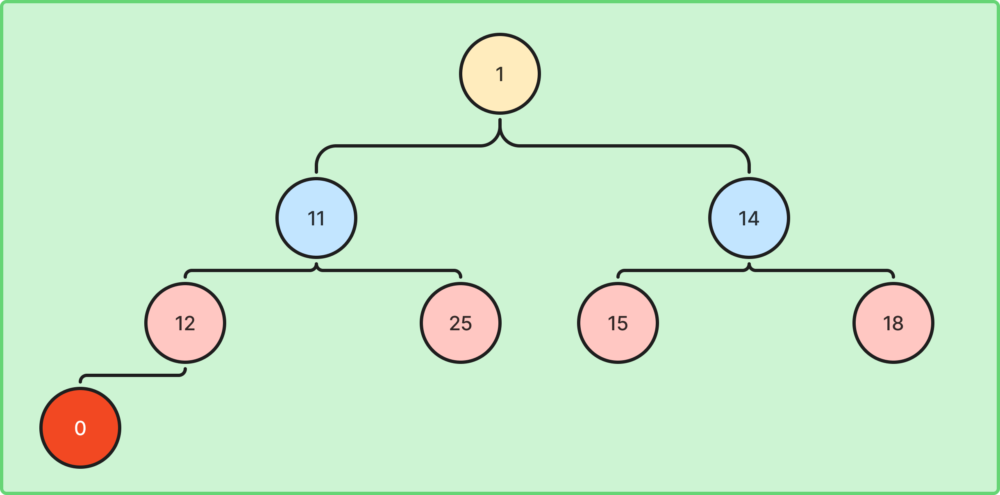

이후에 지속적으로 자신의 부모와 값을 비교하며 올라가는, **상향식 정렬**방식을 통해 자신의 자리를 찾아가게 됩니다.

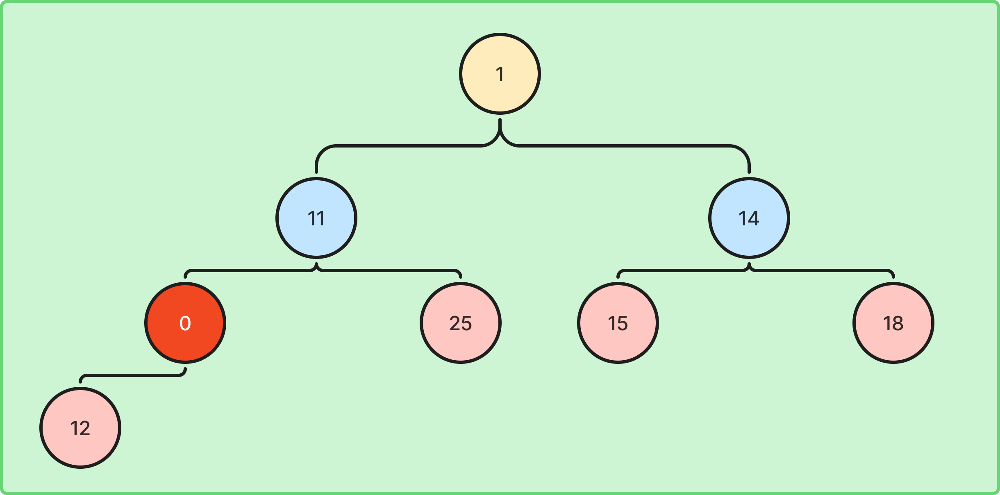

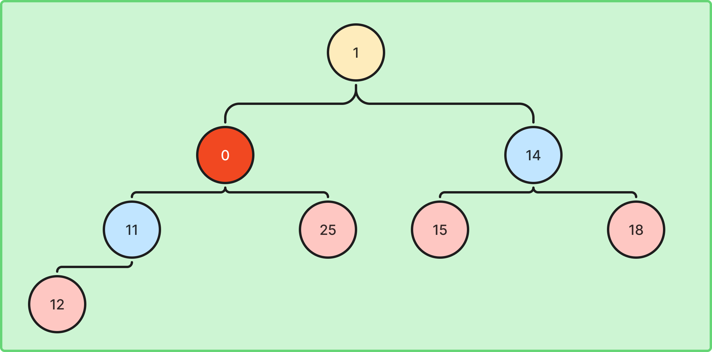

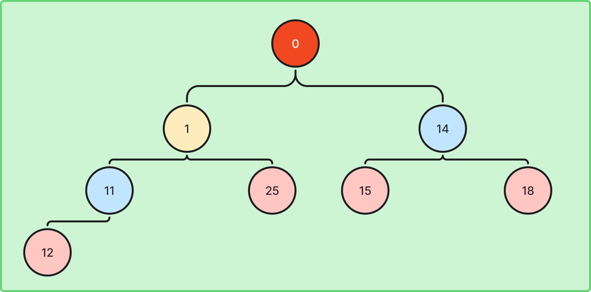

### 삭제

삭제의 경우에는 최댓값 또는 최솟값에 가장 빨리 접근하기 위한 힙의 특성상 루트를 삭제하는 경우가 제일 많기 때문에 루트를 기준으로 예시를 들어보겠습니다. 이 경우에는 맨 마지막 값을 루트로 올리게 됩니다. 그림으로 보면 아래와 같습니다.

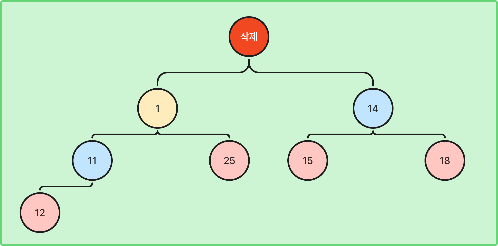

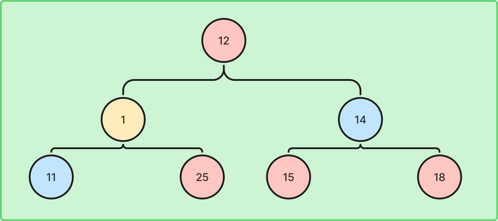

이후 자식과의 비교를 통해 자신의 자리를 찾을 때까지 아래로 내려가게 됩니다. 이를 **하양식 정렬**이라고 부릅니다.

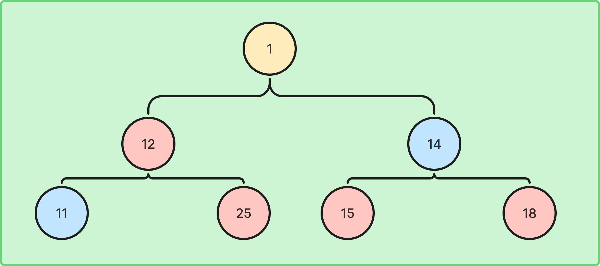

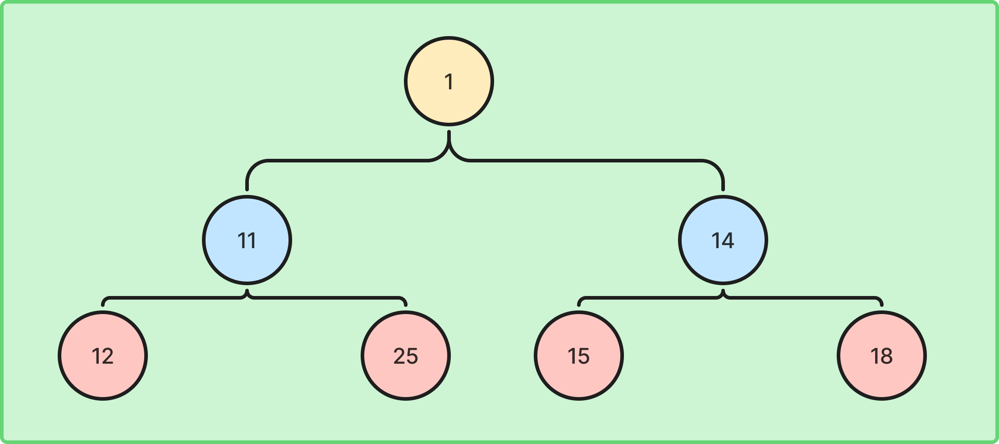

이는 루트가 아닌 경우의 삭제에도 동일하게 적용될 수 있습니다.

### 결론
힙은 삽입/삭제 시 빠르게 리프부터 루트까지 돌면서 규칙을 맞추기 때문에 `O(log n)`이라는 효율적인 속도로 자원을 관리할 수 있습니다.

## 배열로써의 힙과 일반 배열을 힙으로 고치는 방법
### 힙을 배열로 나타내기
우선 일반 랜덤 배열을 힙으로 고치기 전, 힙을 관리하는 일반적으로 효율적인 방식에 대해 소개해보겠습니다.

기본적으로 트리의 경우에는 `자신의 값`, `자식노드 2개`를 가진 노드(객체)들로 이루어져 있으며 이는 객체를 저장할 메모리를 요구하는 방식입니다. 하지만 힙의 경우에는 루트부터 `1`, `2`, `4`, ... 와 같은 레벨별로 `2^[level]`의 노드를 가지며 이는 하나의 배열로써 나타낼 수 있습니다.

일반적으로 하나의 배열에서 `n`레벨의 값들을 왼쪽부터 배열의 `arr[(2^n-1):(2^(n+1))-1]`구간에 순서대로 존재하게 됩니다. 또한 `k`인덱스의 자식노드들의 위치를 보고싶다면 `k*2+1, k*2+2`의 위치를 보면 됩니다.

따라서 아래의 배열은 `[1, 11, 14, 12, 25, 15, 18]`을 통해 나타낼 수 있습니다.

### 랜덤 배열을 힙으로 나타내기
이때 정렬되어있지 않은 배열을 힙의 형태를 만들기 위해선 앞서 설명드린 원리를 통해 레벨별 크기 차이만 맞춰주면 되게 됩니다.

이때 그냥 정렬을 하면 해결될 수 있지만 정렬에 걸리는 가장 빠른 시간은 병합정렬의 `O(n log n)`이지만 이보다 더 빠른 정렬을 할 수 있습니다. (같은 레벨간의 크기는 무시해도 되기 때문입니다.)

예를 들어 `[20, 1, 15, 11, 25, 10, 12]`를 최소정렬 해보겠습니다. 목표는 레벨당 `[1]`, `[10, 11]`, `[12, 15, 20, 25]`의 묶음으로 나타내는 것입니다.

`Heapify`의 원리는 마지막 부모 노드들(`마지막 레벨 - 1`)부터 정렬을 해나가는 것입니다.

최초의 트리의 모습이 다음과 같다고 보겠습니다.

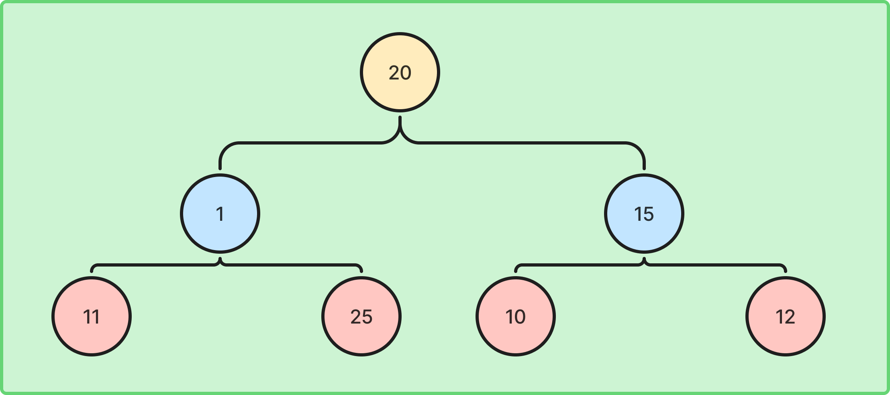

여기에서 먼저 값을 확인할 노드는 `(7 - 2) // 2`위치인 `2`의 인덱스에 존재하는 `15`입니다. `15`에서는 자신의 자식들인 `10`, `12`와 비교를 하여 더 작은 값이 있으면 그 값을 자신의 위치와 바꾸게 됩니다.

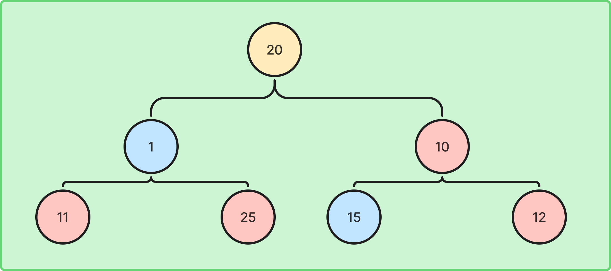

이후에 `1`에서도 동일한 방식으로 진행을 하며, 한 레벨의 작업이 끝나면 그 위 레벨 (`-1 레벨`)에서 동일한 작업을 진행하게 됩니다. 이는 상향식 정렬과 매우 유사합니다.

이를 통해 결과적으로 배열의 모습은 다음과 같아집니다.

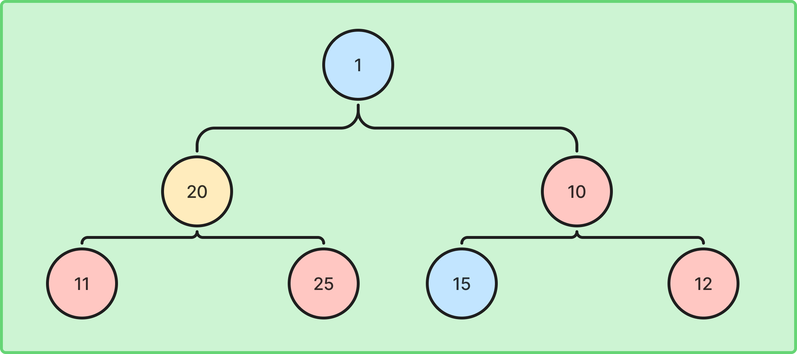

여기에서는 `20`이 `1`과 교환된 후, 자신보다 더 작은 값이 존재하기 때문에 교환이 한번 더 일어나게 됩니다. 이는 하양식 정렬과 유사합니다.

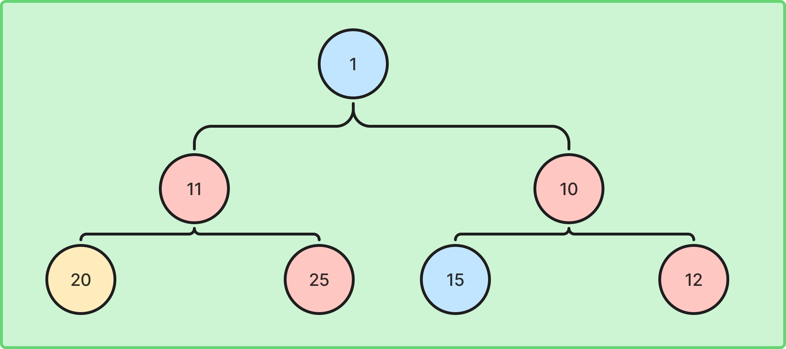

해당 방식의 정렬에 걸리는 시간복잡도는 `O(n)`으로 레벨이 높아짐에 따라 최종적으로 내려가야할 필요가 없어지기 때문입니다.