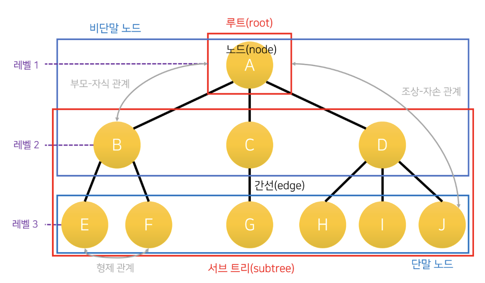

# 트리
트리는 부모/자식 관계를 가지는 노드들로 이루어진 계층적 자료구조입니다. 각 노드는 0개 이상의 자식 노드를 가질 수 있습니다.

## 트리의 기본 용어 
트리는 간선과 노드로 이루어지며 추가적으로 기본적인 용어들을 알아야 합니다.
- 노드: 각 데이터를 가진 객체들
- 부모: 상위 노드
- 자식: 부모로부터 내려오는 노드
- 루트: 최상위 부모 노드
- 간선: 노드와 노드를 잇는 선
- 깊이: 루트로부터 떨어진 간선의 개수
- 차수: 특정 노드에 연결된 자식 노드의 개수
- 트리 차수: 트리 내부에 있는 노드의 최대 차수
- 서브트리: 트리 안에 존재하는 일부 트리

> 모든 트리는 위와 같은 트리의 발전된 형태로 존재합니다.

# 트리의 종류
트리에는 여러 종류가 존재합니다. 일단 간단히 알아보면
- `이진 탐색 트리`: `왼쪽 자식` < `부모` < `오른쪽 자식` 순서로 정렬된 상태로 존재하는 트리입니다. 삽입/탐색/삭제의 기본 구조입니다.
- `AVL 트리`: 높이 균형을 엄격하게 맞추며 탐색이 빠른 트리입니다. 모든 작업에 `O(log n)`의 시간 복잡도를 가집니다. 하지만 균형 유지를 위한 **회전 연산**이 필요하기 때문에 조회 빈도가 압도적으로 높은 시스템에 유리합니다. 

- `레드 블랙 트리`: AVL 트리에 비해 높이 균형이 조금 느슨하게 맞춰집니다. 자바의 TreeMap에 쓰이며, 삽입/삭제 성능이 안정적입니다. 루트의 블랙 노드를 기반으로 연속된 레드 노드가 존재할 수 없다는 규칙과, 임의의 노드에서 리프 노드까지 가는 모든 경로의 블랙 노드 개수가 동일해야 한다는 독특한 특징을 가집니다. AVL 트리에 비해 상대적으로 조회가 느리되 삽입/삭제가 빠릅니다.
- `Splay Tree`: 최근 접근한 노드를 루트 근처로 올리는 트리입니다.
- `Heap`: 완전 이진 트리 기반의 트리로, 마지막 레벨은 왼쪽부터 차례대로 노드가 채워지는 규칙을 가집니다. 레벨간의 크기 차이가 단방향으로 커지거나 작아집니다. 최댓값/최솟값 조회에 `O(1)`의 성능을 가집니다.
- `Treap`: BST + Heap 성질을 섞은 트리입니다.
- `B-Tree`: 하나의 노드에 여러 키를 저장하여 디스크 접근을 줄일 수 있게 해줍니다. DB 인덱스에 쓰입니다.
- `B+Tree`: 실제 데이터를 리프 노드에 몰아두어 범위 검색에 성능을 강화한 버전입니다. DB 인덱스에서 특히 더 중요합니다.

> 아래에는 개인적으로 알지만 구체적으로 몰랐던 트리에 대한 탐구를 정리하였습니다.

## AVL 트리
AVL 트리는 기본적으로 이진 탐색 트리입니다. `왼쪽 서브트리 값` < `현재 노드 값` < `오른쪽 서브트리 값`의 형태를 유지합니다. 여기에 AVL은 왼쪽 서브트리의 높이와 오른쪽 서브트리의 높이를 함께 봅니다. 

이를 **균형 인수**라 부르는데 `균형 인수 = 왼쪽 서브트리 높이 - 오른쪽 서브트리 높이` 형태로 계산하여 `-1` ~ `1`의 범위 안에 존재해야 합니다.

이를 **균형이 맞춰진 트리**라고 부릅니다. (완전 균형 트리)

이 덕분에 `AVL`은 트리 높이가 낮아져 탐색이 빠르게 됩니다.

### AVL 회전
AVL이 균형을 유지하는 원리는 **회전**에 존재합니다.

예를 들어 왼쪽 아래로 향하는 `[[10, [20],null], [30], [null, [null], null]` 형태의 트리가 존재한다면 이를 오른쪽으로 회전시켜 `[[null, [10],null], [30], [null, [20], null]` 형태로 회전시키며 (`LL` 케이스)

`[[null, [null],null], [10], [null, [20], 30]`의 경우에는 왼쪽으로 회전하여 `[null, [[null, [null],null], [10], [null, [20], 30]`으로 만들어 줍니다. (`RR` 케이스)

반대로, `[[null, [10],20], [30], [null, [null], null]`의 경우에는 왼쪽으로 회전하여 `[[null, [10],null], [20], [null, [30], null]`으로 만들어 줍니다. (`LR` 케이스)

`[[null, [null],null], [10], [20, [30], null]`의 경우에는 왼쪽으로 회전하여 `[[null, [10],null], [20], [null, [30], null]`으로 만들어 줍니다. (`RL` 케이스)

> 위 방식의 반복을 통해 언제나 균형을 유지하게 됩니다. 이는 규모가 커져도 결국 3개의 노드를 뽑아 다시 정렬하는 방식으로 이루어지기 때문에 항상 같은 원리로 정렬을 시킬 수 있습니다. (왼쪽은 작고, 오른쪽은 크다는 원리를 응용하는 것입니다.)

## 레드 블랙 트리
레드 블랙 트리는 회전과 색상 규칙은 존재하지만 AVL처럼 균형 인수는 존재하지 않습니다.

레드 블랙 트리의 특징은 모든 노드가 블랙 또는 레드의 색깔을 가진다는 점입니다.

루트 노드는 반드시 블랙이어야 하며, 레드가 연속으로 나오면 안 됩니다. 모든 리프 노드의 존재하지 않는 두 자식은 `NIL`이라고 표현되며 개념상 Black으로 보게 됩니다.

최종적으로 **어떤 노드에서 리프까지 가는 모든 경로의 Black 개수가 같아야 합니다.**

이를 통해 트리가 한쪽으로 너무 길어지는 것을 막습니다.

> AVL은 항상 균형을 맞춘다 하면 레드 블랙 트리는 사전에 어느 정도 규제하는 방식에 가깝습니다.

레드/블랙 트리에도 회전을 통해 Red 연속, Black 개수 불일치를 해결합니다.

기본적으로 노드의 삽입은 **Red**로 넣고, 규칙 위반이 존재하면 색을 변경하거나 회전하며 마지막 루트를 Black로 고정하게 됩니다.

순서는 
1. 위치 찾아서 Red로 삽입
2. 부모가 Black이면 끝
3. 부모가 Red면 [부모, 삼촌, 조부모] 확인
    1. 부모, 삼촌이 Red -> 상위 레벨 색 변경
    2. 부모 Red, 삼촌 Black -> black 개수가 깨지거나 Red-Red가 남을 수 있어서 회전 + 색 변경
을 통해 항상 노드 ~ NIL까지의 Black 개수와 Red-Black 규칙을 만족시킵니다.

## 힙 트리
힙은 최댓값 또는 최솟값을 빠르게 꺼내기 위한 완전 이진 트리입니다.

항상 순서는

0. 1
1. 2, 3
2. 4, 5, 6, 7
3. 8, 9, 10, 11, 12, 13, 14, 15

순으로 늘어나게 됩니다. 오름차순/내림차순 모두 가능합니다. 하지만 `왼쪽` < `부모` < `오른쪽`은 만족하지 않을 수 있습니다.

이때, 힙은 전체 트리가 정렬되는 것이 아니라 부모와 자식 사이에서만 크기 관계를 만족합니다. 따라서 같은 계층의 노드들 사이에는 정렬 순서가 보장되지 않습니다.

### 삽입
1. 크기에 상관없이 먼저 다음 빈칸에 값을 넣습니다.
2. 부모와 비교해서 위로 올리게 됩니다.
### 삭제
힙에서는 보통 루트 삭제를 합니다.
1. 루트 제거
2. 마지막 노드를 루트로 올리기
3. 자식 중 더 큰 값과 바꾸기 (최대 힙 기준)

> 힙은 우선순위 큐 (작업 우선순위 처리)를 위해 자주 사용되는 자료구조이기 때문에 가장 큰 값, 가장 작은 값을 계속 꺼내야 하는 상황에 강합니다.

## B+Tree
`B+Tree`는 대량의 데이터를 범위까지 포함해서 빠르게 탐색하기 위한 다진 탐색 트리입니다.

(저는 [B+Tree를 설명하는 영상](https://www.youtube.com/watch?v=K1a2Bk8NrYQ&pp=ygUGYit0cmVl)에서 도움을 많이 받았습니다.)

이는 한 노드에 여러 개의 키와 여러 개의 자식이 존재하는 트리입니다.

`B+Tree`의 경우에는 대부분 진짜 사용하는 데이터는 리프 노드에만 존재하며, 이외의 노드는 탐색을 위한 경로로서 쓰입니다.

하나의 노드는 최대 `m`개의 자식을 가질 수 있다고 한다면, 한 노드가 최대 `m-1`개의 키를 가지고 있습니다.

예를 들면, 노드에 키가 `[30, 60]`이 존재한다면 자식이 `[0~29값이 존재하는 노드] [30~59값이 존재하는 노드] [60~?? 값이 존재하는 노드]`와 같은 형식이 됩니다.

위의 예시가 3차 `B+Tree`의 예시가 됩니다.

`B+Tree`는 인덱싱을 위해 자주 사용되는 만큼, 항상 정렬된 상태로 데이터가 유지됩니다.

### 삽입과 정렬
`B+Tree`는 항상 삽입과 동시에 정렬됩니다. 위의 유튜브 영상이 잘 설명해주지만, 값이 들어가면서 정렬을 시도하고, 만약 정렬하는 도중 자리가 부족하면 키를 나누어서 노드를 하나 더 추가하게 됩니다. 예를 들어서

B+Tree에서 키가 3개라 한다면 모든 노드의 최대 개수는 3개이고, [10, 20, 30]의 자식은 최대 4개이고, [1,2,3], [11,12,13], [21,22,23], [31, 32, 33]이 포화상태라고 할 수 있습니다.

이때, 14가 추가로 들어온다면 임시로 `[11, 12, 13, 14]` 형태로 저장이 되며, 이는 곧 `[11, 12]` `[13, 14]`로 나뉘게 됩니다. 이후 분할된 노드의 첫 값인 `13`이 부모로 올라가며 부모는 `[10, 13, 20, 30]`의 형태가 되고, 이는 `[10, 13, [20], 30]`과 같은 형태로 높이 2의 트리로 나뉘게 됩니다. 그리고 각각 `[10, 13]`의 자식은 `[1,2,3], [11,12] [13, 14]`가 되며, `[13]`의 자식은 ` [21,22,23], [31, 32, 33]`을 그대로 가져가게 됩니다.

이런 형태로 높이를 최대한 유지하면서 가로로 늘어나는 특징이 있습니다.
