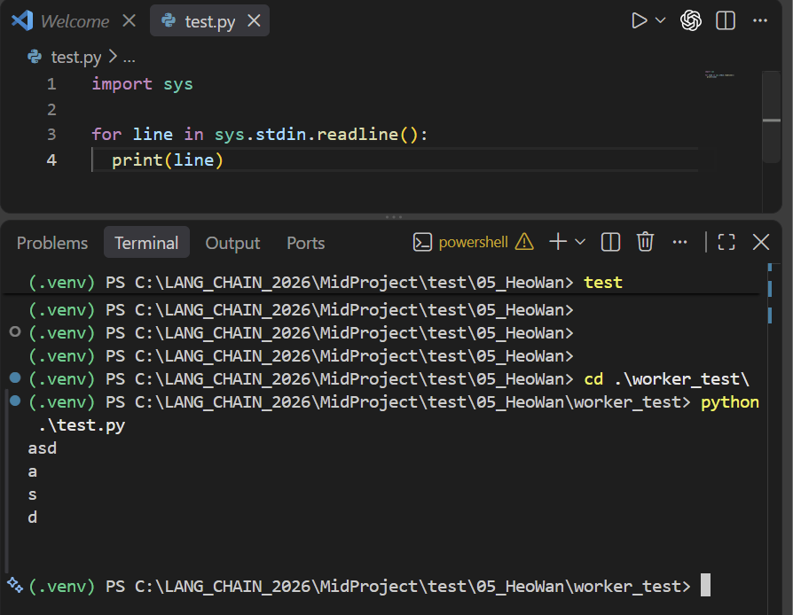
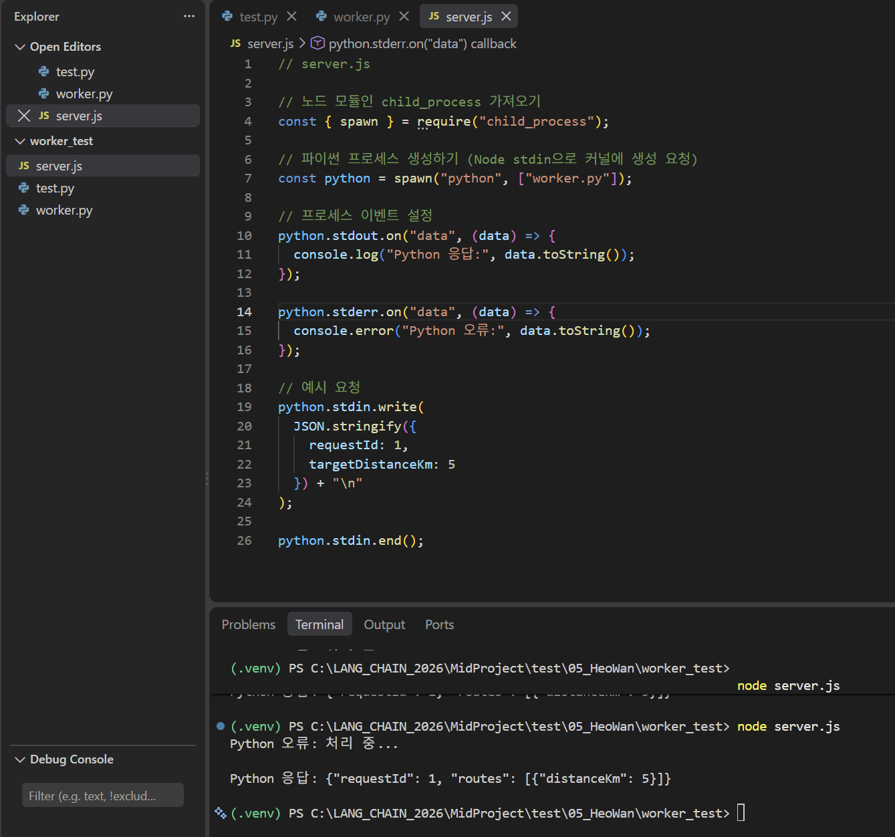
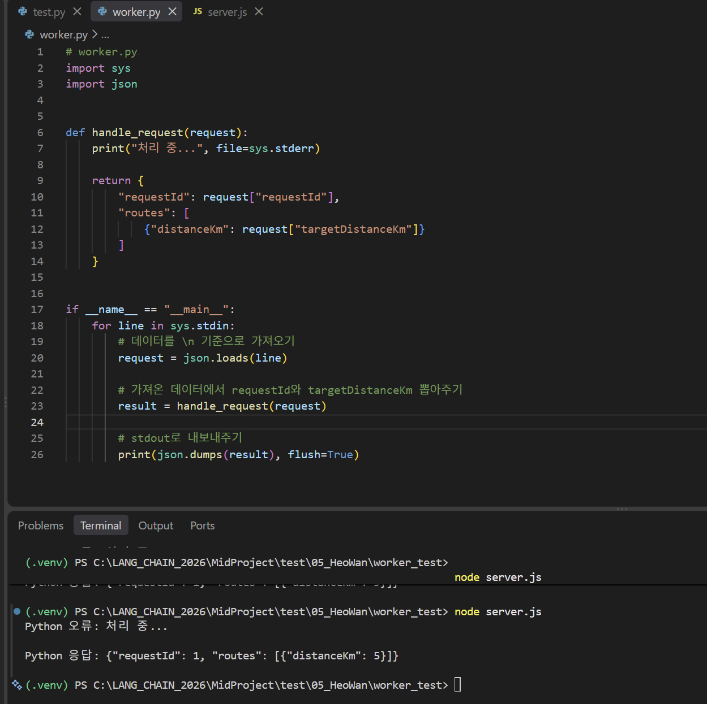

# [Computer Science] 자신 프로세스와 프로세스간 통신
> 이전 [프로세스에 대한 정리글](https://hurwan.tistory.com/117)에서 이어지는 내용입니다.

전체적으로 `프로세스객체의 구조`, `메모리 관리` 등을 다루었었으며 계속 이어서 가겠습니다.

## 자식 프로세스
리눅스를 바탕으로 설명하면 보통 프로세스를 복사할 때 과정은 다음과 같습니다.
1. A 프로세스에서 `fork()` 명령을 통해 자신의 프로세스 아래에 동일한 프로세스 복사
2. 만들어진 A의 자식 프로세스인 B 프로세스가 생성 (이대 현대 OS는 보통 부모 프로세스와 동일한 프레임을 `ReadOnly`로 바라보다 필요할 때 자신의 메모리를 생성합니다. 이를 COW, `Copy-on-Write`라고 부릅니다.)
3. 이후에 B 프로세스의 `exec()`를 통해 실행중인 프로그램 이미지를 다른 프로그램으로 교체하게 됩니다.

만약 쉘에서 `python worker.py`를 실행하게 된다면 해당 쉘에 파이썬 코드의 실행창으로 변경되게 됩니다. 이는 사용자가 보고있는 Shell Process **하위 프로세스**(쉘 프로세스가 변경되는 것이 아님)에 파이썬 프로세스가 생성되는 것입니다.

*하지만 왜 Shell에 출력이 나오는 것인가?*라는 질문이 생길 수 있습니다.

이는 `fork()`를 하면 자식은 부모의 `fd_table` 상태를 이어받기 때문입니다.

따라섯 기존의 Shell Process의 상태가
- fd[0] = terminal[stdin]
- fd[1] = terminal[stdout]
- fd[2] = terminal[stderr]
- fd[3] = file

라면 파이썬 또한 같은 객체(주소)를 참조하는 형태가 되게 됩니다.

이렇게 파이썬 프로세스는 상속받은 fd를 사용하기만 해도 터미널에 연결된 파이프가 된다고 볼 수 있습니다.

또한 `exec()`를 한다고 프로세스에 존재하던 FD가 모두 사라지는 것은 아니며 기본적으로 열린 FD는 유지될 수 있습니다. (`close-on-exec`라는 플래그가 존재한다고 합니다.)

## Pipe
`pipe(fd)`를 호출하게 된다면 해당 `fd`의 내부에 기본적으로 `read end`와 `write end`라는 파이프가 생기게 됩니다.

이 파이프는 특정 프로세스에서 커널의 파이프 버퍼에 접근하기 위한 파일 디스크립터입니다.

두 fd는 각각 다른 역할을 하지만 같은 파일을 대상으로 작업을 하게 됩니다.

기본적으로 유닉스의 파이프는 하나의 파이프에서 단방향으로 데이터가 흐릅니다.

이때문에 두 프로세스가 양방향으로 통신하려면 보통 pipe 여러개가 필요하게 됩니다.

이 때문에 실제로 Node의 `spawn()`을 하게된다면 Node에서 파이썬으로 가는 파이프 하나 `fd 0`, 파이썬에서 Node로 가는 파이프 2개 (stdout, stderr)가 생기게 딥니다.

## Node와 Python 코드 테스트
> 다음과 같은 코드를 작성하였습니다.

Node가 Python stdin을 쓴다고 하면 다음과 같은 작업이 진행됩니다.
0. Node에서 `pythonProcess.stdin.write("hello\n")`
1. Node 사용자 공간 버퍼에 `write(fd, "hello\n")` 시스템 콜
3. 커널이 해당 `fd`가 가리키는 pipe 찾기
4. 커널의 파이프 버퍼에 byte를 저장
5. 잠들어있던 파이썬 프로세스를 깨우거나 이미 깨워져있는 상태라면 `\n`을 기준으로 읽어냄

이후 Python쪽에서 해당 데이터를 읽기 위해선
0. `for문`에서 `sys.stdin.__next__()`를 호출
1. `line = sys.stdin.readline()`을 통해 line 읽어오기
2. 이는 곧 내부적으로 `read(fd[0], buf, cound)` 형태
3. 커널에서 파이썬 프로세스의 `fd[0]`을 확인 후 파이프 버퍼에서 byte를 가져옵니다.
4. 파이썬 메모리로 복사하게 됩니다.

이때 파이프 버퍼가 비어있다면 blocking fd를 기준으로 프로세스를 `WAITING`/`SLEEP` 상태로 변경해두게 됩니다.

## wait queue
커널은 파이썬이 대기중이라는 상태를 파이프 구조체 안에 존재하는 `wait_queue` 정보를 기준으로 그것을 기다리는 프로세스들을 확인하게 됩니다.

이렇게 데이터가 들어오면 `wait_queue`를 확인하고, 기다리고 있는 프로세스를 깨워서 데이터를 반환해주게 됩니다.

반대로 파이프 버퍼가 모두 채워져있는 상황에는 쓰기를 시도하는 프로세스를 `SLEEP` 시킨 뒤 공간에 여유가 생길 때 다시 쓰기 프로세스를 깨워주게 됩니다.

> 파이프는 메시지를 단위로 관리하지 않고 단순하게 `byte stream`일 뿐이기 때문에 사용자가 직접 이를 구분할 수 있게 구현할 필요가 있습니다.