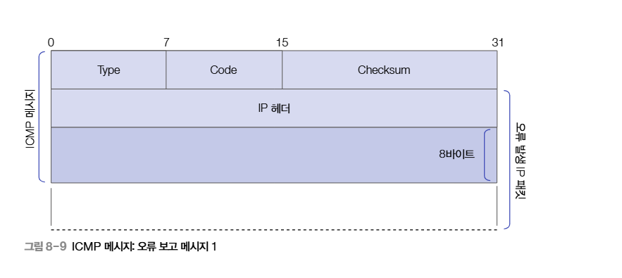
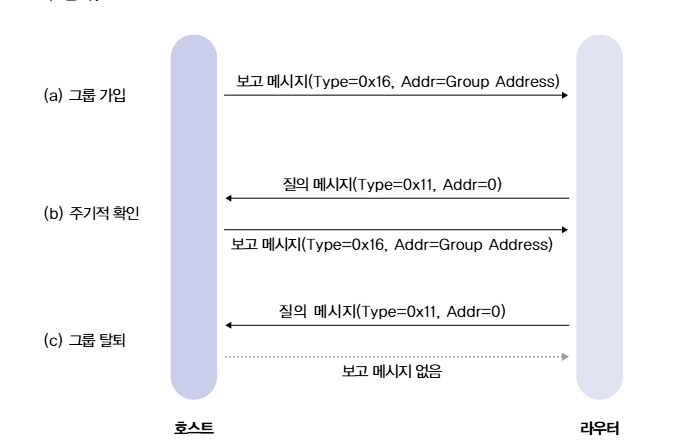

# IP 프로토콜과 제어
이번 글에서는 IPv4, IPv6, ICMP, IGMP의 데이터 구조와 프로토콜 방식에 대해서 정리를 해보려 합니다. (이전에 정리를 했었는데 기억이 흐려져서 다시 복습 삼아 작성합니다 ㅠㅠ)
## IPv4
IPv4의 헤더는 기본 20바이트부터 최대 60바이트의 크기를 가지게 됩니다.
| 순서 | 필드 | 비트 크기 | 설명 |
|:---|:---|:---|:---|
| 1 | Version | 4 | IP버전으로 IPv4일 경우에는 `4`의 값을 가집니다. |
| 2 | IHL | 4 | IPv4의 헤더 길이의 의미로 기본값은 `5`로, 곱하기 4를 하여 바이트 크기를 측정합니다. |
| 3 | DSCP | 6 | 패킷 우선순위로 서비스 품질 QoS와 관련되어 있습니다. | 
| 4 | ECN | 2 | 혼잡도 발생 시 이를 알리기 위해 존재하는 비트입니다 |
| 5 | Total Length | 16 | 헤더와 페이로드를 합한 크기입니다. |
| 6 | Identification | 16 | 패킷이 조각화 될 경우, 해당 패킷이 어디에서 왔는지 식별하기 위한 값입니다. |
| 7 | Flags | 3 | 조각화를 제어하기 위해 `Default`/`Don't Fragment`/`More Fragments` 플래그의 나열로 이루어져 있습니다. |
| 8 | Fragment Offset | 13 | 조각화된 데이터가 원래 패킷의 어느 위치인지 표시합니다. |
| 9 | TTL | 8 | 패킷 생존 기간입니다. | 
| 10 | Protocol | 8 | 상위 계층 프로토콜을 표시합니다. TCP가 6이고, UDP가 17, ICMP가 1입니다. |
| 11 | Header Checksum | 16 | IPv4 헤더 오류 검사용입니다. | 
| 12 | Source IP Address | 32 | 출발 주소 |
| 13 | Destination IP Address | 32 | 목적지 주소 |
| 14 | Options/Padding | 가변 | 여유 공간으로 추가적인 선택 필드 또는 채우기용 공간입니다. |

## IPv6
IPv6는 기본 40바이트로 고정값이며 필요 시 확장 헤더를 사용합니다.

| 순서 | 필드 | 비트 크기 | 설명 |
|:---|:---|:---|:---|
| 1 | Version | 4 | 버전을 나타내며 IPv6는 `6`을 나타냅니다. |
| 2 | Traffic Class | 8 | 패킷 우선순위, QoS 처리용, IPv4의 DSCP, ECN과 비슷한 역할을 합니다. |
| 3 | Flow Label | 20 | 같은 흐름의 패킷을 구분하기 위한 값으로, 실시간 스트리밍, 음성 등에서 흐름을 식별하기 위해 사용할 수 있습니다. |
| 4 | Payload Length | 16 | 기본 헤더를 제외한 데이터 길이를 나타냅니다. (확장 헤더 + 실제 페이로드) |
| 5 | Next Header | 8 | 다음에 오는 헤더를 나타냅니다. |
| 6 | Hop Limit | 8 | IPv4의 TTL과 같은 역할을 합니다. |
| 7 | Source Address | 128 | 출발지 주소 |
| 8 | Destination Address | 128 | 목적지 주소 |

> IPv6의 확장 헤더 종류에는 경로상의 모든 라우터가 확인하게 하는 `Hop-by-Hop Options Header`(0), 패킷이 거쳐갈 경로 정보를 지정하는 `Routing Header`(43), 조각화 처리를 하기 위한 `Fragment Header`(44), 인증/무결성을 제공하는 `AH: Authentication Header`(51), 암호화, 인증을 제공하는 `ESP: Encapsulating Security Payload`(50), 모바일 IPv6에서 이동성을 지원하는 `Mobility Header`(135) 등이 존재합니다.

## ICMP
ICMP는 IP 프로토콜 위에서 돌아가는 프로토콜로, `IP 패킷`의 페이로드 형태로 존재하게 됩니다.

IPv6에서는 `Next Header = 58`로 존재하고 IPv4에서는 `Protocol = 1`로 나타내어집니다.

ICMP의 모습은 다음과 같습니다.
| 순서 | 필드 | 비트 크기 | 설명 |
|:---|:---|:---|:---|
| 1 | Type | 8 | ICMP 메시지 종류 |
| 2 | Code | 8 | Type의 세부 이유 |
| 3 | Checksum | 16 | ICMP 메시지 오류 검사 |
| 4 | 나머지 | 가변 | 메시지 종류에 따라 달라집니다. 송신 시에는 비어서 가게 됩니다. | 

코드는 
| 번호 | 코드 | 뜻 |
|:---|:---|:---|
| 0 | Echo Reply | ping 응답 |
| 3 | Destination unreachable | 목적지 도달 불가 |
| 4 | Source Quench | 송신 억제 (혼잡) 현재는 비활성화 |
| 5 | Redirect | 더 좋은 경로로 보내라는 알림 |
| 8 | Echo Request | ping 요청 |
| 9 | Router Advertisement | 라우터 광고 |
| 10 | Router Solicitation | 라우터 요청 |
| 11 | Time Exceeded | TTL 초과 | 
| 13 | Timestamp | 시간 요청 |
| 14 | Timestamp Reply | 시간 응답 |

이 존재합니다.

## IGMP
IGMP는 멀티캐스팅을 위한 프로토콜입니다. IPv4 멀티캐스트 그룹 가입/탈퇴 관리용 프로토콜입니다.

아래는 IGMPv2의 형태입니다.

| 순서 | 필드 | 비트 크기 | 설명 |
|:---|:---|:---|:---|
| 1 | Type | 8 | IGMP 메시지 종류 |
| 2 | Max Response Time | 8 | 응답까지 허용되는 최대 시간 |
| 3 | Checksum | 16 | IGMP 메시지 오류 검사 |
| 4 | Group Address | 32 | 대상 멀티캐스트 그룹 주소 |

형태로 존재하며 Type에는 `확인`, `가입`, `탈퇴` 등을 나타냅니다. 버전에 따라 형태가 달라지기도 합니다.

