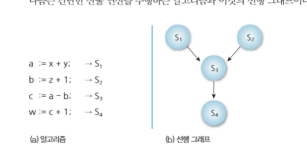
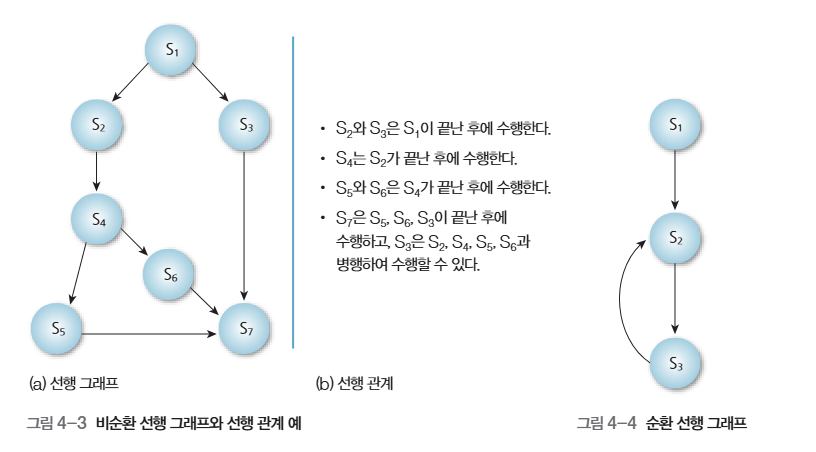
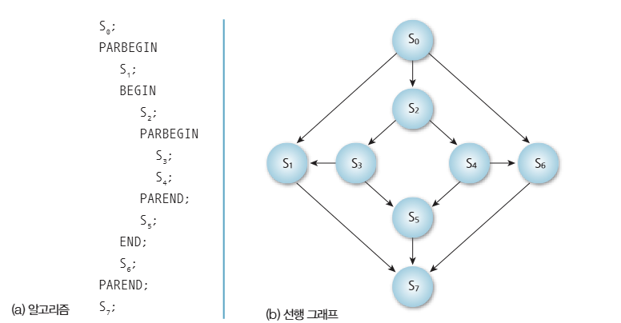
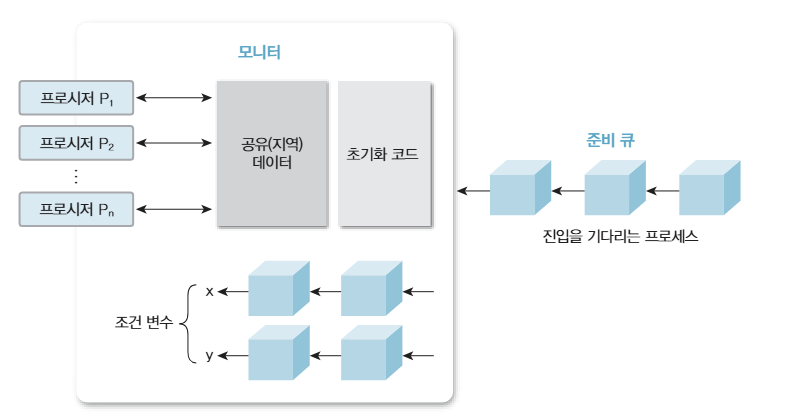

# 프로세스 관리
이번에는 『그림으로 보는 운영체제』를 읽으며 프로세스와 프로세스가 사용하는 공유 자원에 대해 정리하려 합니다.

## 프로세스
프로세스는 실행 중인 프로그램을 뜻합니다. 운영체제가 프로그램을 실행하면 필요한 코드와 데이터가 메모리에 적재되고, 운영체제는 커널 영역에 PCB(Process Control Block, 프로세스 제어 블록)를 생성하여 프로세스의 상태와 자원을 관리합니다.

PCB에는 아래와 같은 정보가 존재합니다.
- 프로세스 ID
- 프로세스 상태
- 우선순위
- 프로그램 카운터
- 레지스터 값
- 메모리 위치 정보
- 다음 PCB 포인터

운영체제는 PCB를 준비 큐나 대기 큐 등에 연결하여 프로세스를 관리합니다. 스케줄러는 준비 큐에 있는 실행 가능한 프로세스나 스레드 중 하나를 정책에 따라 선택해 CPU를 할당합니다.

### 스레드
스레드의 실행 문맥도 TCB(Thread Control Block, 스레드 제어 블록)에 저장되며, TCB에는 일반적으로 아래와 같은 정보가 포함됩니다.
- 스레드 ID
- 스레드 상태
- 프로그램 카운터
- 스택 포인터
- 레지스터 값
- 우선순위
- 스케줄링 정보

일반적으로 현대 운영체제에서 CPU 스케줄링의 기본 단위는 커널이 인식하는 스레드입니다. 따라서 준비 큐에도 프로세스 자체보다는 실행 가능한 커널 스레드가 들어가는 경우가 많습니다.

스레드는 구현과 관리 주체에 따라 사용자 수준 스레드와 커널 수준 스레드로 구분할 수 있습니다. 커널 수준 스레드는 운영체제 커널이 직접 생성하고 스케줄링합니다. 사용자 수준 스레드는 사용자 영역의 런타임이나 스레드 라이브러리가 관리하므로 커널이 각각의 스레드를 직접 인식하지 못할 수도 있습니다.

사용자 수준 스레드와 커널 수준 스레드의 대응 방식에는 다대일, 일대일, 다대다 모델이 있습니다. 현대의 범용 운영체제에서는 사용자 스레드 하나를 커널 스레드 하나에 대응시키는 일대일 모델이 널리 쓰입니다. 일부 문맥에서는 커널이 스케줄링하는 실행 단위를 경량 프로세스(LWP)라고 부르기도 하지만, 운영체제마다 용어와 구현이 다릅니다.


## 병행 프로세스
병행성(concurrency)은 여러 프로세스나 작업의 실행 구간이 시간적으로 겹치는 것을 말합니다. 단일 CPU에서는 작업을 빠르게 번갈아 실행하여 병행성을 구현할 수 있고, 여러 CPU 코어에서 작업이 실제로 동시에 실행되는 것은 병렬성(parallelism)이라고 합니다.

병행성은 여러 작업의 실행을 번갈아 진행하는 다중 프로그래밍을 구현하는 핵심 개념입니다.

### 선행 그래프
선행 그래프는 작업 사이에서 어떤 작업이 먼저 실행되어야 하는지를 나타내는 방향성 비순환 그래프입니다.





### fork/join

`fork`는 하나의 실행 흐름을 여러 실행 흐름으로 나누고, `join`은 나뉜 실행 흐름이 모두 끝날 때까지 기다린 뒤 하나의 흐름으로 합치는 연산입니다.


### 병행 문장
병행 문장은 여러 문장을 동시에 실행하라고 표현하는 방식으로 아래와 같은 문법이 존재합니다.
- `parbegin`: 병행해서 실행할 문장들의 시작
- `begin`: 여러 문장을 하나의 순차적인 문장 블록으로 묶는 시작
- `end`: `begin`으로 시작한 순차적인 문장 블록의 끝
- `parend`: `parbegin`에서 시작한 병행 문장들이 모두 끝날 때까지 기다린 뒤 병행 구간을 종료




## 프로세스의 상호 배제
여러 프로세스나 스레드가 공유 자원에 동시에 접근하면 연산 순서가 뒤섞이는 경쟁 상태(race condition)가 발생하여 데이터의 일관성이 깨질 수 있습니다. 이를 방지하기 위해 상호 배제 기법을 사용합니다.

공유 자원에 접근하는 코드 영역 중 한 번에 하나의 프로세스나 스레드만 실행해야 하는 부분을 **임계 구역(critical section)**이라고 합니다.

이를 지키기 위한 방식으로는 아래와 같은 것들이 존재합니다.
- 데커의 알고리즘: 소프트웨어 방식
- TestAndSet(TAS): 하드웨어 원자적 명령어 방식
- 세마포어: 운영체제 동기화 도구
- 모니터: 고급 언어 수준 동기화 도구

### 데커의 알고리즘
두 프로세스가 동시에 임계 구역에 진입하지 못하게 하는 소프트웨어 기반 상호 배제 알고리즘입니다.

각 프로세스가 임계 구역에 진입하려는지를 나타내는 `boolean flag[2]`와 양쪽이 동시에 진입하려 할 때 누구에게 양보할지를 나타내는 `int turn`을 사용합니다. 두 프로세스가 동시에 진입을 시도하면 `turn`을 기준으로 한 프로세스가 양보하며, 임계 구역을 빠져나온 프로세스는 자신의 플래그를 해제합니다.

> 데커의 알고리즘은 이론적으로 중요하지만 구현이 복잡하고 두 프로세스에 대해서만 동작하며 바쁜 대기를 사용하므로, 현대 운영체제에서는 일반적인 동기화 수단으로 직접 사용하지 않습니다.

### TestAndSet(TAS) 명령어
**TestAndSet**은 하드웨어가 제공하는 원자적 명령어입니다. **원자적**이라는 것은 해당 연산이 중간에 끼어드는 다른 연산 없이 하나의 단위로 수행된다는 뜻입니다.

일반적인 코드의 형태는 다음과 같습니다.
```C
boolean TestAndSet(boolean *lock) {
  boolean old = *lock;
  *lock = true;
  return old;
}

//////////////////////////////////////////

boolean lock = false;

while (TestAndSet(&lock)) {
    // 바쁜 기다림
}

// 임계 구역

lock = false;
```
`lock`이 `false`일 때 `TestAndSet`을 실행한 스레드는 이전 값인 `false`를 반환받고 임계 구역에 진입합니다. 동시에 `lock`은 `true`로 변경되므로 다른 스레드는 반복문에서 바쁜 대기를 합니다. 임계 구역을 빠져나올 때 `lock`을 다시 `false`로 설정합니다.

> TAS는 구현이 단순하고 여러 스레드에도 적용할 수 있으며 원자성이 하드웨어로 보장된다는 장점이 있습니다. 다만 바쁜 대기로 CPU 시간을 소비하며, 진입 순서를 보장하지 않으므로 기아 상태가 발생할 수 있습니다.

### 세마포어
세마포어는 공유 자원의 사용 가능 개수나 사건의 발생 여부를 정수 카운터로 표현하는 동기화 도구입니다. 초기값은 0 이상의 정수로 설정합니다.

`wait(P)` 연산은 사용 가능한 자원이 있으면 카운터를 감소시키고 계속 실행하며, 자원이 없으면 호출한 스레드를 대기시킵니다. `signal(V)` 연산은 카운터를 증가시키거나 대기 중인 스레드 하나를 깨웁니다. 두 연산은 원자적으로 수행되어야 합니다.

초기값이 1인 이진 세마포어는 상호 배제에 사용할 수 있지만, 소유권 개념이 있는 뮤텍스와 완전히 같은 것은 아닙니다.

> 세마포어는 상호 배제와 실행 순서 동기화에 사용할 수 있지만, `wait`와 `signal`의 순서나 호출 횟수를 잘못 작성하면 교착 상태나 동기화 오류가 발생할 수 있습니다.

### 모니터
모니터는 공유 데이터와 그 데이터를 다루는 연산을 하나로 묶고, 한 번에 하나의 스레드만 모니터 내부의 연산을 실행하도록 보장하는 고수준 동기화 구조입니다.

조건 변수의 `wait` 연산은 조건이 충족되지 않은 스레드를 대기시키면서 모니터의 잠금을 놓습니다. 다른 스레드는 상태를 변경한 뒤 `signal` 또는 `notify`를 호출하여 대기 중인 스레드를 깨울 수 있습니다. 예를 들어 버퍼가 비어 있으면 소비자가 기다리고, 버퍼가 가득 차 있으면 생산자가 기다립니다.

> 모니터는 상호 배제를 구조적으로 제공하여 세마포어보다 사용하기 쉽지만, 조건 검사와 `wait`/`signal` 또는 `notify` 호출은 여전히 올바르게 작성해야 합니다. 또한 언어나 라이브러리가 모니터에 해당하는 기능을 지원해야 합니다.


