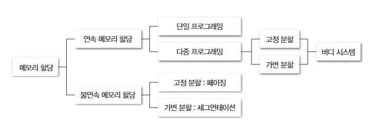
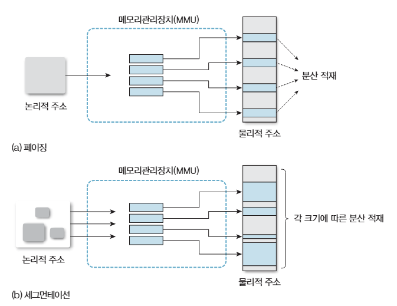
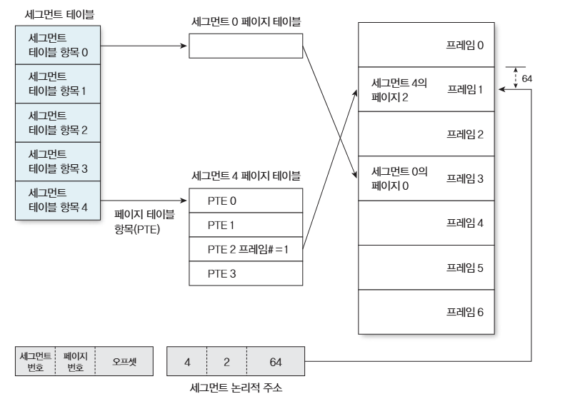

# 7장 메모리 관리 정책
> 그림으로 배우는 구조와 원리 운영체제 7장을 보고 정리한 글입니다. (오늘따라 머리에 잘 안들어와서 글로 정리해봤습니다.)

운영체제는 프로세스를 실행하기 위해서는 메모리에 프로세스의 데이터를 적재할 필요가 있습니다. 이번 절에서는 해당 과정에 대해서 이야기를 합니다.

## 1. 메모리 관리 정책
메모리 관리 정책에는 크게 3단계 순서가 있습니다.
1. 적재정책: 언제 메모리에 올릴 것인지
2. 배치정책: 메모리의 어디에 넣을 것인지
3. 대치정책: 메모리가 부족하면 무엇을 뺄 것인지

### 1. 적재정책 (로딩, 로드, 반입)
적재정책은 디스크에 있는 프로세스나 페이지를 언제 메모리로 가져올지를 결정하는 정책입니다.

운영체제는 실행할 프로그램을 무조건 처음부터 전무 메모리에 올리지 않으며 크게 2가지 방식으로 디스크로부터 프로그램의 데이터를 주기억장치에 올리게 됩니다.
1. 요구적재: 프로그램이 특정 페이지를 올려달라고 하면 메모리에 올려주는 방식입니다.
2. 예상적재: 앞으로 필요할 것 같은 데이터를 미리 메모리에 올려두는 방식

이는 각각 요구적재의 경우에는 필요한 순간에 디스크 접근이 발생할 수 있으며 예상적재는 실제로 사용하지 않을 것을 가져오게 될 수 있다는 단점이 존재합니다.

### 2. 배치정입 (할당, 매핑)
배치정책은 디스크에서 가져온 프로세스나 메모리 블록을 메모리의 어느 위치에 넣을지 결정하는 단계입니다.

연속 메모리 할당방식에서는 프로세스 블록 하나가 메모리의 연속된 공간을 차지하기 때문에 더 나은 방식을 고를 필요가 존재합니다.

대표적인 배치정책은 다음 3가지가 존재합니다.
1. 최초적합: 처음 발견한 들어갈 수 있는 공간에 넣어주기
  - 할당 속도가 빠르지만 사용하지 외부 단편화가 앞부분에 집중적으로 발생할 수 있습니다.
2. 최적적합: 들어갈 수 있는 가장 작은 공간에 넣어주기
  - 빈 공간을 최대한 쪼개지 않고 메모리 공간의 낭비를 줄일 수 있지만 전체를 탐색해야해서 속도가 느린 편이며, 크기가 작은 유휴 공간들이 많이 발생합니다.
3. 최악적합: 들어갈 수 있는 공간중 가장 큰 빈 공간에 넣어주기
  - 프로세스를 할당하고 남은 공간의 크기가 커서 이후에 큰 크기의 프로세스를 적재하기 유리합니다. 하지만 이 또한 전체 탐색으로 인해 속도가 느리며 큰 공간을 먼저 사용해 이후에 공간이 부족해질 수 있습니다.

### 3. 대치정책 (교체, 스왑)
대치정책은 메모리가 부족할 때 현재 메모리에 있는 것 중 무엇을 먼저 제거할지 결정하는 정책입니다.

방식으로는 가장 먼저 들어온 것을 제거하거나 가장 오랫동안 사용되지 않은 것을 제거하는 방식이 있을 수 있습니다. 

## 2. 메모리 할당 방법
메모리에 프로세스를 적재하는 방법들로 아래와 같이 나뉩니다.

### 연속 메모리 할당
연속 메모리 할당은 프로세스 하나를 그대로 메모리의 연속된 공간 하나에 배치하는 방식입니다. 이는 단순하고 메모리의 시작-끝 범위를 알기 쉽지만 프로세스들이 생성과 종료를 반복하다보면 이용할 수 없는 빈 공간(외부 단편화)가 생길 수 있습니다.

### 비연속 메모리 할당
비연속 메모리 할당은 프로세스들을 여러 조각으로 나누고, 그 조각들을 메모리 여러곳에 나누어 배치하는 방식입니다.

방식으로는 
- 페이징: 프로세스들은 일정 크기(예를 들어 4KB)로 나누어 메모리에 논리적으로 적재하는 방식입니다. 속도가 매우 느립니다.
- 세그멘테이션: 스택, 힙, 공유 라이브러리, 전역데이터 등과 같은 모듈 프로그램으로 나누어 쓰는 방식입니다. 크기가 일정하지 않을 수 있습니다. 속도가 매우 느립니다.
- 페이징화된 세그멘테이션: 세그먼트를 페이지들로 나누어 쓰는 방식으로 주소가 `[세그먼트 번호] [페이지 번호] [오프셋]` 형태로 만들어지게 됩니다.

이 존재하며, 