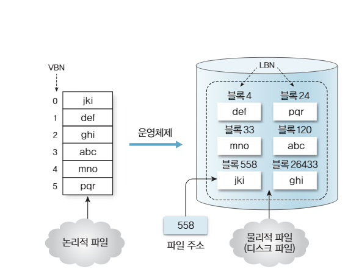
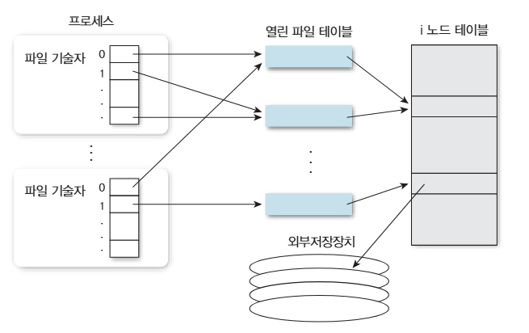
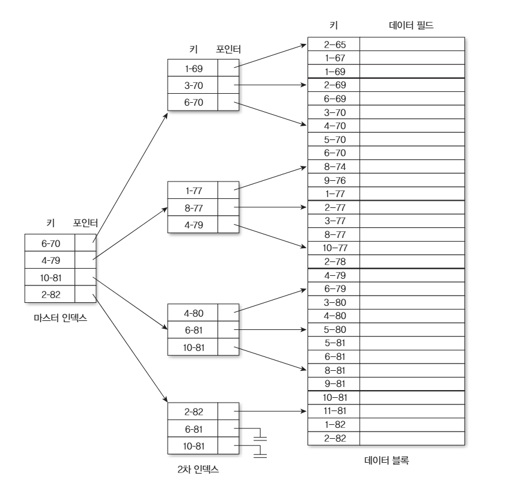

# 파일시스템

파일시스템은 저장 장치에 데이터를 파일과 폴더 형태로 저장하고 관리하는 규칙과 구조를 말합니다.

## 사용자로부터 디스크까지의 동작 과정
운영체제는 사용자가 쉽게 파일을 쓰거나 읽을 수 있게 해주며 파일의 무결성을 지켜줍니다. 그 동작 방식은 다음과 같습니다.
1. 응용 프로그램 
2. 논리 파일 시스템 
3. 파일 구성 모듈 
4. 기본 파일 시스템 
5. 입출력 제어기 장치 드라이버

이를 통해서 최종적으로 물리적으로 데이터를 읽거나 작성하게 됩니다.

### 블록
블록은 파일 시스템이 디스크 공간을 관리하고 입출력하는 기본 단위입니다.

블록 크기가 `4KB`라면 `10KB`파일은 3개의 블록을 사용하게 됩니다.

또한 파일시스템은 가상 메모리와 같이 디스크를 논리 블록으로 나누어 관리하게 됩니다.

블록은 더 작은 단위인 레코드들로 나뉘며 레코드는 의미있는 데이터의 가장 작은 단위인 필드(바이트의 집합)의 집합을 통해 구성되게 됩니다. 일반적으로 레코드를 가변길이로 설정하면 위치를 찾기 어렵기 때문에 순차처리에 적합한 경우가 많습니다.

### 응용 프로그램
응용 프로그램은 파일의 물리적인 위치를 직접 다루지 않고 시스템 콜을 통해 `파일 디스크립터`, `파일 경로`, `읽기/쓰기`또는 `실행`, `데이터와 크기` 등을 전달하여 커널이 작업을 처리해줄 수 있게 해줍니다.

### 논리 파일 시스템
논리 파일 시스템은 파일과 디렉터리를 논리적으로 객체로 관리하는 계층입니다.

논리 파일시스템은 다음 정보를 관리합니다.
- 파일 메타데이터 관리
- 파일 이름과 경로
- 파일 내용이 저장된 디스크 위치
- 파일 크기와 생성/수정된 시간
- 파일 디스크립터 관리
- 소유자와 접근 권한
- 남은 저장 공간
- 디렉터리 구조

경로를 통해 해당 파일의 위치를 찾은 뒤, 해당 파일의 `inode`를 찾아 크기, 권한, 데이터 블록 위치 등을 확인하게 됩니다.

또한 논리 파일 시스템은 파일에 접근하기 전에 사용자와 그룹, 실행 권한, 파일 소유자 확인 등과 같은 것들을 확인하여 보호 및 보안을 지켜줍니다.

### 파일 구성 모듈
파일 구성 모듈은 파일의 논리적 위치를 실제 디스크 블록 번호로 변환하고 공간을 할당하는 계층입니다.

주요 역할은
- 논리 블록을 디스크 블록에 연결
- 새로운 블록 할당 및 미사용 블록 회수
- 빈 공간 관리
- 연속/연결/인덱스 할당 방식 적용

등을 관리합니다. 아래는 인덱스를 통해 데이터에 접근하기 위한 인덱스 순차 엑세스를 위한 인덱스 구조입니다.

### 파일과 블록의 가용 공간
이는 데이터가 없는 논리적 영역인 파일과 어떤 파일에도 할당되지 않은 디스크 블록을 연결하여 새 파일에 디스크 블록을 할당해주게 됩니다. 또한 하나의 파일에 대한 디스크 블록은 반드시 연속될 필요가 있진 않습니다.

### 기본 파일 시스템
기본 파일 시스템은 상위 계층에서 받은 디스크 블록 요청을 일반적인 블록 입출력 명령으로 처리해주게 됩니다. 이를 통해 블록에 대한 작업 요청을 생성해주며 드라이버 호출, 입출력 요청 규 등을 관리해주게 됩니다.

기본 파일 시스템에는 `test.txt`와 같은 이름을 알지 못하며 몇번 블록에 작업을 할 것인지에 대해 관심사를 두게 됩니다.

### 드라이버 호출
기본 파일 시스템에 의해 최종적으로 요청을 받아 파일을 읽거나 써주는 작업을 해주게 됩니다. 