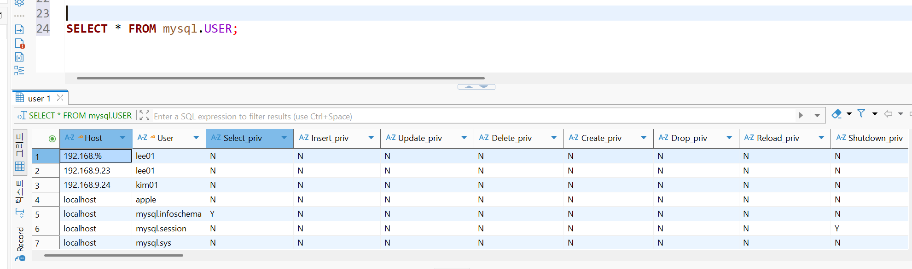
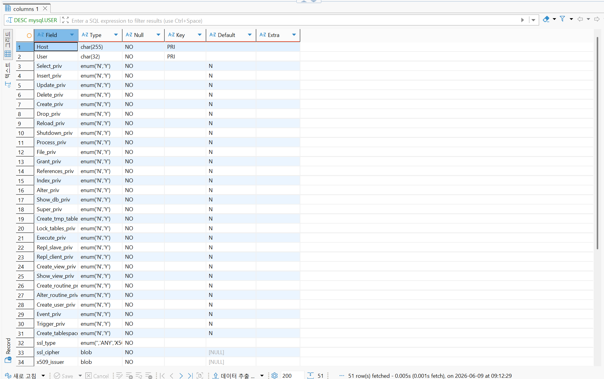

# MySQL 자유 정리


# 뷰
뷰의 경우에는 `CREATE VIEW [뷰 이름] AS [SELECT문]`을 통해 제작이 가능합니다.

뷰는 저장된 SELECT문에 가까운 존재입니다. 예를 들어 제가 위의 식에서 `CREATE VIEW MEMBER_VIEW AS SELECT MEMBER_PK AS PK, MEMBER_ID AS ID, MEMBER_HOBBY AS HOBBY FROM MEMBER;`라고 작성하게 된다면 원본 테이블의 형태가 바뀌면 `MEMBER_VIEW` 또한 연동되어 바뀌는 것을 확인할 수 있습니다. 추가로 `alias`를 통해 기존 테이블의 컬럼을 은닉하여 보안성 또한 추가할 수 있습니다. (추가적으로 복잡한 SQL을 단순화 하며, 재사용, 가동성의 이점이 존재합니다.)


# 데이터베이스 기본
## DDL
`Data Definition Language`라는 의미로 데이터베이스 구조를 만들거나 수정, 삭제하는 명령어입니다.

가장 기본적으로 `CREATE`, `DROP`, `ALTER`등이 존재합니다. 이것들은 대체로 하나하나가 관리하는 데이터 구조에 큰 영향을 미치는 문법입니다.

### CREATE DATABASE
데이터베이스의 경우에는 기본적으로 `CREATE DATABASE [데이터베이스 명]`을 통해 생성이 가능합니다. 이때 몇가지의 추가 설정이 가능한데 `문자셋`, `정렬 규칙`, `암호화` 등이 있습니다.

`문자셋`의 경우에는 글자를 어떤 방식으로 저장할지에 대한 이야기입니다. 

`CREATE DATABASE testdb DEFAULT CHARACTER SET utf8mb4`라는 4바이트 길이의 유니코드 문자를 온전하게 저장하기 위한 문자 집합입니다. 기존에 사용하던 `utf8`은 3바이트 길이로 특정 한자 및 이모티콘을 저장하지 못했었습니다. 다른 문자 셋으로는 `latin1`, `euckr` 등이 있으며 이 설정에 따라 출력/입력 등의 인코딩 형태가 깨질 수 있으므로 유의할 필요가 있습니다.

`CHARSET`과 함께 `COLLATE`라는 설정 또한 존재하여 정렬 규칙을 설정할 수 있습니다.

예를 들면 `utf8mb4_0900_ai_ci`와 같이, `utf8mb4`에 `0900`유니코드 9.0 기반 방식의 `ai`라는 악센트 무시, `ci`라는 대소문자 무시 방식을 사용하는 정렬 방식을 사용하게 되었습니다.

> 경우에 따라 Docker을 통한 데이터베이스를 사용하는 경우에 `latin1`과 같은 인코딩 기본 방식에 의해 문제가 생길 수 있으니 이를 유의하면 좋습니다. 

### CREATE USER
MySQL에서 DCL은 데이터베이스 선택 없이 설정이 가능합니다. (사용자들 관리하는 것이기 때문)

MySQL은 기본적으로 사용자를 `[사용자명]@[접속 위치]` 로 관리한다.

여기에서 계정을 생성하는 명령어는 
`CREATE USER '사용자명'@'접속위치' IDENTIFIED BY '비밀번호';` 가 된다.

여기에서 접속 위치에 `192.168.%`로 작성하면 `192.168`의 모든 대역을 허용한다는 뜻이고, `%`로 작성하면 모든 위치에서 접속이 가능하다는 뜻이 된다.

권한 부여의 경우에는 
```SQL
GRANT [SELECT | INSERT | UPDATE | DELETE | CREATE | ALTER | DROP | INDEX | ALL | ALL PRIVILEGES | OPTION]
ON [스키마].[테이블] -- *.*을 통해 모든 스키마와 모든 테이블에 대해서 권한을 줄 수 있습니다.
TO '[사용자명]'@'[접속위치]', ...;
```
와 같은 명령어를 통해 사용자에게 특정 테이블에 대한 사용 가능 권한을 줄 수 있다.

반대로 권한을 빼앗을 때에는 위의 명령어에서 `GRANT`를 `REVOKE`로 바꾸기만 하면 되며, 계정을 삭제할 때에는 `DROP USER '사용자명'@'접속위치'`를 통해 나타낼 수 있다.

MySQL은 계정과 권한 정보를 내부 DB인 `mysql` 데이터베이스에 저장합니다.

대표적으로 `mysql.user` 테이블이 존재합니다.





여기에서 대표적으로 `Host`에 접속 위치가, `User`에 사용자 명이 존재하며 뒤에는 권한 데이터가 `N`과 `Y`의 형태로 저장되어 있습니다.

### CREATE TABLE과 ALTER
`CREATE TABLE`의 경우에는 데이터베이스 사용 시 빼먹을 수 없는 가장 기초적인 문법입니다.

```sql
CREATE TABLE [테이블 명](
  [컬럼명1] [타입1] [제약조건1],
  [컬럼명2] [타입2] [제약조건2],
  ...,
  [별도 제약조건 (아래에서 설명)]
)
```
을 통해 작성하게 됩니다.
#### 타입
타입의 경우에는 `INT`, `VARCHAR(N)`, `CHAR(N)`, `TEXT`, `DATE`, `DATETIME`, `DECIMAL(N, M)` 등이 있습니다. 특이점으로는 `VARCHAR`의 경우에는 자동으로 길이를 조정하주고 `CHAR`의 경우에는 무조건 데이터 길이만큼의 공백을 채우게 됩니다. 또한 `DECIMAL`의 `N`은 소숫점의 크기인 `M`을 포함한 10진 실수 크기입니다.

#### 제약조건
제약 조건으로는 
- `PRIMARY KEY`: 행을 구분하는 대표값
- `AUTO_INCREMENT`: 자동 증가
- `NOT NULL`: NULL 금지
- `UNIQUE`: 중복 금지
- `DEFAULT`: 기본값
- `CHECK`: 조건 검사
- `FOREIGN KEY`: 다른 테이블과 연결

등이 있습니다.

#### 별도 제약조건
> 특히 `CHECK`와 `FOREIGN KEY`의 경우에는 각각 `CHECK (조건식)`과 `FOREIGN KEY ([규칙 이름]) REFERENCES [참조할 테이블명]([참조할 테이블의 컬럼명])` 을 통해 작성하게 됩니다.

#### ALTER 
`ALTER`의 경우에는 테이블, 데이터베이스, 인덱스, 뷰, 저장 프로시저 및 함수, 트리거 등 대부분의 객체를 바꿀 수 있으며, 진행중인 서비스(실무)에서는 이미 저장되거나 사용되고 있는 객체일 가능성이 매우 높기 때문에 사용에 매우 유의해야합니다.

대표적인 사용 예시는 `ALTER TABLE [테이블명] ADD [컬럼명] [타입]`을 통해 컬럼을 추가한다던가, `ALTER TABLE [테이블명] MODIFY [컬럼명] [바꿀 타입]`을 통해 컬럼의 자료형을 바꿀 수 있습니다. 사용 가능한 부분이 많지만 실제로 사용하는 경우가 적기 때문에 실제로 사용할 때 여러 시각으로 고려하는 것이 중요합니다.

### DML
쿼리에서 가장 많이 쓰이게 되는 부분이기 떄문에 간단한 소개만 하고 향후 따로 다룰 필요가 있다고 판단했습니다.
- `INSERT`: 데이터(행) 추가
- `SELECT`: 탐색
- `UPDATE`: 데이터 수정(행)
- `DELETE`: 데이터(행) 삭제 (실제로는 `UPDATE`를 통해 논리적 삭제를 하는 경우도 많습니다.)

> 이부분을 다룰 부분이 많으며 특히 `SELECT`에서 `JOIN`, 서브쿼리, `UNION`, 윈도우 함수 등등 매우 많기 때문에 향후 다루도록 하겠습니다.
