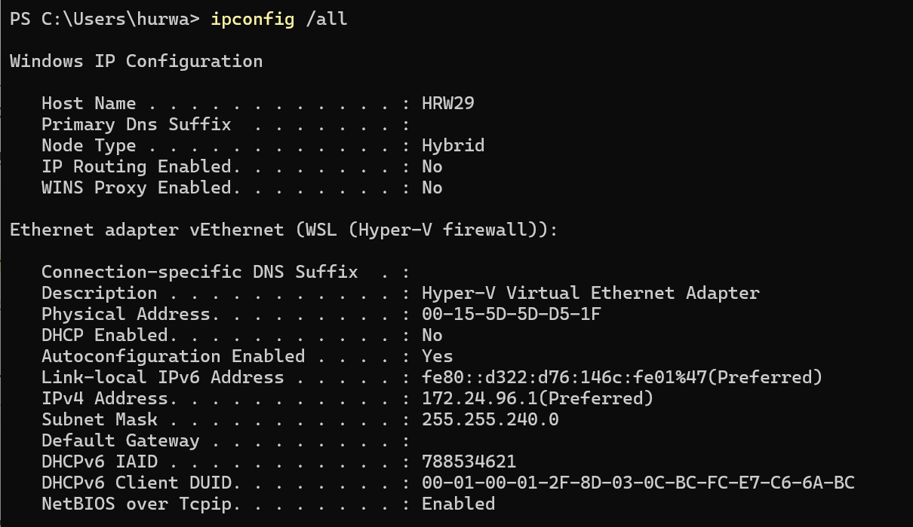
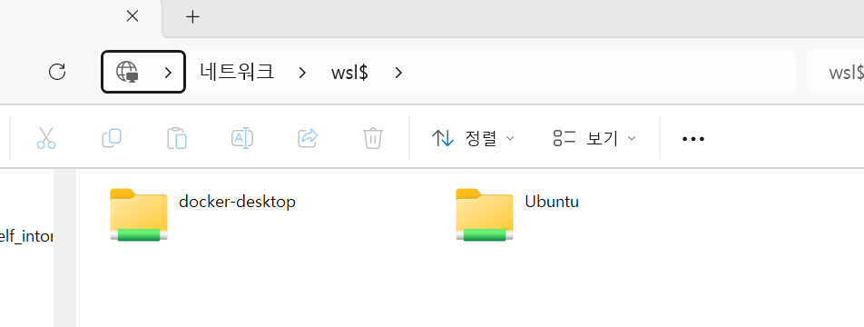
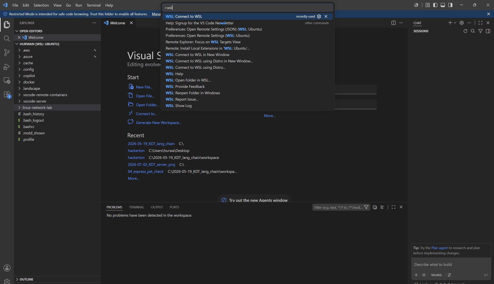
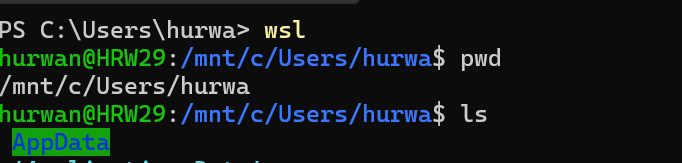

# 시작
일단 VM, 도커, WSL 등을 어떻게 공부할지 고민하다 일단 VM은 무겁기도 하고 쓸 이유가 크게 없으니 WSL 우분투 환경을 이용해서 리눅스 명령어와 도커 사용법을 복습하고 숙지하는 형태로 진행하기로 하였습니다.

### [2026-07-07 07:38:34] WSL
우선 WSL은 `Windows Subsystem for Linux`의 줄임말입니다. 이는 윈도우 안에서 리눅스 환경을 사용할 수 있게 해주는 기능을 말합니다.

기존에는 리눅스를 사용하기 위해 다음과 같은 과정을 거쳐야 했습니다.
- 컴퓨터에 Ubuntu OS를 직접 설치
- VM 프로그램을 이용하여 Ubuntu 설치
- 원격 리눅스 서버 사용해보기

하지만 WSL을 통해 윈도우를 그대로 사용하며 Ubuntu를 실행할 수 있습니다.

#### WSL의 특징
WSL은 Windows운영체제 위에서 터미널을 통해 Ubuntu 명령어를 사용할 수 있는 구조입니다.

WSL 버전1은 윈도우 위에서 리눅스 시스템콜을 번역하는 방식에 가까웠습니다. 하지만 현재(`2026-07-07`) WSL2의 경우에는 윈도우 위의 가벼운 가상화 환경을 통해 실제 Linux 커널을 사용하는 방식이 되었습니다.

WSL의 경우에는 독립된 서버가 아닌, Windows와 파일 시스템이 연결되어있어 `/mnt/c`를 통해 마운팅이 되어있는 드라이브에 접근이 가능합니다. 반대로 WSL 내파일은 Windows 탐색기에서 `\\wsl$`을 통해 볼 수 있습니다.

`localhost`의 경우에는 Windows파일시스템과 WSL이 동일한 주소 취급을 하게 됩니다.

한계점으로는 `systemd`가 Ubuntu와 완전히 동일하지 않기 때문에
- 부팅
- systemd
- 방화벽
- 네트워크 어댑터
- SSH 서버 운영
- 리눅서 서버 보안 설정

과 같은 작업은 VM에서 하는것이 권장됩니다.

#### WSL의 구현 방식
WSL2는 가벼운 VM 안에 실제 Linux 커널이 있으며 그 위에서 Ubuntu가 실행되는 구조입니다.

윈도우 커널/하드웨어 위에 Windows의 가상화 계층이 존재하며 그 위에 WSL의 경량 VM속 실제 Linux 커널을 통해 돌아가는 형태에 가깝습니다.

여기에서 윈도우의 경량 VM은 보여지지 않는 공간에서 WSL을 관리하게 합니다.

또한 기존의 Windows의 파일시스템과 WSL의 파일시스템은 구조적으로는 분리되어있지만 편의를 위해 `localhost`, `마운트` 등의 기능이 존재합니다.

여기에서 `localhost`가 같은것과 같이 사용할 수 있지만 이것이 두 운영체제가 동일한 네트워크 인터페이스를 가진다는 뜻은 아니며 아래 사진과 같이 윈도우는 자신의 WSL 환경에 대한 네트워크 인터페이스를 가집니다.



두 운영체제의 포트는 윈도우의 기능을 통해 포트의 선점을 통해 중복 사용이 제한됩니다. 이때 윈도우의 브라우저에서 `localhost:WSL포트` 로 요청을 넣으면 응답이 잘 오는 이유는 윈도우에서 포트포워딩 기능을 제공해주기 때문입니다.

### 실행
```bash
PS C:\Users\hurwa> wsl -l -v
  NAME              STATE           VERSION
* docker-desktop    Stopped         2
  Ubuntu            Stopped         2
PS C:\Users\hurwa> docker compose ls
NAME                STATUS              CONFIG FILES
PS C:\Users\hurwa> wsl --ser-default Ubuntu
잘못된 명령줄 인수: --ser-default
지원되는 인수 목록을 가져오려면 'wsl.exe --help' 사용하세요.
PS C:\Users\hurwa> wsl --set-default Ubuntu
작업을 완료했습니다.
PS C:\Users\hurwa> wsl -l -v
  NAME              STATE           VERSION
* Ubuntu            Running         2
  docker-desktop    Running         2
PS C:\Users\hurwa>
```
> 위와 같은 작업을 통해 WSL 배포판을 선택하여 실행할 수 있으며 중간에 `docker-desktop`, `Ubuntu`가 실행된 것은 제가 도커 데스크탑 및 `wsl --set-default Ubuntu`를 실행하였기 때문입니다.

### 여러가지 접속 방법







### 명령어들
```powershell
hurwan@HRW29:~$ mkdir a/b/c/
mkdir: No such file or directory
hurwan@HRW29:~$ mkdir -p a/b/c/
hurwan@HRW29:~$ id addr
id: 'addr': no such user
hurwan@HRW29:~$ ip addr
1: lo: <LOOPBACK,UP,LOWER_UP> mtu 65536 qdisc noqueue state UNKNOWN group default qlen 1000
    link/loopback 00:00:00:00:00:00 brd 00:00:00:00:00:00
    inet 127.0.0.1/8 scope host lo
       valid_lft forever preferred_lft forever
    inet 10.255.255.254/32 brd 10.255.255.254 scope global lo
       valid_lft forever preferred_lft forever
    inet6 ::1/128 scope host proto kernel_lo 
       valid_lft forever preferred_lft forever
2: eth0: <BROADCAST,MULTICAST,UP,LOWER_UP> mtu 1432 qdisc mq state UP group default qlen 1000
    link/ether 00:15:5d:f2:f8:86 brd ff:ff:ff:ff:ff:ff
    altname enx00155df2f886
    inet 172.24.104.153/20 brd 172.24.111.255 scope global eth0
       valid_lft forever preferred_lft forever
    inet6 fe80::215:5dff:fef2:f886/64 scope link proto kernel_ll 
       valid_lft forever preferred_lft forever
hurwan@HRW29:~$ 
```
여기에서 `mkdir -p` 를 통해 하위 루트를 만들어주고 `ip addr`을 통해 자신의 네트워크 인터페이스 정보를 확인할 수 있습니다. `lo`는 루프백을 말하며 `eth0`의 경우에는 리눅스 안의 가상 네트워크 카드를 말합니다. 이더넷 인터페이스의 이름입니다. 
- `<BROADCAST,MULTICAST,UP,LOWER_UP>`: 인터페이스의 기능입니다. `UP`는 관리자 설정상 인터페이스가 켜져있다는 뜻이며 `LOWER_UP`는 물리/가상 링크 계층이 실제로 연결되어있다는 뜻은 합니다.
- `mtu 1432`: 한번에 보낼 수 있는 최대 패킷 크기입니다.
- `qdisc mq`: **Queueing Discipline**로 네트워크 패킷을 내보낼 때 큐를 관리하는 방식으로 `mq`는 **multi queue**로 여러개의 송신큐를 사용할 수 있다는 의미입니다.
- `state UP`: 활성화 되어있다는 뜻입니다.
- `group default`: 해당 인터페이스가 `default` 그룹에 속해있음을 의미합니다.
- `qlen 1000`: 송신 큐의 길이를 나타내며 최대 1000개까지의 큐에 대기시킬 수 있다는 뜻입니다.
- `link/ether 00:15:5d:f2:f8:86`: 2계층 주소 타입이 이더넷이며 MAC주소와 함께 나타내어집니다.
- `brd ff:ff:ff:ff:ff:ff`: MAC 브로드캐스트 주소입니다.
- `altname enx00155df2f886`: `eth0`이라는 인터페이스 이름의 대체 이름으로 MAC 주소를 통해 예측할 수 있는 형태의 이름입니다.
- `inet`, `inet6`: 각각 IPv4, IPv6 주소를 나타내는 행입니다. 
- `scope global`: 해당 스코프를 사용할 수 있는 범위로 `host=자기 안에서만`, `link=같은 링크 안에서`, `global=일반 네트워크`의 의미를 가집니다.
- `valid_lft forever preferred_lft forever`: 유효시간이 무한대라는 뜻입니다.