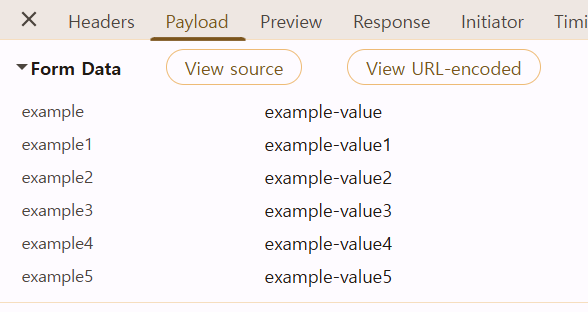
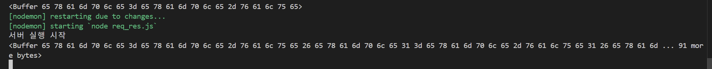

### http.createServer()의 콜백함수
`http.createServer()`은 인자로 콜백함수를 받으며 아래와 같은 형태로 인자를 받습니다.

- `([요청 객체], [응답 객체]) => {...}`

여기에서 각각의 객체에 대한 메서드를 정리해보려 합니다.

#### 요청 객체 
정확한 타입은 `http.IncomingMessage`이며 짧게 `req`라고 부르겠습니다.

해당 객체는 `ReadableStream`으로 소켓 양단과 그 통로를 다룰 수 있게 해주는 객체입니다. 

req.method
req.url
req.headers
req.rawHeaders
req.httpVersion
req.httpVersionMajor
req.httpVersionMinor
req.complete
req.trailers
req.headersDistinct
req.aborted

req.on("data", callback)
req.on("end", callback)
req.on("error", callback)
req.read()
req.setEncoding("utf8")
req.pause()
req.resume()
req.pipe(dest)
req.destroy()
req.setTimeout(ms, callback)

```javascript
req.on("data", (chunk) => {
  console.log(chunk)
})
```

