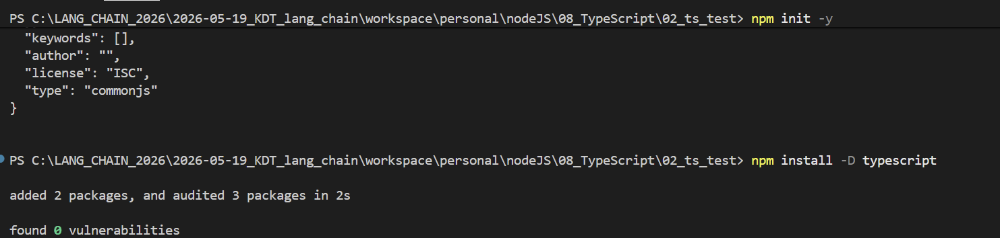
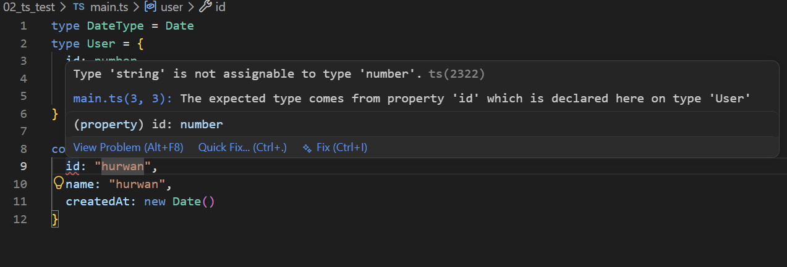
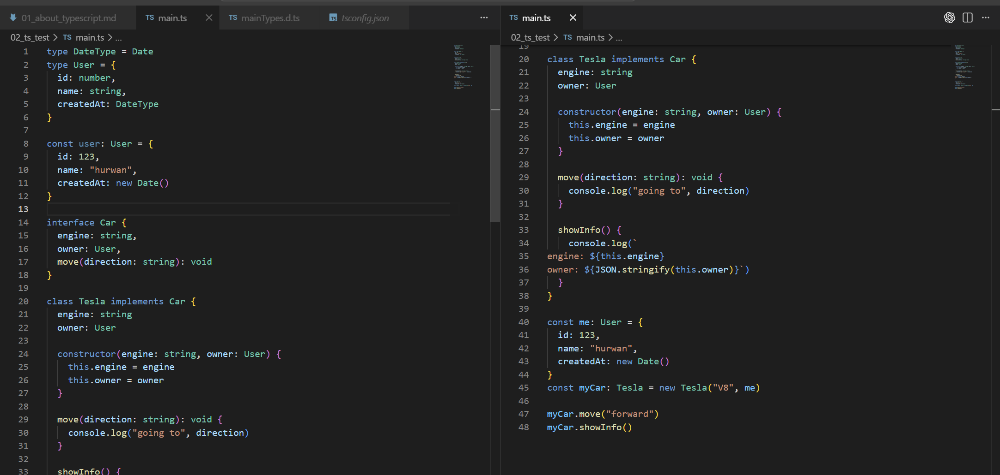
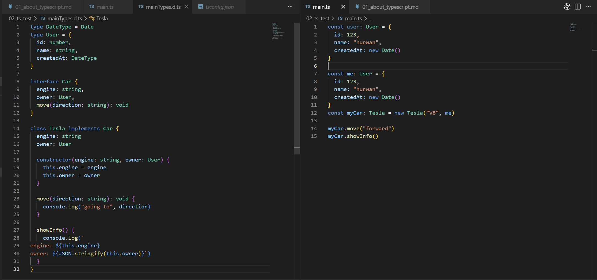
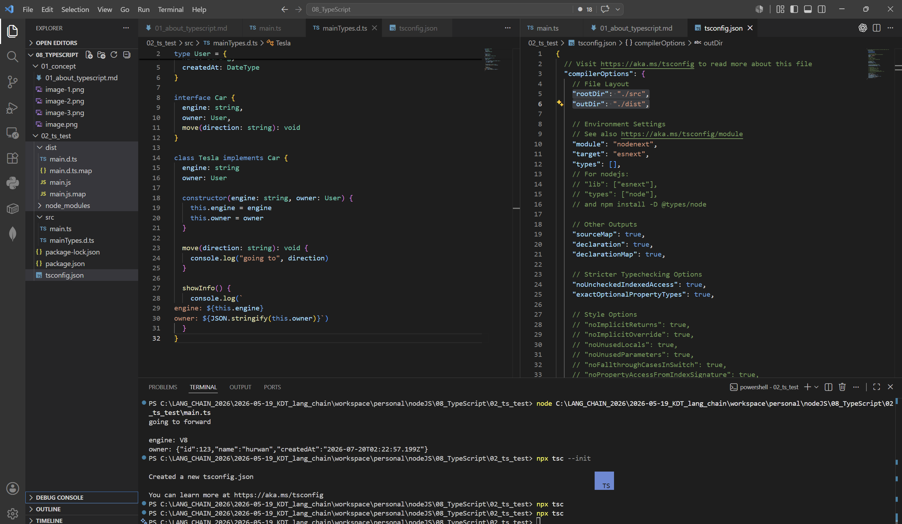

# 타입스크립트 개념과 사용법
이번에는 계속 관심이 있었지만 시급함이 있는건 아니였기에 간간히 찾아보면서 써왔던 `Typescript`에 대해서 개념을 파악하고 사용법을 정리해보려 합니다.

## 타입 스크립트란?
타입 스크립트는 `JavaScript`를 개발할 시 타입 정적 분석이 약한 부분에 대해서 타입을 명확히 명시해주며 경우에 따라 자동완성, 리팩토링 등까지 확인해주는 개발용 **언어**입니다.

위에서는 언어라 하였지만 타입 스크립트는 패키지 또는 컴파일러라고 표현할 수도 있습니다.

타입 스크립트는 공식 컴파일러와 관련 프로그램이 `typescript`라는 이름의 npm 패키지로 배포되게 됩니다. (`npm install -D typescript`)

해당 `install`을 실행한다면 `tsc`라는 Typescript 컴파일러(`ts`에서 `js`로)와 언어 서비스, 타입 선언 파일 등을 제공받을 수 있습니다. 컴파일을 하는 경우에는 `npx tsc`를 통해 사용이 가능합니다.

VSCode에서 타입스크립트를 사용할 수 있는 이유는 VSCode에서 기본적으로 TypeScript를 분석하는 언어 서비스가 들어있기 때문입니다. 예를 들어 다음과 같은 기능이 존재합니다.
- 빨간 밑줄
- 자동완성
- 함수 인자 표시
- 타입 추론
- 정의로 이동
- 이름 변경

## 타입 스크립트의 주요 문법
타입스크립트 문법은 크게 두 영역으로 구분됩니다. 
- 타입 검사 (`: type`, `type`, `interface`)
- 실행 시 실제로 존재 하는 것 (`const`, `function`, `new`)

그중에서도 `class`는 실제로 사용됨과 동시에 타입으로도 사용 가능한 객체이자 타입입니다.

```typescript
// 기본적인 속성 넣기
const name: string = "hurwan"
const age: number= 21

// 함수 시그니처 넣기
function greet(name: string): string {
  return `Hello ${name}!`
}

// 객체에 속성 넣기
const user: {
  id: number,
  name: string
} = {
  id: 12,
  name: "hurwan"
}

// 타입 자체를 만들기 (별칭)
type User = {
  id: number,
  name: string,
  age: number,
  createdAt: Date | null
}

// 특정 값만 허용하기 
type status = "ready" | "pending" | "completed"
const paymentStatus: status = "ready"

// 복수 타입 허용
type UserId = number | string
const appleId = 1
const bananaId = "banana"

// 인터페이스 정의 (유니온, 문자열 등과 같은 타입이 가능한 일부를 못사용하지만 객체 형태 정의 및 확장에 쓰임)
interface User: {
  id: number
  name: string
  greet(): string
}

// 인터페이스 implements
class UserImpl implements User {
  id: number
  name: string

  constructor(id: number, name: string) {
    this.id = id
    this.namd = namd
  }

  /*
  위 내용을
  constructor(
    public id: number, 
    public name: string
  ) {}
   으로 축약 가능
  */

  greet(): string {
    console.log("hello", this.name)
  }
}

```

## 실제 사용 예시

> 패키지 다운



> 타입 에러 확인



> `.d.ts` 작업 전 예제



> `.d.ts` 이관



> `npx tsc --init` 이후 `rootDir`, `outDir` 설정 및 `npx tsc`을 통한 js 빌드



## 결론
최종적으로 이와 같이 타입을 검사하지 않는 `JavaScript`의 강한 보조 패키지의 `TypeScript`에 대해서 알아보았습니다.

컴파일, 언어 규칙 등이 존재하며 직접 `js`를 실행하지는 않기때문에 애매한 경계에 있지만 최종적으로 정리를 하면
1. TypeScript는 언어 규칙과 컴파일러, 코드 검사 기능을 제공하는 언어가 맞다.
2. VSCode에서의 TypeScript에 의한 코드 정적 검사는 TypeScript 가 제공하는 Language Service를 이용하여 일어난다. VSCode 자체만으로 TypeScript 파일을 읽어서 동작하는 것과는 약간 다르다
3. 이번에 다루진 않았지만 `ESLint`보다 더 기초적인 부분을 탐지하며 코드 품질 등은 적극적으로 관리하지 않는다.