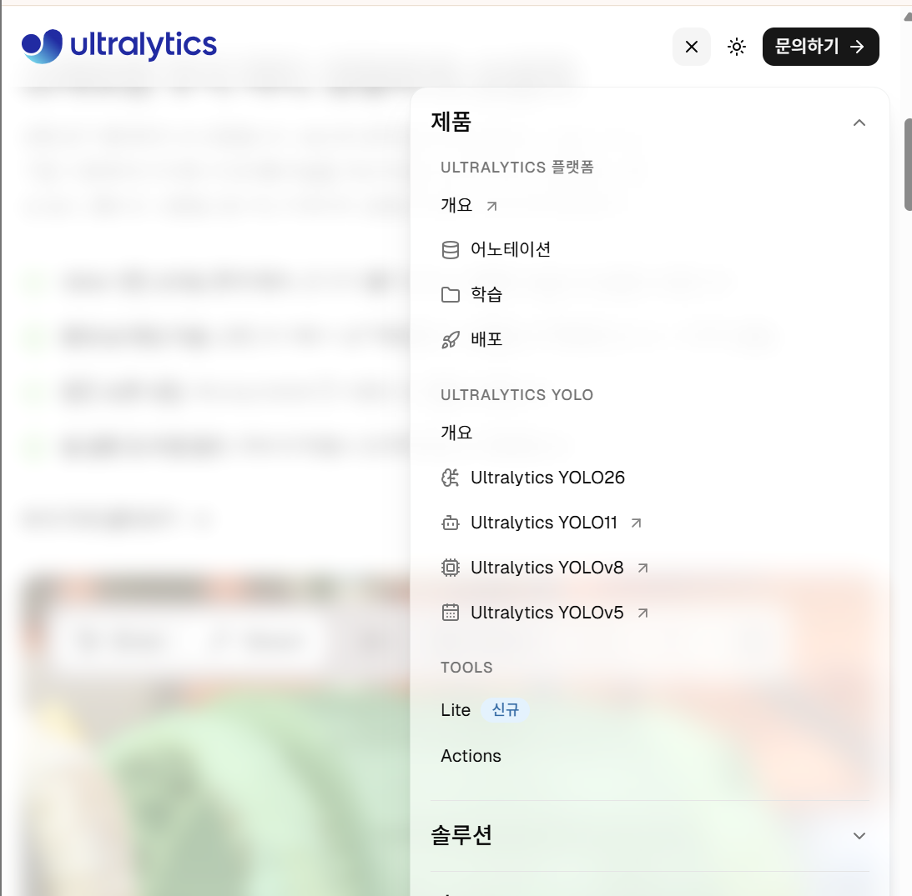
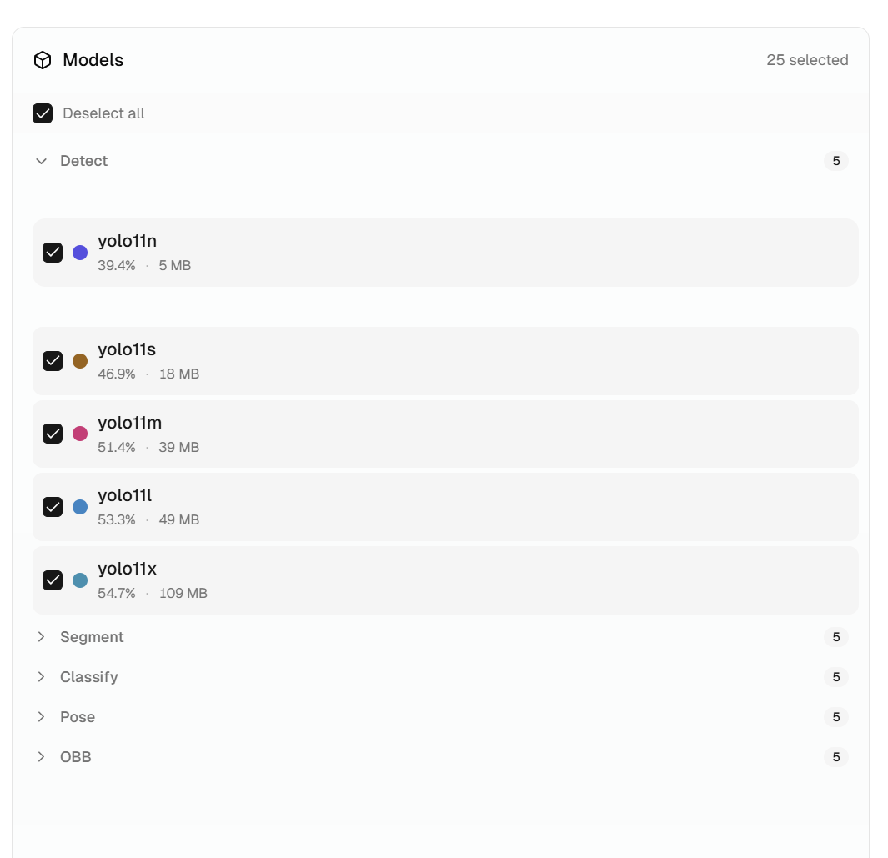
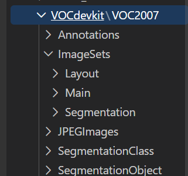
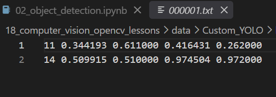
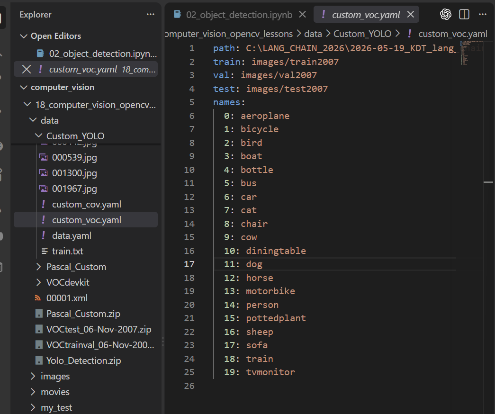
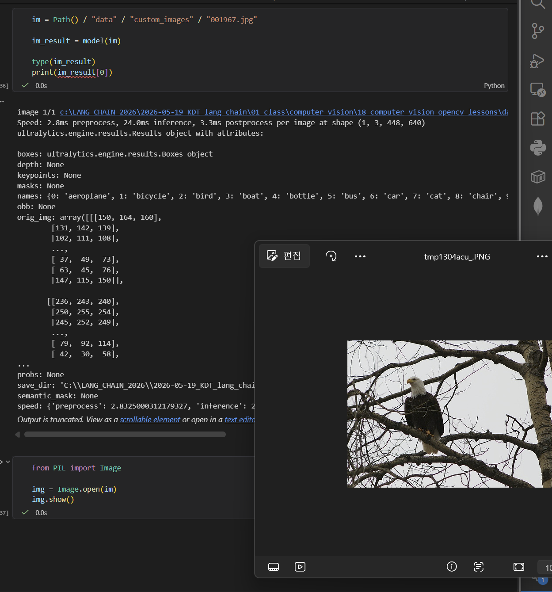

# [객체탐지] 객체탐지의 개요
> 이번에는 수업 내용을 바탕으로 객체탐지에 대해서 복습하는 시간을 알아보겠습니다.

## 객체탐지란?

객체탐지는 이미지나 영상에서 특정 객체의 존재의 여부를 확인하고, 해당 객체의 위치를 바운딩 박스로 표시하는 기술입니다.

이는 주로 CNN 모델을 사용하며 대표적인 알고리즘은 R-CNN 계열, SDD 등이 존재하며 이러한 기술은 자율주행, 보안 감시 등과 같은 실시간으로 여러 클래스를 탐지해야하는 다양한 분야에서 사용됩니다.

객체 탐지는 크게 3가지 출력을 만들어 냅니다. 
- 클래스: 객체에 대한 분류 범주
- 바운딩 박스: 객체의 위치와 크기
- confidence score: 해당 예측을 모델이 얼마나 확신하는지에 대한 점수

객체 탐지 모델은 **크게 2가지 분류**로 나뉩니다. 
1. One-Stage 모델: 한번의 흐름을 통해 객체 클래스의 확률과 위치를 직접 예측하는 방식입니다. 주로 YOLO, SSD, RetinaNet 등이 존재합니다.
2. Two-Stage 모델: 2단계로 나뉘어 객체가 있을 법한 후보 영역을 찾은 뒤, 후보 영역을 분류하고 Bounding Box를 보정하는 형태입니다. `Faster R-CNN`, `Mask R-CNN` 등이 존재합니다.

여기에서 중요한 포인트로는 일반적으로 OneStage는 빠르고 정밀도가 낮고, TwoStage는 느리지만 정밀도가 높다는 잘못된 판단입니다. 이는 모델 설계 또는 데이터셋에 따라 서로 특징이 뒤바뀔 수 있습니다.

## YOLO
YOLO 는 `You Only Look Once`의 약자로 위치와 클래스를 동시에 예측하는 `One-Stage Detection` 알고리즘을 의미합니다.

한번의 신경망 추론으로 전체 이미지 탐지를 수행하여 빠르고, 실시간 탐지에 적합한 형태입니다.

YOLO는 이미지를 격자 단위로 나눈 후, 각 격자에서 객체의 위치와 클래스를 동시에 예측하는 One-Stage 모델입니다.

여기에서 격자는 말 그대로 이미지를 Grid로 나누어서 Grid별로 클래스가 존재할 confidence score을 만들어내는 기법입니다.

### 예측하는 박스의 종류와 NMS
YOLO는 처음부터 단 하나의 완벽한 박스를 예측하는 방식이 아닌, 여러 후보 박스를 만든 뒤, 중복박스를 점수화를 통해 해결하는 방식을 사용하고 있습니다.

여기에서 많은 후보 Bounding Box를 제거하는 방식은 크게 2단계로 이루어져 있습니다.

첫번째 단계는 사용자가 직접 지정한 Confidence Score을 threshold로 모델이 책정한 confidence score과 비교하여 1차로 걸러내는 방식이며 

두번째가 **NMS**(`Non-Maximum Suppression`)아리는 방식을 이용하여 중복을 제거하는 방식입니다.

여기에서 걸러진 바운딩 박스를 기준으로 NMS는 confidence가 가장 높은 박스를 하나 고릅니다. 이후에 **IoU**(`Intersects over Union`)을 이용하여 IoU threshold보다 낮은 bounding box만을 살려주는 방식을 이용하여 겹치는 부분이 많은 영역을 걸러내주는 방식을 이용하게 됩니다.

> 이때 주의할 점으로는 **IoU**는 두가지 종류로 사용되며 하나는 예측 박스를 정답으로 인정할 때 사용할 수 있으며 두번째는 두 예측이 같은 객체를 중복해서 잡을 것인지에 대한 사용입니다. 각각 추론중과 추론 후, 평가시에 사용되는 지표로 사용되게 됩니다.

### YOLO 모델의 종류
YOLO는 Ultralytics라는 인공지능 기업이자 오픈소스 프레임워크에서 제공하는 모델 종류가 여러가지 존재합니다.

**ultralytics** 공식 사이트에서는 YOLO 의 여러 모델들이 제공되어 있으며 직접 Python의 ultralytics 패키지를 이용하여 모델을 가져와 사용할 수 있습니다.



yolo는 크게 5가지의 모델로 나뉘어집니다.
- Detect: 이미지에 존재하는 객체와 함께 바운딩 박스, confidence score을 제공합니다.
- Segment: Detect보다 더 많은 연산을 이용하여 픽셀 영역까지 마스킹을 하여줍니다.
- Pose: 관절의 위치를 찾아주는 방식의 모델입니다.
- Cls: 이미지를 분류하는 방식의 모델입니다.
- OBB: 회전된 객체를 탐지하는 유형이며 기울어진 물체를 다룰 때 유용한 모델입니다. (`Oriented Bounding Box`)



## PascalVOC
Detection을 위한 모델을 학습시키기 위해서는 이미지별로 라벨링을 하는 방식이 아닌 객체의 위치 정보까지 annotation으로 저장할 필요가 있습니다.

이는 PascalVOC라는 객체 탐지용 정답 데이터가 잘 정리되어있는 대표적인 데이터셋/벤치마크를 말합니다.

VOC는 Visual Object Class입니다.

비유를 하자면 이미지 분류에서는 ImageNet, CIFAR-100 같은 것을 사용하였다면 객체탐지에서는 PascalVOC를 사용할 수 있습니다.

**PascalVOC**는 20개의 클래스와 `train`/`val`/`test`으로 나누어져 있으며, 내부적으로는 아래와 같은 구조를 가지고 있습니다.



여기에서 중요한 것은 `ImageSets/Main`에 존재하는 클래스별 이미지에 존재하는 개수에 대한 정보, 그리고 각 이미지가 속하는 집합(훈련/검증/테스트)이 나열되어있으며 `Annotations/` 폴더에 존재하는 각 이미지에 대한 `.xml`파일입니다. 현재 수업 과정에서 사용된 이미지는 총 9,963장이였으며 어노테이션 파일 또한 동일한 개수가 존재하였습니다.

### Pascal의 XML annotation과 YOLO
Pascal은 주로 XML 어노테이션을 사용합니다.

아래 예시는 Pascal의 xml 어노테이션 하나의 예시입니다.

```xml
<annotation>
	<folder>VOC2007</folder>
	<filename>000001.jpg</filename>
	<source>
		<database>The VOC2007 Database</database>
		<annotation>PASCAL VOC2007</annotation>
		<image>flickr</image>
		<flickrid>341012865</flickrid>
	</source>
	<owner>
		<flickrid>Fried Camels</flickrid>
		<name>Jinky the Fruit Bat</name>
	</owner>
	<size>
		<width>353</width>
		<height>500</height>
		<depth>3</depth>
	</size>
	<segmented>0</segmented>
	<object>
		<name>dog</name>
		<pose>Left</pose>
		<truncated>1</truncated>
		<difficult>0</difficult>
		<bndbox>
			<xmin>48</xmin>
			<ymin>240</ymin>
			<xmax>195</xmax>
			<ymax>371</ymax>
		</bndbox>
	</object>
	<object>
		<name>person</name>
		<pose>Left</pose>
		<truncated>1</truncated>
		<difficult>0</difficult>
		<bndbox>
			<xmin>8</xmin>
			<ymin>12</ymin>
			<xmax>352</xmax>
			<ymax>498</ymax>
		</bndbox>
	</object>
</annotation>
```

각각 이름, 라벨, `xmin`, `xmax`, `ymin`, `ymax`, 개수, 난이도 등이 존재합니다.

반대로 YOLO의 어노테이션의 모습은 아래와 같은 모습입니다.



이는 순서대로 `class`, `x_center`, `y_center`, `w`, `h` 형태로 나열되어있습니다.

이에 따라 데이터를 직접 순환해주며 라벨과 이미지를 나눠줄 필요가 있었습니다.

> 수업에서는 `ImageSets`폴더와 `Annotation`의 정보를 이용해서 YOLO 폴더인 `images/`, `labels/` 폴더에 `train/`, `test/`, `val/`에 적절한 형태의 데이터들을 넣어주었습니다.

또한 YOLO의 데이터 폴더의 루트에 `custom_voc.yaml`이라는 위치 정보를 함께 넣어준 파일을 만들어주었습니다.



이때 어디에도 `labels/`에 대한 정보는 존재하지 않지만 이는 `labels/` 폴더를 `images/`폴더를 기반으로 찾아간다고 이해할 수 있습니다.

## YOLO 모델 사용
YOLO 모델은 매우 간단하게 사용될 수 있었습니다.

```PYTHON
from ultralytics import YOLO

model = YOLO("yolo11s.pt")

results = model.train(
    data=str(custom_voc_yaml),
    epochs=10,
    imgsz=640,
    batch=16,
    device=DEVICE, # 사용할 디바이스
    workers=2,
    project=str(PROJECT_ROOT), # 학습 결과를 저장할 상위 폴더
    name="voc2007_yolo11s",
    exist_ok=True,
    seed=2026
)

# 저장된 경로에서 모델 .pt 파일 가져오기
best_path = Path("runs/detect/voc2007_yolo11s/weights/best.pt")
best_path.exists()
# best_path.resolve()

# 학습이 끝났을 시점의 모델이 가장 좋다는 보장이 없기 때문에 
# 저장되어있는 최고 점수의 가중치를 불러와주기
model = YOLO(str(best_path))

# 모델을 이용해서 추론하기
val_results = model.val(
    data=str(custom_voc_yaml),
    split="val",
    imgsz=640,
    batch=16,
    device=DEVICE,
    workers=2
)

# IoU threshold=50인 PR커브의 영역에 가까운 값
# 쉽게 말하면 대강 맞출 확률
print("mAP50:", val_results.box.map50)
# IoU threshold=range(50, 5, 100)의 평균을 구한 값
# 진짜 확신하는 것들에 대한 점수
print("mAP50-95:", val_results.box.map)

"""output
mAP50: 0.7726281908241984
mAP50-95: 0.549494218806809
"""
```

여기에서 `.pt`는 학습된 가중치가 존재하는 `checkpoint`를 의미합니다. (`s`는 small을 의미합니다.)


이후 모델을 사용하여 결과를 출력하면 다음과 같이 만들어지게 됩니다.

