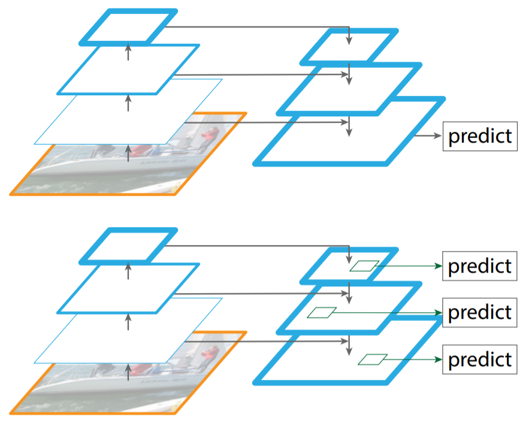
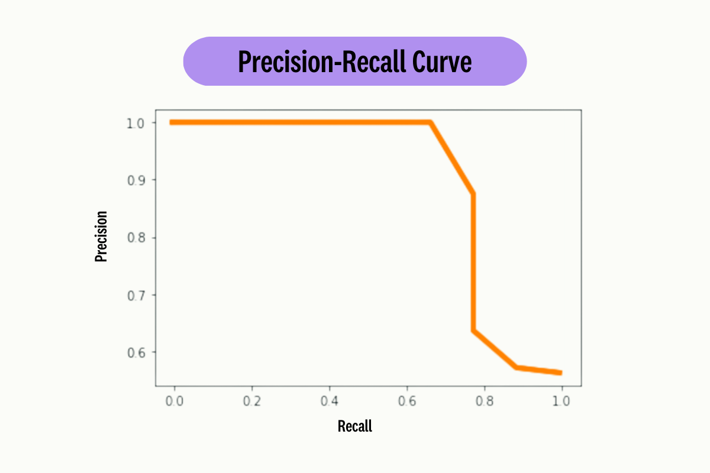

# [객체탐지] 학습부터 탐지까지의 파라미터들

### 빠른 요약
객체탐지의 학습시 요소들은 아래와 같은 것들이 존재합니다.

**전체**
- GT: 사용자가 지정해놓은 정답 데이터 정보

**모델 추론 시**
- confidence score: 모델이 클래스를 확신하는 정도
- confidence threshold
- NMS iou threshold: 어느정도의 같은 영역을 공유하는 중복 박스를 지울 것인가
- 

**평가 시**
- 평가용 iou threshold
- PR 커브 생성용 confidence score threshold 변화
- mAP

**평가 지표**
- cls loss : 모델의 예측과 정답의 차이로 잘못 예측한 정도
- box loss : 예측 bbox의 위치가 GT bbox와 다른 정도
- DFL loss: `Distribution Focal Loss`로 bbox 경계까지의 거리 분포를 예측하게 도와주는 loss (bbox 위치 정밀 회귀용)

## 객체탐지의 예측 과정
객체탐지는 여러 레이어를 통해 `bbox`와 `class score`, `confidence` 등을 뽑아내게 됩니다.

이는 일반적으로 정답을 하나만 만들어내는 이전 회귀/분류 문제와는 약간 다른 형태를 가지고 있습니다.

큰 형태는 보통
1. 이미지
2. backbond
3. feature map
4. neck
5. 여러 크기의 feature map
6. detection head
7. `bbox` + `class score`

로 이루어져 있습니다.

여기에서 **Neck**는 여러 단계의 feature을 섞어서 작은 물체와 큰 물체를 동시에 잡아내기 위해서이며 **Detection Head**의 경우에는 각 위치에서 `bbox`에 대한 수치들과 `class score`을 반환하게 됩니다.

이후에는 여러 예측들에 대한 `confidence score`을 모델마다 다른 방식으로 예측하는 형태를 가집니다.

## 객체탐지의 역전파
객체탐지는 최종 출력값이 여러가지가 있는만큼 역전파 또한 여러 손실함수에서 이루어지게 됩니다.

객체탐지 또한 결국 여러 복잡한 수식으로 이루어진 하나의 모델이기 때문에 함수 및 수식이 존재하며 이를 역전파 하는것이 가능합니다.

보통 예측한 `bbox`와 사용자가 미리 만들어둔 `GT bbox` (Grounded Truth)를 비교하여 만드는 `box loss`와 `DFL`을 사용하며 예측 클래스에 대해서는 `GT class`와 비교를 통한 총 손실을 구한 이후, 역전파를 실행하여 가중치를 바꿔주게 됩니다.

## Neck와 Detection Head
`Neck`와 `Detection Head`는 객체탐지 모델의 핵심 구간중 하나입니다.

**Neck**를 먼저 보면 backbone은 보통 여러 해상도의 `feature map`을 만들게 됩니다.

예를 들어 `32*32`, `16*16`, `64*64` 크기의 여러 피처맵을 생성할 수 있습니다. 

이때 피처맵의 크기에 따라 다른 특징을 가지는데 피처맵의 크기가 클수록 피처맵의 한 픽셀이 가지는 정보가 적어지며 그 픽셀의 수 자체는 늘어나기 때문에 찾는 객체에 대한 정확한 위치를 찾습니다.

반대로 피처맵의 크기가 작으면 한 픽셀에 많은 정보들이 압축되어있기 때문에 오히려 작을수록 작은 객체를 표현하지 못하는 효과를 만들게 됩니다.

**Neck**에는 **FPN**, **PAN**이라는 개념이 존재하는데 FPN의 top-down 방향은 작은 크기의 Feature 맵을 큰 크기의 Feature Map으로 보내주어 세세한 디테일을 추가해주는 방식이 존재합니다.

반대로 **PAN**의 경우에는 큰 피처맵에서 작은 피처맵으로 위치와 세부 정보를 전달하는 방식이 존재합니다. 

**Detection Head**는 Neck가 만들어주는 feature map을 실제 예측값으로 만드는 부분을 말합니다.

Neck에서는 여러 feature map을 만들었는데 Detection Head는 각 위치에 대한 피처 벡터들을 이용하여 두가지를 예측하려 합니다. 
1. 클래스
2. bbox

이를 통해 최종적으로 Detection Head는 feature map의 한 위치에서 `하나의 bbox 정보`와 `모든 클래스에 대한 점수 c개`를 반환하게 됩니다.

쉽게 설명하기 위해 예시를 들면 다음과 같습니다. `[x, y, w, h, class1_score, class2_score, class3_score]`

이때 앞선 **Neck**에서 총 N개의 feature map가 만들어졌다고 한다면 총 N개 만큼의 후보가 생긴다고 볼 수 있습니다.

## 객체탐지의 평가
객체탐지는 평가를 몇가지 수순에 따라 합니다.
1. 모든 예측들을 class 별로 그룹 짓기
2. confidence에 대해서 나열
3. 모든 예측에 대한 GT와의 IoU를 계산
4. TP로 취급할 confidence threshold를 낮춰가며 TP/FP를 누적
5. 정밀도와 재현율 (Precision과 Recall)을 이용하여 pr커브 생성
6. AP (Average precision) 구하기 
7. 클래스별 AP 평균 구하기
8. 최종적으로 mAP 반환.

mAP에도 여러가지 종류가 존재하는데 `mAP50` 같은 경우에는 평가용 iou threshold를 `0.5`로 설정하여 구한 AP 값을 의미하며, `mAP50`의 경우에는 **얼마나 대략적으로 잘 잡는지**를 나타낸다고 인식할 수 있으며 `mAP50-95`의 경우에는 `IoU`를 `0.5`에서 `0.95`까지 `0.05` step을 가지고 확인을 하여 그를 평균낸 값을 의미합니다.

**보통 좋은 모델일수록 높은 Precision 이 오래 유지됩니다.**

