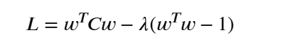

# 머신러닝이란?
머신러닝은 사람이 규칙을 짜는 대신 데이터가 보고 컴퓨터가 규칙을 찾게 하는 방법입니다.

데이터들을 통해 특정 패턴에 따라 결론일 확률을 도출해 내는 방법(수식)을 도출해 내는 방식으로 이루어집니다.

단순히 수학적으로 말하면 $y = f(x)$와 같은 함수를 기계가 직접 도출해 내는 방식이 됩니다.

## 행렬과의 관계
일반적으로 머신러닝을 하게 되면 `pandas`의 `DataFrame`과 같은 데이터 또는 `numpy`의 `ndarray` 같은 $n$차원의 데이터를 사용하게 됩니다.

여기에서 데이터를 보통 입력값 $x$와 정답 $y$로 나누게 됩니다.

이를 `pandas` 식으로 풀어내 보게 된다면
```python
import pandas as pd

df = pd.read_csv('./data.csv')

# 제공되는 입력값 데이터들
X = df.iloc[:, :-1]
# 정답 y
y = df.iloc[:, -1]
```
와 같은 형태가 됩니다.

## 머신러닝 예시
또한 선형 회귀 모델을 예시로 `sklearn`을 사용해보면
```python
from sklearn.model_selection import train_test_split
from sklearn.linear_model import LinearRegression

X_train, X_test, y_train, y_test = train_test_split(
  X, y,
  test_size = 0.2, # 테스트 데이터를 20%로 맞추기
  random_state=42, # 지속적으로 동일한 무작위 시드 부여
)

# 모델 선택
model = LinearRegression()

# 학습
model.fit(X_train, y_train)

# 예측 결과 보기
pred = model.predict(X_test)

print(pred)
```

## 머신러닝의 큰 분류
머신러닝은 크게 3가지로 나뉘어 있습니다.

1. 지도학습
2. 비지도학습
3. 강화학습 - 따로 설명하진 않겠지만 보상을 통해 컴퓨터가 알아서 수식을 수정해 나가는 방식입니다.

### 지도학습
지도학습은 정답이 있는 데이터를 통해 학습하는 과정을 말합니다. 예를 들어 주어진 이미지 50장이 있을 때, 이것이 강아지 또는 고양이라는 정확한 $y$값이 존재할 때, 이를 통해 학습을 시키는 방법입니다.

지도학습에서도 분류가 2가지로 나뉩니다.

#### 지도학습 - 회귀 (Regressor)
연속적인 숫자 값을 예측하는 것을 말합니다.

결과가 `['강아지', '고양이', '사과']` 등과 같이 나뉘어 있는 것이 아닌 `결과 = 정수값`, `결과 = 내일 주식의 종가` 등과 같은 형태로 나타나는 것을 말합니다.

대표적인 모델로는
1. 선형 회귀: 데이터의 경향성을 가장 잘 나타내는 하나의 직선을 찾는 모델
2. 릿지 회귀: 선형 회귀에서 과적합을 막기 위해 **중요도가 낮은 변수의 영향력을 0에 가깝게 줄여서** 안정적으로 만드는 모델 ($L_2$ 규제)
3. 라쏘 회귀: 릿지와 동일하게 과적합을 막기 위해 **중요도가 떨어지는 변수의 영향력을 0으로 만들어 제거**하는 방식 ($L_1$ 규제)
4. 랜덤 포레스트 회귀: 수많은 의사결정 나무(if문과 같은 조건 트리)를 독립적으로 만든 후, 그 예측값들의 평균을 내어 결과를 내는 모델 (분류도 가능)
5. XGBoost 회귀: 나무를 한 번에 만들지 않고, 앞선 나무가 틀린 오류를 다음 나무가 보완하는 방식 (과적합 위험 있음, 난이도 있음) (분류도 가능)

가 있습니다.

#### 지도학습 - 분류 (Classifier)
분류는 이미 말하였듯, `['강아지', '고양이', '사과']` 또는 `['남자', '여자']` 등과 같이 몇 가지 정답들이 이미 정해져 있는 경우를 말합니다. 

대표적인 모델로는

1. 로지스틱 회귀: 데이터를 나누는 선형 경계선을 찾아 시그모이드 함수를 통해 결과를 확률로 바꾸어 $0.5$(또는 사용자 설정)보다 크면 통과시키는 방식으로 판단하는 분류입니다. (회귀를 통해 확률을 찾아 `회귀`라는 단어가 붙습니다.)
2. KNN: `K-Nearest Neighbors`라는 의미로 가장 가까운 데이터 $K$개를 통해 분류합니다.
3. 결정 트리: 앞에서 설명한 의사결정 트리(if문과 같은 조건 트리)입니다.
4. 랜덤 포레스트: 위에서 말한 `랜덤 포레스트 회귀`에서 평균을 내는 것이 아닌 다수결을 따르는 방식입니다.
5. SVM: `Support Vector Machine`으로 두 클래스 사이의 거리를 가장 넓게 벌리는 최고 경계선(범위 또는 도로로 표현 가능)을 찾아 분류하는 모델입니다. (로지스틱 회귀와 비슷한 느낌)
6. 나이브 베이즈: 조건부 확률을 활용하여 특정 조건들이 주어졌을 때 어떤 클래스일 확률이 가장 높은지 계산하는 모델. 모든 요소들이 독립적으로 움직인다는 가정하에 요소에 따라 다른 점수를 부여하여 판단하는 모델입니다.
7. XGBoost: 위와 동일

## 비지도 학습
비지도학습은 단어에서 알 수 있듯이 정답 $y$가 없는 데이터에서 $X$만을 가지고 데이터 패턴을 찾는 방식입니다. 데이터에 존재하는 수학적 성질을 기준으로 컴퓨터가 스스로 기준을 세워 학습하게 됩니다. 또한 사용자는 정답 대신에 데이터를 묶거나 쪼개는 규칙 (알고리즘과 하이퍼파라미터)을 설정하여 원하는 방향으로 학습을 유도하게 됩니다. 

이것이 일반적으로 고객들을 비슷한 그룹으로 나누기, 비슷한 상품끼리 묶기 등의 예시가 있습니다.

대표적인 비지도 학습으로는
- K-Means (군집화): 사용자가 최종적으로 나눌 그룹의 개수 $K$를 지정하면 $K$개의 그룹으로 묶는 군집화 방식입니다.
- DBSCAN (군집화): 데이터가 얼마나 빽빽하게 모여 있는지를 기준으로 그룹을 나누는 군집화 알고리즘입니다. 특정 수치 이상의 밀도로 데이터가 모여 있으면 묶고, 그 외의 데이터들은 노이즈로 판별합니다.
- PCA (차원 축소, 주성분 분석): 복잡하고 변수가 많은 고차원 데이터에서 핵심 정보로 데이터를 변환시킵니다. 보통 행렬곱을 통해 만들어집니다. 고유값분해를 통해 정보를 가장 적게 잃어버리는 축을 찾는 방식입니다.
- Isolation Forest (이상치 탐지): 데이터 중에서 정상 패턴과 완전히 동떨어진 이상치를 빠르게 찾아내는 이상 탐지 알고리즘입니다. 데이터를 무작위로 쪼개어 나가는 트리를 만들어 적은 조건만으로 혼자 남게 되는 데이터를 찾아내는 방식입니다.

## 중간 궁금증 - PCA에서 왜 고유벡터가 주성분을 만드는 가중치인지
> PCA는 고유값분해를 통해 $[(\text{고유값 } \lambda, \text{고유벡터}), \ldots]$을 찾게 됩니다. 여기에서 기존의 행렬 $A\ (n, m)$에서 공분산인 $C\ (m, m)$을 찾았을 때 벡터 $v\ (1, m)$과 고유값 $\lambda$(람다)를 찾아야 합니다. 이를 통해 $X\ (\text{벡터 개수}, m)$을 만들게 됩니다.
> 왜 하필이면 행렬식으로 나온 고유벡터 $v$가 나오는 걸까요? 이것은 기존의 데이터를 가중치로 선형결합했을 때의 새로운 분산을 최대화하는 것을 목표로 잡은 것입니다. 여기에서 $\text{변환된 분산} = v^\top C v$가 최대가 되어야 하는데 $v$의 요소들이 무한히 증가하면 `변환된 분산` 또한 무한히 증가하기 때문에 $v^\top v$(자기내적)이 $1$이 되어야 하는 제약 조건을 가지게 됩니다. 여기에서 **라그랑주 승수법**이라는 도구를 통해 식 $L$을 만들어 이를 미분하여 최종적으로 고유값 방정식의 형태가 나옵니다. 



> 내용이 주제와 다르기 때문에 나중에 더 자세히 알아보겠습니다.

## 전처리
실제 머신러닝에서는 모델보다 전처리가 더 중요할 때가 많은데, 데이터들에서 좋은 모델을 만들기 위한 적합한 것들을 선별하고, 데이터를 좋은 형태로 바꾸는 것을 말합니다.

예를 들면
- 결측치
- 이상치
- 스케일링
- 원-핫 인코딩
- 라벨 인코딩
- `train`/`test` 나누기

## 파이프라이닝/그리드서치CV
전처리, 모델 학습, 평가를 하나의 형태로 만들어 하나의 흐름으로 만들게 하는 방식을 말합니다.

## 내부 원리
내부적으로 사용하는 원리를 이용하여 더욱 세밀한 원리와 이해를 할 수 있습니다.

배우는 것 중 몇 가지를 예시로 들면
- 선형 회귀 원리
- 경사 하강법
- 손실함수
- 가중치와 편향
- 엔트로피
- 랜덤 포레스트
- 공분산 
- 차원축소

등이 있습니다.

## 딥러닝
딥러닝은 위에서 말한 머신러닝의 하위 개념으로 가중치, 편향, $L_1/L_2$ 규제 등과 같은 여러 기법을 통해 여러 층을 통한 신경망을 만드는 것입니다. (저는 몇 년 전에는 대단하다고 생각했는데 알고 보니까 머신러닝의 일부분일 뿐이었습니다!)

## 앞으로 할 일
우선 이제 슬슬 수학만 하지 않고 직접 여러 모델 피팅과 전처리 등을 해보면서 병합 지점을 잡아 나가려고 합니다.
