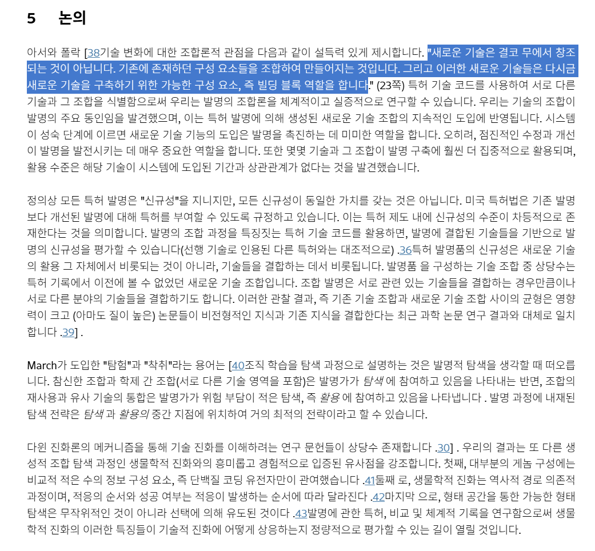
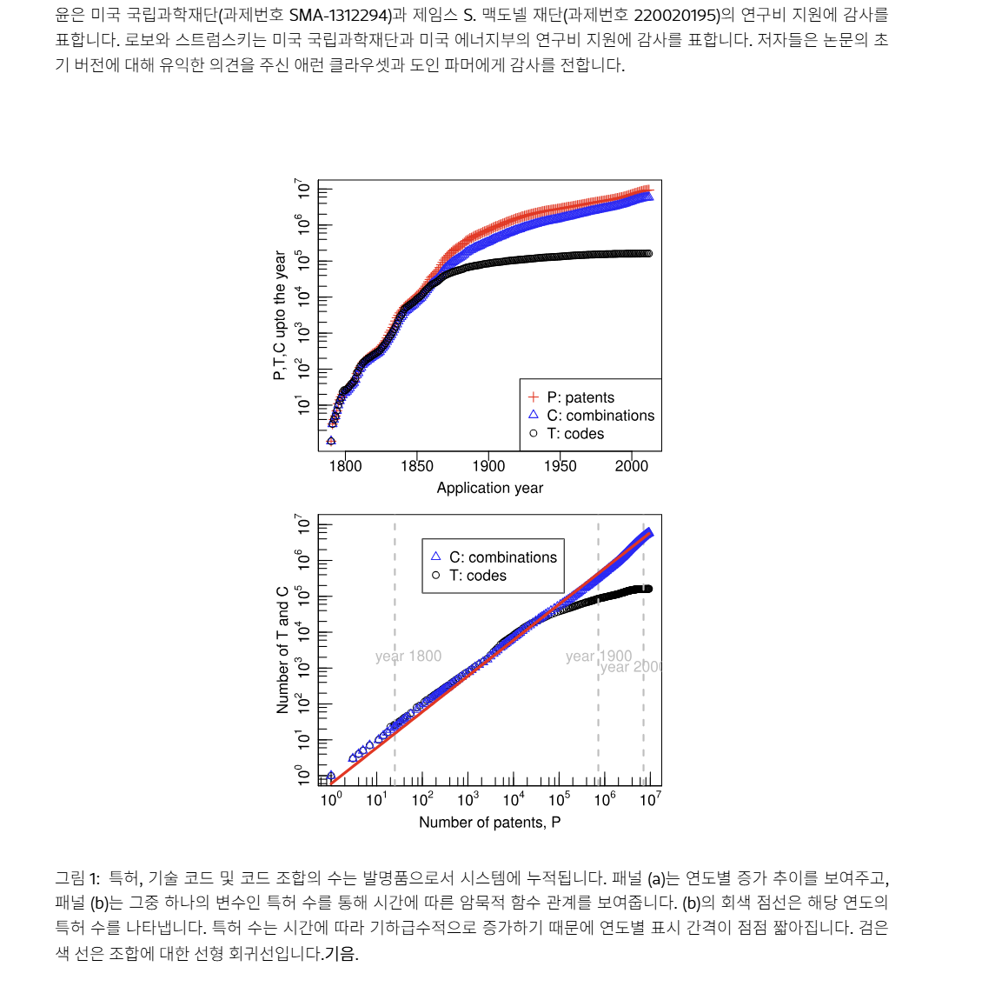
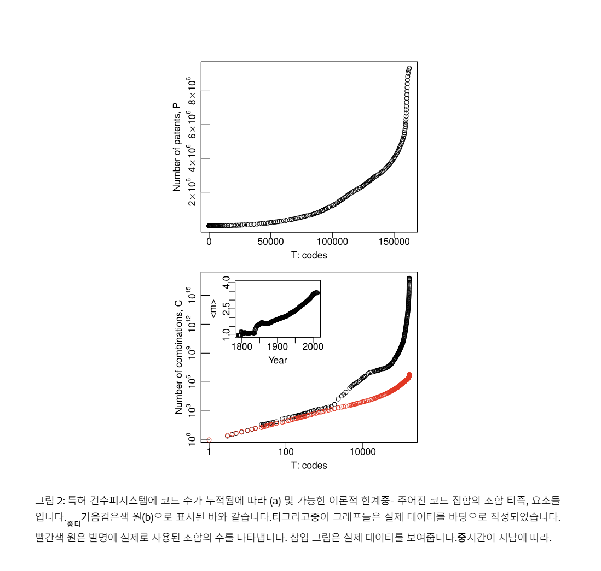
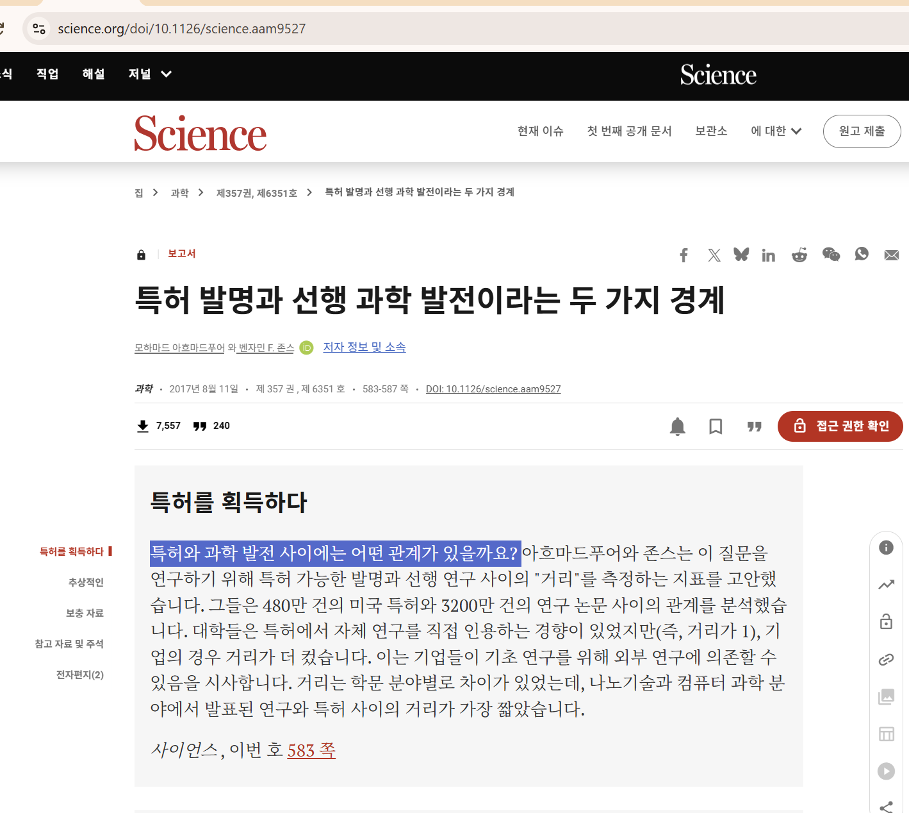
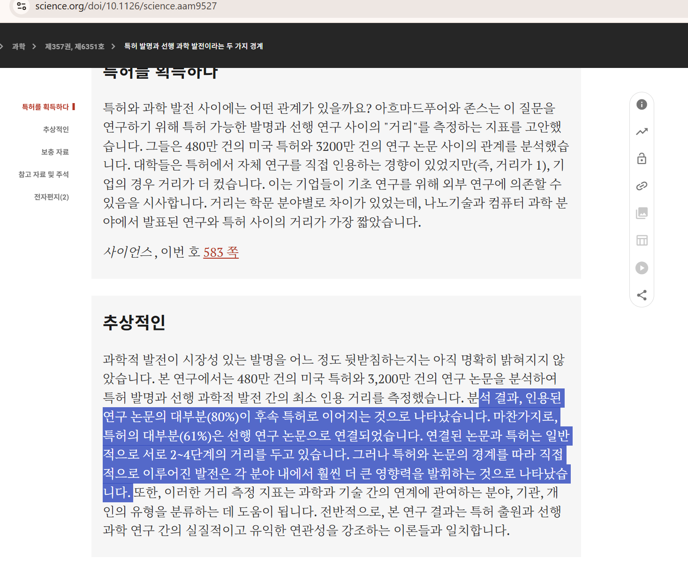
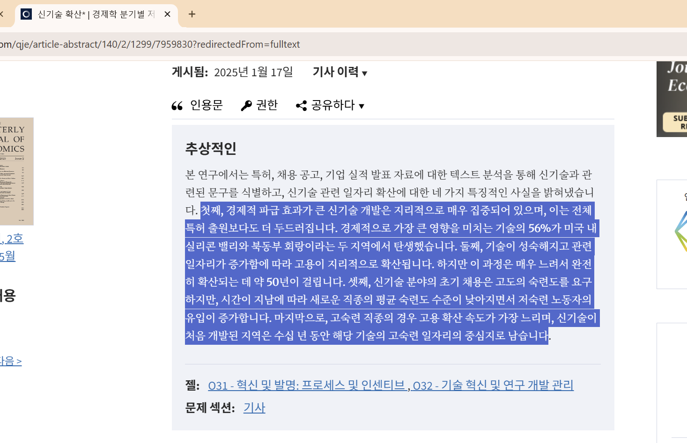
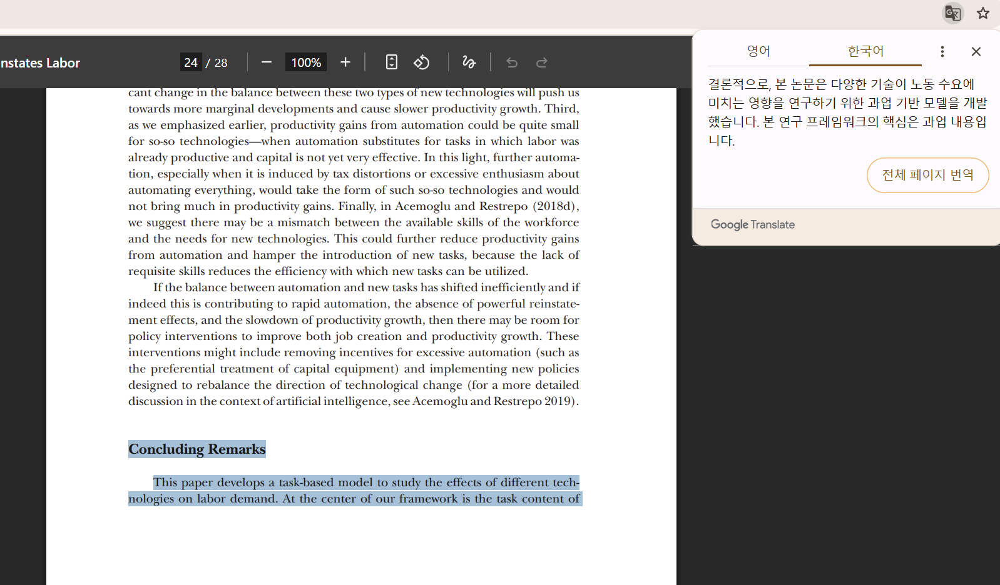
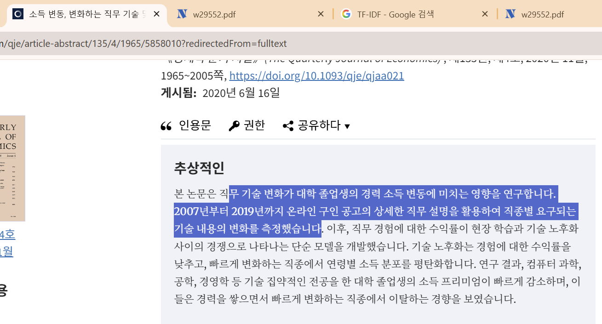

# 기술 변화 기반 미래 직무·역량 분석 서비스

## 1. 프로젝트 목표

과학·기술 분야에서 나타나는 변화 신호를 분석하여

> 미래에 성장할 가능성이 있는 기술 → 필요한 업무(Task) → 필요한 역량(Skill)

을 추정하고, 이를 사용자의 현재 역량·성향과 비교하여 진로 방향을 제안한다.

## 2. 문제 정의

기존 진로 서비스는 주로 현재 존재하는 직업과 현재 필요한 역량을 기준으로 추천한다.

하지만 진로를 준비하는 사람에게는

> 현재 무엇이 필요한가?

보다

> 앞으로 무엇이 필요해질 가능성이 있는가?

도 중요하다.

따라서 단순히 유망 직업을 추천하는 것이 아니라 **기술 변화의 전조부터 분석**한다.

## 3. 핵심 흐름

논문·연구 증가  
+ 특허·기술 개발 증가  
+ 관련 분야의 결합  
↓  
성장 가능성이 있는 기술 후보  
↓  
기술과 관련된 Task 탐색  
↓  
Task 수행에 필요한 Skill 추출  
↓  
미래 인재 역량 Profile  
↓  
사용자 Skill / 성향과 비교  
↓  
진로·학습 방향 추천

## 4. 분석 단위

데이터를 다음 단위로 분리한다.

Technology  
↓  
Task  
↓  
Skill

예:

생성형 AI  
↓  
AI 결과 검증  
↓  
통계 / Python / 비판적 사고

직업 이름 자체보다 **직업을 구성하는 Task와 Skill**을 중심으로 분석한다.

## 5. 논문·특허 데이터 처리

논문과 특허에서 다음과 같은 값을 만든다.

- 연도별 관련 논문 수
- 논문 증가율
- 연도별 관련 특허 수
- 특허 증가율
- 새로운 연구주제 등장 정도
- 서로 다른 연구 분야의 결합 정도
- 논문 ↔ 특허 내용 유사도

문서 데이터는 다음과 같이 처리한다.

논문 / 특허 Abstract  
↓  
TF-IDF 또는 Embedding  
↓  
Vector  
↓  
Clustering / Cosine Similarity

이를 통해 비슷한 연구들을 묶어 **Technology Candidate**를 생성한다.

## 6. 미래 기술 성장 예측

학습 데이터의 기본 형태는 다음과 같이 만든다.

| 연도 | 기술 후보 | 논문 증가율 | 특허 증가율 | 신규성 | 연구 응집도 | 논문-특허 유사도 | 향후 성장 |
|---|---|---:|---:|---:|---:|---:|---:|
| 2018 | 기술 A | 0.21 | 0.15 | 0.72 | 0.61 | 0.58 | 1 |

모델 후보:

- Logistic / Linear Regression
- Random Forest
- Gradient Boosting
- XGBoost

예측 대상은

> 향후 1~3년 동안 해당 기술의 연구·특허·산업 확산이 증가하는가

로 설정한다.

## 7. 기술 → Task → Skill 변환

성장 가능성이 높은 기술의 문서 Vector와 직무 Task 문장을 비교한다.

Technology Vector  
↕ Cosine Similarity  
Task Vector

관련성이 높은 Task를 찾은 뒤 O*NET/NCS 등의 데이터를 이용하여 필요한 Skill을 가져온다.

예:

기술 A  
↓  
관련 Task A / B / C  
↓  
Programming  
Mathematics  
Systems Analysis  
Critical Thinking

이를 해당 기술의 **미래 인재 역량 Profile**로 사용한다.

## 8. 사용자 매핑 및 최종 결과

사용자에게 다음 정보를 입력받는다.

- 현재 보유 Skill
- Skill 숙련도
- 관심 분야
- 직업적 흥미(RIASEC 등)
- 업무 성향

그리고

미래 기술 요구 Skill  
↕  
사용자 현재 Skill

을 비교한다.

최종적으로 다음과 같이 제공한다.

기술 A 성장 가능성 : 높음

필요 역량
- Programming
- Mathematics
- Systems Analysis

사용자 강점
- Programming

보완 추천
- Mathematics
- Systems Analysis

사용자 적합도 : 78%

모델 검증은 Random Split보다 시간 순서를 유지하여

과거 데이터 → Train  
중간 기간 → Validation  
최근 기간 → Test

형태로 구성한다.

---

# 활용 데이터

## [OpenAlex Works](https://developers.openalex.org/api-reference/works)

논문·연구 데이터

주요 컬럼:

- `title`
- `publication_year`
- `publication_date`
- `abstract_inverted_index`
- `topics`
- `keywords`
- `authorships`
- `referenced_works`
- `cited_by_count`

## [Harvard USPTO Patent Dataset (HUPD)](https://github.com/suzgunmirac/hupd)

특허 데이터

주요 컬럼:

- `title`
- `filing_date`
- `date_published`
- `main_cpc_label`
- `cpc_labels`
- `abstract`
- `claims`
- `background`
- `summary`
- `full_description`

## [O*NET Task Statements](https://www.onetcenter.org/dictionary/30.3/excel/task_statements.html)

직업별 Task 데이터

주요 컬럼:

- `O*NET-SOC Code`
- `Title`
- `Task ID`
- `Task`
- `Task Type`
- `Date`

## [O*NET Emerging Tasks](https://www.onetcenter.org/dictionary/30.3/excel/emerging_tasks.html)

새롭게 등장하거나 변경되는 Task 데이터

주요 컬럼:

- `O*NET-SOC Code`
- `Title`
- `Task`
- `Category`
- `Original Task`
- `Date`

## [O*NET Essential Skills](https://www.onetcenter.org/dictionary/30.3/excel/essential_skills.html)

직업별 Skill 데이터

주요 컬럼:

- `O*NET-SOC Code`
- `Title`
- `Element ID`
- `Element Name`
- `Data Value`
- `Date`

## [O*NET Career Interest Types](https://www.onetcenter.org/dictionary/30.3/excel/career_interest_types.html)

사용자 설문과 직업을 연결하기 위한 RIASEC 데이터

- Realistic
- Investigative
- Artistic
- Social
- Enterprising
- Conventional

## [NCS 국가직무능력표준](https://www.data.go.kr/data/15157547/openapi.do?recommendDataYn=Y)

한국 직무·역량 데이터

기본 구조:

직무  
↓  
능력단위  
↓  
능력단위요소  
↓  
지식 / 기술 / 태도

---

# 참고 연구

## [Invention as a Combinatorial Process: Evidence from US Patents](https://arxiv.org/html/1406.2938v1)

새로운 기술이 기존 지식과 기술의 새로운 **조합**을 통해 만들어질 수 있다는 근거.

## [The Dual Frontier: Patented Inventions and Prior Scientific Advance](https://www.science.org/doi/10.1126/science.aam9527)

과학 연구와 이후 특허·기술 발전 사이의 관계를 분석한 연구. 

## [The Diffusion of New Technologies](https://academic.oup.com/qje/article/140/2/1299/7959830)

새로운 기술이 특허에서 등장한 뒤 기업·지역·채용시장으로 확산되는 과정을 분석한 연구.

## [Technology-Skill Complementarity and Labor Displacement](https://www.nber.org/system/files/working_papers/w29552/w29552.pdf)

특허 문서와 직업 Task 문서를 연결하여 **기술과 업무의 관계를 Text Similarity로 측정**한 연구. 

## [Automation and New Tasks](https://www.aeaweb.org/articles?id=10.1257%2Fjep.33.2.3)

기술 발전이 기존 Task를 대체하는 동시에 새로운 Task를 만들어낼 수 있다는 이론적 근거. 

## [Earnings Dynamics, Changing Job Skills, and STEM Careers](https://academic.oup.com/qje/article/135/4/1965/5858010)

기술 변화가 빠른 분야에서 동일 직업 내부의 요구 Skill도 빠르게 변화할 수 있다는 근거.

