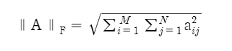
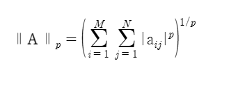
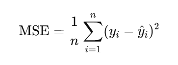
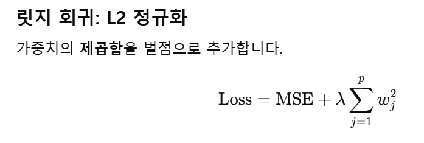
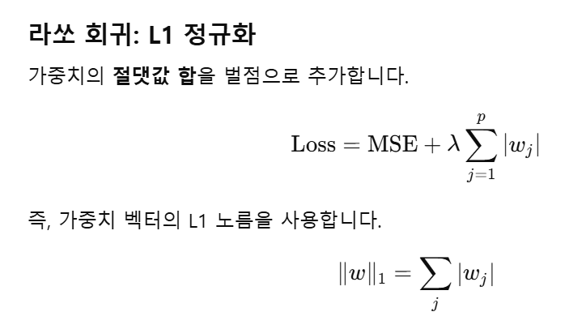
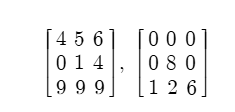
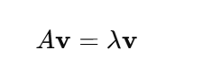
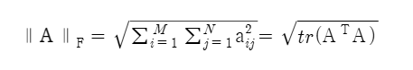

## 하기전 행렬의 이동 복습
이전에 했었던 개념중 가장 복잡하게 느꼈던 행렬의 이동에 대해서 복습하고 시작하려합니다.

행렬에서는 행렬 + 스칼라를 할 수 없습니다. (파이썬에서 가능하지만 선형대수학 연산은 아닙니다.) 여기에서 선형대수학에서는 정방 행렬에 스칼라를 더하는 방식이 있는데 이를 행렬 이동이라고 합니다.

# 행렬 파트 2 - 행렬의 확장 개념
행렬 곱셈은 수학자들에게 저희가 받은 멋진 선물입니다. 하지만 기본 선형대수학을 넘어 응용 선형대수학의 데이터과학 알고리즘을 이해하고 개발하려면 행렬곱셈만으로는 부족합니다.

이번 장에서는 행렬 노름과 행렬 공간에 대해 이야기합니다. 근본적으로 행렬 노름은 벡터 노름의 확장이고, 행렬 공간은 벡터 부분공간의 확장입니다. (결국 선형 가중 결합입니다.)

전치와 곱셈같은 기본 개념을 넘어 **선형 독립성**, **계수**, **행렬식**과 같은 개념을 이해하면 **역**, **고윳값**, **특잇값**과 같은 고급 주제를 이해할 수 있습니다. *이러한 고급 주제는 데이터 과학 응용에 꼭 필요한 선형대수학의 핵심입니다.*

## 5.1 행렬 노름
벡터 노름은 유클리드 기하학적 길이로 벡터 원소의 제곱합이 제곱근으로 계산됩니다.

행렬 노름에서 **단 하나**의 행렬 노름은 없습ㄴ디ㅏ. 행렬은 여러 개의 서로 다른 노름을 가집니다. 각 행렬 노름은 행렬을 특정짓는 하나의 숫자라는 점에서 벡터 노름과 유사합니다. 행렬 `A`의 노름은 `||A||`와 같이 이중 수직선을 사용하여 나타냅니다.

각 행렬 노름은 서로 다른 의미를 가집니다. 수많은 행렬 노름은 크게 2가지로 나뉘어집니다.
- 원소별 계열: 행렬의 개별 원소를 기반으로 계산되어 행렬의 원소의 크기를 반영
- 유도 계열: 행렬은 벡터를 변환하는 기능이 있는데 변환으로 인한 벡터의 크기가 얼마나 조정되는지에 대한 측정치

유클리드 노름은 프로베니우스 노름이라고도 하며 모든행렬 원소의 제곱합의 제곱근으로 계산됩니다.

프로베니우스 노름은 `l2 노름`이라고도 합니다. 그리고 `l2 노름`은 원소별 `p-노름`에 대한 일반공식(`p=2`일 때 프로베니우스 노름)에서 이름을 딴 것입니다.

> 프로베니우스 노름은 벡터의 유클리드 노름을 구하는 것과 같으며 `p-노름`은 벡터나 행렬의 원소 크기를 하나의 숫자로 나타내는 일반화된 계산 방법입니다.

행렬 노름은 머신러닝과 통계 분석의 여러곳에서 응용되고 있습니다. 그중에서 **정규화**는 중요한 응용입니다. 정규화의 목표는 모델 적합성을 개선하고 발견되지 않는 데이터에 대한 모델의 일반화 성능을 높이는 것입니다. (데이터의 범위 또는 단위 차이에 의한 왜곡 감쇄) 정규화의 기본 생각은 행렬 노름을 최소화 알고리즘에 비용함수로 추가하는 것입니다. 노름은 모델 매개변수가 너무 커지거나 희소 결과가 나오는 것을 방지합니다. 

> 각각 L1, L2 릿지 회귀 또는 라쏘 회귀 라고도 합니다. 릿지회귀는 L2 정규화라고 하며 가중치의 제곱합을 벌점으로 추가합니다. L1 정규화인 라쏘 회귀는 가중치의 절댓값 합을 벌점으로 추가합니다.

프로베니우스 행렬 거리는 프로베니우스 노름에서 `A`를 `A - B`로 바꾸면 `A`와 `B`의 거리가 됩니다.

### 5.1.1 행렬의 대각합과 프로베니우스 노름
행렬의 대각합은 대각 원소의 합이 `tr(A)`로 나타냅니다. 다음 행렬은 모두 대각합이 `14`로 동일합니다.

대각합에는 몇가지 흥미로운 특성이 있습니다. 예를 들어 행렬의 대각합은 행렬의 고윳값과 같고 결국 행렬의 고유공간의 부피에 대한 측정치가 됩니다. 대각합의 많은 속성은 데이터 과학 응용과 관련이 적지만 다음과 같은 한가지 흥미로운 점이 존재합니다.

> 행렬의 고윳값은 행렬 A를 곱했을 때 방향은 그대로이고 크기만 변하는 벡터를 말합니다. 아래의 공식에서 `v`가 고유 벡터이며 `λ`가 고유값입니다.

> 아래 사진은 프로베니우스 노름의 크기가 행렬의 전치와 행렬을 곱한 결과의 대각합의 제곱근과 같음을 나타냅니다. (행렬 내적의 대각합의 제곱근) 이는 스스로 내적을 하면 대각 원소는 각 열벡터를 자기 자신과 내적한 값이 되기 때문입니다.

## 행렬 공간
행렬 공간은 전통 및 응용 선형대수학의 많은 주제에서 핵심적인 개념입니다. 행렬 공간의 개념은 어렵지 않으며 근본적으로 행렬의 서로 다른 특징들 사이의 선형 가중 결합입니다.