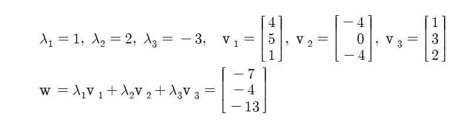
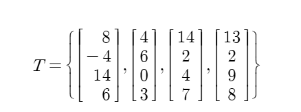
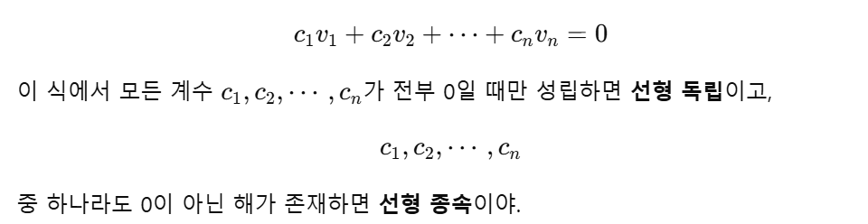
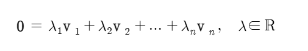
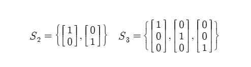
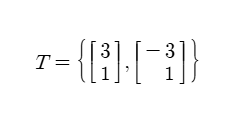
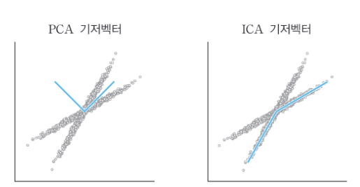

# 벡터, 파트 2: 벡터의 확장 개념
이전 장에서는 벡터와 벡터의 기본 연산에 대한 이해를 돕는 기초적인 내용을 다뤘습니다. 이제 선형대수학 지식의 범위를 넓히기 위해 선형 독립성, 부분공간, 기저 등 상호 연관된 개념들에 대해 학습해 보겠습니다.

여기서 일부 내용은 추상적이어서 응용 선형대수학과는 관련 없는 것처럼 보일 수 있지만 실제로 벡터 부분공간과 통계 모델의 데이터 적합 사이의 관계처럼 매우 가깝습니다. 데이터 과학 응용은 나중에 다루므로 지금은 어려운 내용들을 쉽게 이해할 수 있도록 기초적인 내용에 좀 더 집중하길 바랍니다.

## 2.1 벡터 집합
먼저 쉬운 내용으로 시작해봅시다. 벡터들의 모음을 집합이라고 합니다. 벡터 한 뭉치를 가방에 넣고 다닌다고 생각해 볼 때, 벡터 집합은 `S` 또는 `V`와 같이 대문자 이탤릭체로 표시합니다. 수학적으로는 집합을 다음과 같이 나타낼 수 있습니다.

`V = {v1, ..., vn}`

예를 들어 100개국의 `COVID-19` `양성 환자`, `입원` 및 `사망자 수`에 대한 데이터 집합이 있다고 상상해 봅시다. 각 국가의 데이터를 세 개의 원소를 가진 벡터에 저장하고 100개의 벡터가 포함된 벡터 집합을 생성할 수 있습니다.

벡터 집합은 유한 또는 무한한 수의 벡터를 가질 수 있습니다. 무한한 수의 벡터를 가진 벡터 집합은 너무 추상적으로 느껴지기도 하지만, 벡터 부분공간이 무한한 벡터 집합이고 이는 통계 모델을 데이터에 적합시킬 때 큰 영향을 미칩니다.

## 2.2 선형 가중 결합
선형 가중 결합은 여러 변수마다 가중치를 다르게 주어 정보를 혼합하는 방법입니다. 이 기초 연산을 선형 혼합, 또는 가중결합이라고도 합니다. (선형이라고 가정). 때로는 가중 대신 계수라는 용어를 사용하기도 합니다.

선형 가중 결합은 단순하게 말하면 스칼라-벡터 곱셈을 한 다음 합하는 것입니다. 벡터 집합에서 각 벡터에 스칼라를 곱한 다음 이들을 더해 하나의 벡터를 만듭니다.

선형 가중 결합: `w = λ1v1 + λ2v2 + ... + λnvn`이 됩니다.

여기에서 모든 벡터 `v(i)`의 차원은 같다고 가정합니다.

선형 가중 결합은 여러 방면에서 응용될 수 있습니다. 
- 통계 모델로부터 예측된 데이터는 최소제곱 알고리즘을 통해 계산되는 회귀변수(독립변수 v(n))와 계수(스칼라 λn)의 선형 가중 결합으로 생성됩니다. (최소제곱 알고리즘은 실제값과 예측값의 차의 제곱합을 말합니다.)
- 주성분 분석과 같은 차원 축소 과정에서 각 성분은 성분의 분산을 최대화하는 가중치(계수)와 데이터 채널의 선형 가중 결합으로 도출됩니다. (성분의 분산을 최대화한다는 뜻은 여러 성분들의 데이터가 넓게 퍼지는 방향을 찾는다는 뜻입니다.)
- 인공 신경망에는 두 가지 연산, 즉 입력 데이터의 선형 가중 결합과 비선형 변환이 있습니다. 가중치는 비용 함수를 최소화하도록 학습되었습니다. 비용함수는 일반적으로 모델 예측과 실제 목표 변수 사이의 차이입니다. (인공신경망은 한 층에서 보통 두 단계를 반복합니다. 가중치를 곱해서 더하기 -> RELU와 같은 비선형 변환. 여기에서 예측과 실제값의 오차를 계산한 것이 비용함수입니다.)

## 2.3 선형 독립성
벡터 집합에서 적어도 하나의 벡터를 집합의 다른 벡터들의 선형 가중 결합으로 나타낼 수 있을 때 벡터 집합을 선형 종속성이라고 합니다. 반대로 집합에 있는 벡터들의 선형 가중 결합으로 집합의 아무런 벡터도 나타낼 수 없다면 벡터 집합은 선형 독립적입니다.

> 이를 쉽게 말하면 벡터 하나를 다른 벡터들을 늘리고 줄이고 더해서 만들 수 있는지에 대한 것입니다. [1, 2] [2, 4]는 서로 비율적으로 같으므로 해당 벡터집합은 선형 종속적이지만 [0, 1] [1, 0]은 비율적으로 다르므로 선형 독립적이라고 부릅니다.

복잡한 예시로

와 같은 경우 또한 선형 종속적입니다. 이를 눈으로만 보고 알아내기는 쉽지 않습니다. 데이터 과학 분야에서는 선형 독립성을 결정하기 위해 벡터 집합으로 행렬을 만들고, 행렬의 계수를 계산한 다음 행의 수와 열의 수 중에서 작은 값과 비교하게 됩니다. 행렬 계수에 대해 아직 배우지 않았기 때문에 그 내용을 지금 이해하기 어렵습니다.

> gpt에 물어보니 이 정도로 이해했습니다. 일단 나중에 더 깊이 할 것 같으니 가볍게 넘기겠습니다.

### 2.3.1 수학에서의 선형 독립성

의 의미는 선형 종속적이라면 집합의 벡터들의 선형 가중 결합으로 영벡터를 만들 수 있다는 것입니다.

식을 참으로 만드는 `λ`를 찾을 수 있다면 벡터 집합은 선형 종속적입니다. 반대로 벡터를 선형적으로 결합해서 영벡터를 생성할 수 있는 방법이 없다면 벡터 집합은 선형 독립적입니다.

> 위 부분 또한 이해가 잘 되지 않아 조금 더 이해를 해보았습니다. **영벡터가 들어간 벡터 집합은 무조건 선형 종속이다**를 설명하는 내용이 있었는데, `0 = w1v1 + w2v2 + ... + wnvn`에서 모든 `wi`들이 0이면 성립하며, 이를 **자명한 해**라고 앞서 말했었습니다. 그렇기에 선형 종속은 `wi`가 하나라도 0이 아닌 답이 있는 경우에 성립합니다. 예를 들어 `[0, 0] [1, 2]`의 경우에는 `w1`이 어떤 값을 가져도 `w2`가 `0`이기만 하면 선형 종속이 되기도 합니다. 이때, 위의 식의 좌항을 0벡터로 만드는 이유는 이것이 더 일반적이어서라고 합니다. (결국 이항하면 다항식을 풀기 쉽듯)

## 2.4 부분공간과 생성
선형 가중 결합을 소개할 때 특정 가중치를 사용한 예제를 보여줬습니다. 부분공간 또한 비슷합니다. 하지만 집합 안에서 벡터들을 선형 결합할 수 있는 무한한 방법을 다룹니다.

다시 말해, (유한한) 벡터 집합의 동일한 벡터들을 사용하지만 다른 가중치 숫자를 사용해서 무한히 선형 결합하는 방식으로 벡터 부분공간을 만듭니다. 가능한 모든 선형 가중 결합을 구성하는 메커니즘을 벡터 집합의 생성이라고 합니다.

> 이는 선형대수에서 정말 중요한 부분공간 subspace와 생성 span의 이야기입니다. 이는 어떤 벡터들을 재료로 삼고, 그 벡터들을 여러 비율로 섞어서 만들 수 있는 모든 벡터들의 집합을 생성공간(span)이라고 합니다. 그리고 그렇게 만들어진 공간이 원점을 지나고, 더하기/스칼라배를 해도 그 안에 머무르면 부분공간(subspace)이라고 합니다.

> 예를 들어 w1v1 + w2v2에서 v1 = [1, 0], v2 = [0, 1] 이라고 할 때, w1, w2가 [3, 2]면 [3, 2]가 결과로 나오고 [-1, 5]이면 [-1, 5]가 결과로 나옵니다. 이렇게 만들어지는 전체 벡터 집합을 span(v1, v2)라고 합니다. 

> subspace의 경우에는 스칼라 곱을 해도 그 공간 안에 존재해야 합니다. 따라서 부분공간은 0*v = 0 이 성립해야 하므로 (스칼라가 0일 경우 스칼라배는 0) 원점을 항상 지나는 벡터여야 합니다. 

> 이전에 투영에서 베타r은 span(r)이라고 생각할 수 있습니다.

벡터 수와 차원은 무조건 같지 않다는 것이 중요한 부분입니다. 벡터가 2개 있다고 무조건 2차원인 공간을 만드는 것이 아닙니다.

두 벡터가 [1, 1, 1] [2, 2, 2]라고 한다면 두 벡터의 방향은 같기 때문에 span을 계산해보면 span([1, 1, 1], [2, 2, 2]) = span([1, 1, 1]) 과 동일하기 때문에 이는 1차원 직선입니다.

이 때문에 R^3 와 같은 3차원에서는 독립적인 방향이 최대 3개이며

- 독립 벡터 1개 = 직선
- 독립 벡터 2개 = 평면
- 독립 벡터 3개 = 3차원 전체 공간
- 벡터 4개 이상 = 무조건 선형 종속

> 최종적으로 중요한 것은 벡터 집합의 모든 가능한 선형 결합을 통해서 벡터 부분 공간이 생긴다는 것만 기억하면 됩니다.

## 2.5 기저
암스테르담과 테네리페 사이의 거리는 대략 얼마일까요? 대략 2,000 정도라고 합니다. 여기에서 2,000은 무슨 뜻일까요? 이 숫자는 기저(basis) 단위를 부여해야 의미가 있습니다. 기저는 일종의 공간을 측정하기 위한 자와 같습니다.

이 예에서 단위는 마일입니다. 그래서 네덜란드-스페인 간 거리의 기저 측정치는 1마일입니다.

기저는 행렬의 정보를 설명하는데 사용하는 자(ruler)의 집합입니다. 예와 마찬가지로 동일한 데이터를 다양한 자로 설명할 수 있습니다. 하지만 일부 상황에 따라 사용하기 편리한 단위가 있습니다.

가장 일반적인 기저 집합은 데카르트 좌표계(Cartesian Coordinate System)입니다. 데카르트 좌표계는 초등학교 때부터 이미 사용했던 익숙한 XY 평면입니다. 다음은 2차원과 3차원 데카르트 그래프의 기저 집합입니다.

데카르트 기저 집합은 서로 직교하며 단위 길이인 벡터로 이루어져 있습니다. 이는 엄청난 특성으로 데카르트 기준집합이 어느 곳에서든 존재하는 이유입니다. (실제로 표준 기저 집합이라고 불립니다.)

그러나 이것이 유일한 기저 집합은 아닙니다. 다음 집합은 R^2의 또 다른 기저 집합입니다.

기저집합 S2와 T는 모두 동일한 부분공간을 생성합니다.

그런데 왜 S보다 T를 선호할까요? 데이터 점 p와 q를 설명한다고 가정할 때, 기저 S 또는 기저 T를 사용해서 원점과의 관계 즉, 좌표로 설명할 수 있습니다.

기저 S에서는 이 두 좌표는 `p = (3, 1)`와 `q = (-6, 2)`입니다. 선형대수학에서 점은 기저벡터의 선형 결합으로 표현됩니다. 

여기에서 S로 표현하면 `p = 3S(1) + 1S(2)`, `q = -6S(1) + 2S(2)`입니다. 

T로 표현하면 `p = 1t(1) + 0t(2)`, `q = 0t(1) + 2t(2)`입니다. 

이를 통해서 T가 S에 비해 p와 q를 나타낼 때 더욱 직관적인 것을 확인할 수 있습니다.

> 모든 분석은 본질적으로 특정 문제에 대한 최적의 기저벡터를 찾는 것이 목적입니다.

예시를 통해 확인해보면 두 변수를 가진 데이터 집합에서 기저 벡터를 나타내는 표준 기저 집합이 아닌 것은 다음과 같습니다.

여기에서 두 표현 방식인 PCA와 ICA는 각각 다른 기저 벡터로서 제약조건 등에 따라 선택을 다르게 할 수 있습니다.

> 기저벡터의 큰 특징은 **독립 벡터여야 한다**는 점입니다.
