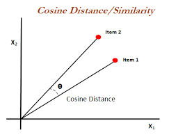
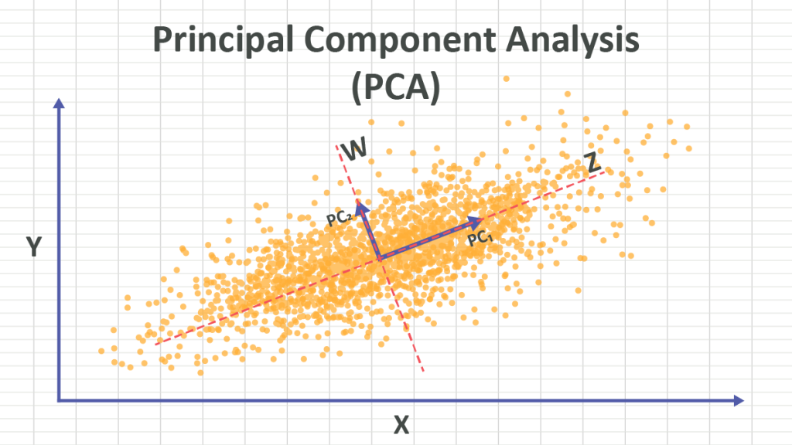
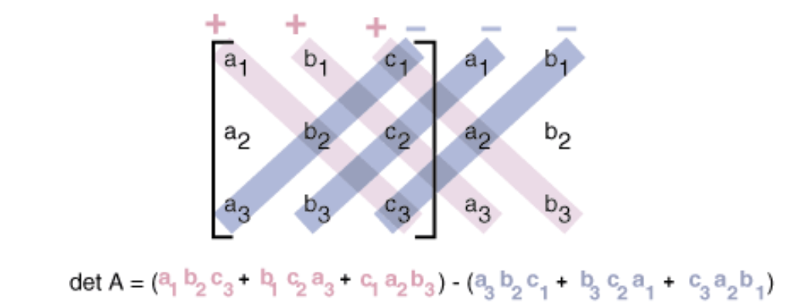
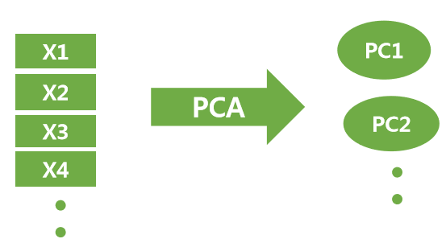

# 선형 대수 기초
> 벡터와 행렬, 행렬곱 이후의 확장 개념을 다뤄보겠습니다.

이번 KDT 교육과정 중 잠시 기초적인 행렬곱을 배우는 시간을 가졌는데, 저는 따로 공부를 해놓았었어서 이 시간 동안 조금 더 확장 개념을 공부하는 데 시간을 사용하였습니다.

대체로 얻은 개념은 다음과 같습니다.

- 노름
- 내적
- 선형 변환
- 코사인 유사도
- 고유값
- PCA

> 해당 글은 AI 공부를 위한 최소한의 내용에 가까우니 `벡터` > `행렬` > `행렬곱` 까지 알아보시고 한 번 읽어보시길 권장드립니다. 물론 저도 따로 정규교육을 받진 않고 독학 위주입니다.

## 노름

노름은 단어에 비해 어렵지 않습니다. `벡터의 원점으로부터의 거리`라고 볼 수 있습니다. 말 그대로 유클리드 거리인 경우가 일반적이지만, 노름에는 여러 종류가 있습니다.

- $L_1$ 노름: 맨해튼 거리. 각 성분의 절댓값 합입니다.
- $L_2$ 노름: 유클리드 거리입니다.

벡터 $\mathbf{x} = [x_1, x_2, \dots, x_n]$에 대해 대표적인 노름은 다음처럼 표현할 수 있습니다.

$$
\lVert \mathbf{x} \rVert_1 = \sum_{i=1}^{n} |x_i|
$$

$$
\lVert \mathbf{x} \rVert_2 = \sqrt{\sum_{i=1}^{n} x_i^2}
$$

> 어렵지 않죠?

## 내적

내적 또한 단순합니다. 두 벡터가 다음과 같다고 하겠습니다.

$$
\mathbf{x}_1 = [a_1, b_1, c_1, d_1, \dots, f_1]
$$

$$
\mathbf{x}_2 = [a_2, b_2, c_2, d_2, \dots, f_2]
$$

이때 두 벡터의 내적은 다음과 같습니다.

$$
\mathbf{x}_1 \cdot \mathbf{x}_2
=
a_1a_2 + b_1b_2 + \cdots + f_1f_2
$$

이러한 내적은 코사인 유사도에 크기를 더한 수치라고 볼 수 있습니다.

> 더 큰 양수일수록 더 비슷한 방향과 크기이며, $0$일수록 직각, 더 작은 음수일수록 더 다른 방향과 크기입니다.

노름은 보통 다음처럼 표현합니다.

$$
\lVert \mathbf{x} \rVert
$$

### 코사인 유사도

방향만 알고 싶은 경우에는 **코사인 유사도** 공식을 사용할 수 있으며, 이에 대해 호기심이 생겨 알아보았습니다.

코사인 유사도의 본질적 정의는 `반지름이 1인 원(단위원) 위를 움직이는 점의 가로(x좌표) 위치`이자 `직각 삼각형에서 기준각에 인접한 밑변의 비율`입니다.

또한 코사인 유사도는 두 벡터 사이의 각도 $\theta$를 내적으로 구하는 공식입니다.

#### 피타고라스 정리부터

일반적으로 저희가 아는 식은 다음과 같습니다.

$$
c^2 = a^2 + b^2
$$

이는 사실상 다음 식에서 $\theta = 90^\circ$인 경우와 같습니다.

$$
c^2 = a^2 + b^2 - 2ab\cos\theta
$$

#### 코사인 정리

벡터 $\mathbf{a}$와 벡터 $\mathbf{b}$가 존재할 때, 벡터 $\mathbf{b}$를 중심으로 `벡터 a만큼 이동할 때`와 `벡터 b만큼 이동하는 양`의 비율을 $\cos\theta$라고 볼 수 있습니다.

$$
\cos\theta
=
\frac{
\mathbf{a}\text{의 }\mathbf{b}\text{ 방향 성분}
}{
\lVert \mathbf{a} \rVert
}
$$

이후 양변에 $\lVert \mathbf{b} \rVert$를 곱하면 다음처럼 정리할 수 있습니다.

$$
\lVert \mathbf{b} \rVert
\times
\lVert \mathbf{a} \rVert
\times
\cos\theta
=
(\mathbf{a}\text{의 }\mathbf{b}\text{ 방향 성분})
\times
\lVert \mathbf{b} \rVert
=
\mathbf{a} \cdot \mathbf{b}
$$

> 마지막에서 조금 헷갈렸었는데 $\lVert \mathbf{b} \rVert$ 만큼 움직일 때, **`a의 b방향 성분`**을 곱하면 $\lVert \mathbf{a} \rVert$가 된다고 이해하여 해결하였습니다.

위 과정을 통해 $\mathbf{a}$와 $\mathbf{b}$의 방향 차이를 알기 위해서는 **코사인 유사도** 수식을 사용하여 해결 가능합니다.

$$
\cos\theta
=
\frac{
\mathbf{a} \cdot \mathbf{b}
}{
\lVert \mathbf{a} \rVert
\lVert \mathbf{b} \rVert
}
$$

## 선형 변환

선형 변환은 특정 벡터를 행렬을 이용하여 새로운 형태의 벡터로 만든다고 볼 수 있습니다.

일반적인 행렬곱은 다음 형태입니다.

$$
(n, m) @ (m, k) \rightarrow (n, k)
$$

즉 $m$개의 속성을 $k$개의 속성으로 바꾸게 됩니다. 이때 뒤의 $(m, k)$를 가중치 행렬이라고 생각하고, 앞의 $(n, m)$에서 $m$이 $1$인 벡터라고 생각하면 됩니다. 신경망 또한 이와 동일한 원리로 다음 과정을 반복합니다.

$$
\mathbf{x} @ W \rightarrow \mathbf{y}
$$

이를 통해 결과적으로 정답을 맞추기 좋은 모양으로 바꾸게 됩니다.

예를 들어 문장을 받아 이를 `감정`, `분위기`, `문법`, `근거` 등의 속성으로 변환시켜 예측하는 느낌입니다. 물론 특성은 참고용으로만 보시길 권장드립니다.

## 고유값과 고유 벡터

선형 변환에서 벡터의 크기만 바뀌었을 때, 이를 고유벡터라고 부릅니다.

예를 들어 $\mathbf{x} @ W$가 되었을 때, 이 값이 $n\mathbf{x}$와 동일하다면 $\mathbf{x}$를 **고유 벡터**라고 부르며, $n$이 고유값이 됩니다.

$$
A\mathbf{v} = \lambda\mathbf{v}
$$

## PCA

**PCA**는 *Principal Component Analysis*로, 주요 특성으로 특성을 줄이는 방식입니다. 선형 변환의 주요 일부분이라고 생각할 수 있습니다.

큰 순서대로 PC1, PC2, ... 라고 부릅니다.

> PCA는 개념 자체는 쉽지만 중요한 정보입니다. 행렬의 특성을 줄여주어 필요 없는 특성을 없애고, 중요한 특성으로 만들어주는 역할을 합니다.

데이터들을 산점도의 형태로 늘어놓았을 때, 3차원 이상이어도 대부분의 특성은 한 방향으로 늘어지게 됩니다.

예를 들어 생선 데이터의 특성이 `[길이] [폭] [성별] [부피]`로 있다면, 일반적으로 `[길이] [폭] [부피]`를 하나의 성분으로 결합이 가능할 것입니다.

공분산에 대해 설명해보겠습니다.

### 공분산

공분산 행렬은 행렬의 표준화 없이 특성 간의 상관관계를 나타낸 **대칭 행렬**이자 **정사각 행렬**이기 때문에 언제나 고유값을 보장합니다.

위의 예시에서는 `[길이] [폭] [부피]` 간 각각의 데이터끼리, 예를 들면 `길이가 1cm 늘어나면 평균적으로 부피는 30밀리리터 늘어난다`와 같은 상관관계가 있을 수 있습니다.

#### 공분산이 고유값을 보장하는 이유

일단 공분산은 **두 특성의 데이터가 어떻게 움직이는지**를 나타내는 값입니다. 각 데이터가 평균에서 얼마나 벗어났는지를 두 변수끼리 곱한 뒤 평균낸 값에 가깝습니다.

$$
Cov(X, Y)
=
\frac{
\sum_{i=1}^{n} (x_i - \bar{x})(y_i - \bar{y})
}{
n - 1
}
$$

위에서 공분산 행렬은 항상 고유값을 보장한다고 하였는데, 일반적으로 고유값은 다음 수식으로 찾아집니다.

$$
A\mathbf{v} = \lambda\mathbf{v}
$$

이때 $\lambda$를 찾기 위해서는 다음 식을 풀어야 합니다.

$$
\det(A - \lambda I) = 0
$$

여기서 $I$는 단위행렬입니다. 단위행렬은 주대각선은 $1$, 나머지는 $0$인 정사각 행렬입니다. 이를 곱하여 이항하였을 때 $\mathbf{v}$가 $0$이 아닌 값을 찾는 문제가 됩니다.

이를 위해서는 $A - \lambda I$가 $0$이 되는 값을 구해야 하는데, 두 행렬을 예시로 들면 다음과 같습니다.

$$
A =
\begin{bmatrix}
a & b \\
b & c
\end{bmatrix}
$$

$$
\lambda I =
\begin{bmatrix}
\lambda & 0 \\
0 & \lambda
\end{bmatrix}
$$

여기서 $\det(A - \lambda I)$를 구해야 합니다.

> $\det()$는 행렬이 넓이/부피를 몇 배로 바꾸는지 나타내는 값입니다. 계산 방법은 아래와 같습니다.

증명은 알아보지 않았지만 위의 계산을 통해 $\lambda$의 값을 구하여 비율이 높은 고유값을 살리고, 낮은 고유값을 없애는 방식으로 데이터를 판단할 수 있습니다.

예를 들어 5가지의 특성에서 $80\%$, $10\%$, $5\%$, $2\%$, $3\%$의 설명분산비율이 나왔다고 한다면 몇 가지 방식으로 가중치를 만들 수 있습니다.

1. PC1과 PC2로 $90\%$가 설명되니 $10\%$는 버리자
2. 누적합을 통해 예를 들어 PC1과 PC2로 $90\%$만 시각화한다, PC1~PC4로 정보 손실을 줄인다 등과 같이 선택할 수 있습니다.
3. 다음 벡터처럼 `[PC1*0.7+PC2*0.3, PC1*0.5+PC2*0.2+PC3*0.1+PC4*0.1+PC5*0.1]`를 만들어 다음 가중치로 사용할 수 있습니다.
4. `Scree plot`를 통해 직접 확인하기
5. 그냥 이것저것 다 시도해보고 모델이 잘 나오는 것을 선택하기

등이 될 수 있습니다.

