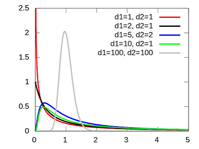
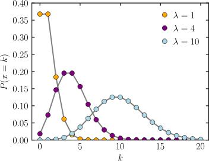
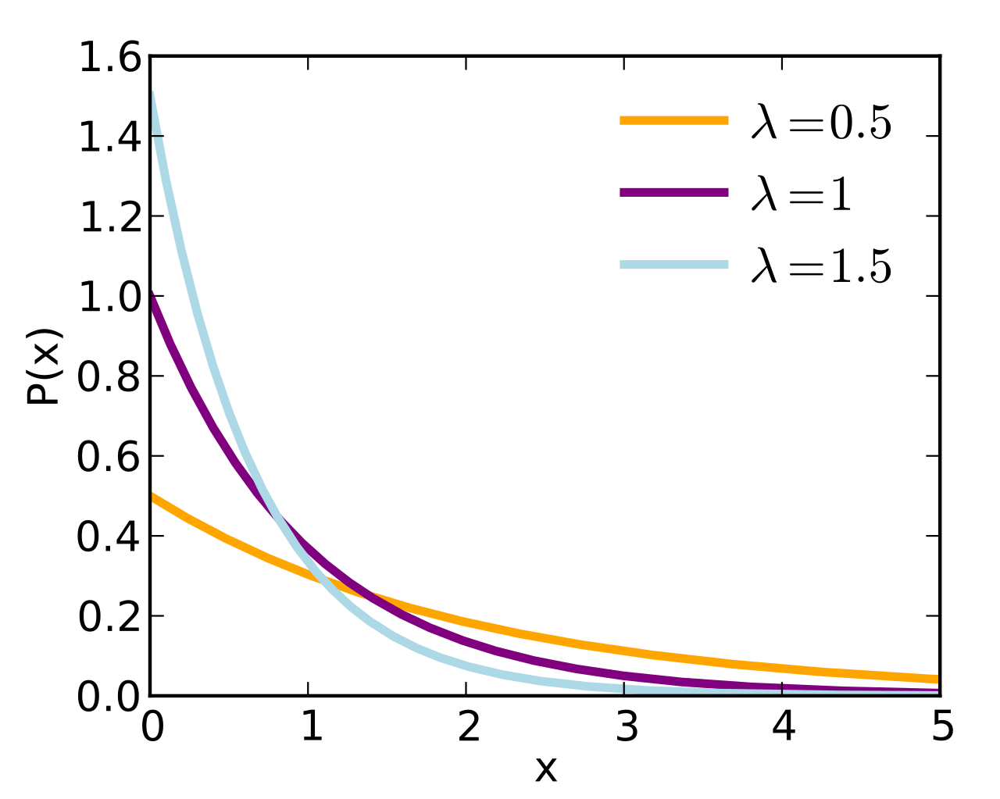
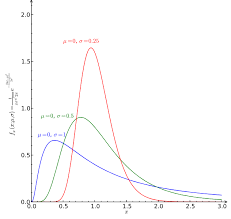

# 확률과 분포

일반적으로 확률은 `0`~`1` 사이의 어떤 사건이 일어날 확률이고,

분포는 여러 값들이 각각 어떤 확률로 나오는지에 대한 전체 구조입니다.

표기는 `P(사건) = 확률` 으로 표기합니다.

여기에서 **표본 평균**은 모집단의 일부일 **표본 데이터**가 실제 모집단에 비해 얼마나 대표성을 띄우는가 입니다.

이걸 이해하기 위해서는 **표본 분포**가 필요하며 표본분포를 이해하기 위해서는 **확률 분포**를 알아야합니다.

일단 분포의 종류에 대해 간단하게 설명을 해보자면
- 베르누이 분포: 성공 또는 실패 1번
- 이항 분포: 성공 또는 실패를 여러번
- 정규분포: 평균 주변에 값이 몰리는 데이터
- 표준 정규분포: 평균 `0`, 표준편차 `1`로 바꾼 정규분포
- t분포: 표본이 작을 때 평균 추정
- 카이제곱 분포: 범주형 데이터 검정, 분산 관련
- F분포: 분산 비교, ANOVA, 회귀모형 비교


- 포아송 분포: 일정 시간/공간/범위 안에서 사건 발생 횟수


- 지수 분포: 사건이 발생할 때까지의 대기시간


- 로그정규분포: 가격, 소득, 거래량처럼 오른쪽 꼬리가 긴 데이터



## 조건부와 독립
### 조건부 확률이란
조건부확률은 **어떤 정보가 주어졌을 때, 확률이 어떻게 바뀌는가**입니다.

예를 들어 일반적인 `사건A`의 확률이 `P(A) = 0.1`과 같다고 할 때, `사건 B`가 존재할 경우, `사건A`의 발생 확률이 더 오를 수 있습니다. 이를 `P(A | B) = 0.2`와 같이 설명이 가능합니다.

예를 들어서 이메일을 스팸으로 처리할 확률이 있엇는데 (사건 A)

`"무료"`, `"광고"` 라는 단어가 있을 때 일어날 확률이 더 높아지는 것을 말합니다.

### 독립이란
독립은 **하나를 알아도 다른 하나의 확률이 바뀌지 않는 관계**를 말합ㄴ디ㅏ.

일반적으로 동전던지기, 주사위던지기 같은 것들이 **독립**입니다.

> 동전이 앞면이 나왔다고 해서 주사위가 6일 확률이 바뀌지 않음과 같습니다.

이와 같은 형태를 `P(A | B) = P(A)`라고 표현할 수 있습니다.

## 베이즈 정리
베이즈 정리는 **새로운 증거를 보고 기존 판단을 업데이트 하는 공식**을 말합니다.

공식부터 보여주면 `P(A | B) = P(B | A) x P(A) / P(B)` 입니다.

이를 말로 풀어보면 
1. 기존에 `사건B`가 있을 때 `사건A`의 확률이 있었습니다.
2. 이 확률은 `사건A`가 있을 때 `사건B`인 경우와 기존의 `사건B`에 비해 `사건A`가 얼마나 많은지

를 수식으로 풀어낸 형태입니다.

조금 더 풀어서 설명해보면 (제가 납득이 안되어서 ㅎㅎ;)

> `사건B`가 있을 때의 `사건A`의 확률이 있습니다(이는 `사건A`자체의 확률보다 높을 수도, 낮을 수도 있습니다.). 이때, 여기에 `사건B`가 일어날 경우를 곱하면 전체 경우에서 `사건B`가 일어나서 `사건A`가 일어날 확률로 해석이 가능합니다. 이때 공식은 `P(B) x P(A | B)`입니다. 이렇게 되면 반대항은 반대로  `P(A) x P(B | A)`로 정 반대의 의미를 가지게 됩니다. 결국 모두 `사건A`와 `사건B`가 동시에 일어날 확률을 말하고 있습니다.

## 나이브베이즈
나이브 베이즈는 베이즈 정리를 이용한 분류 모델입니다.

나이브베이즈는 대략적으로 근거들을 기반으로 사건이 발생할 확률을 예측하는 분류 모델입니다.

예를 들어서 사건 `A`, `B`, `C`, `D`가 있을 경우가 있습니다. `사건A`에 대해서 알아야할 경우에, 나이브 베이즈는 아래와 같이 판단합니다.
```
P(A사건 | B, C, D)
```
가 됩니다.

주로 
- 스팸 메일 분류
- 문서 분류
- 감성 분석
- 뉴스 카테고리 분류
- 간단한 텍스트 분류

등에 사용됩니다.

예를 들어서 하나의 문장에서 `"안돼"`, `"!"`, `"ㅠㅠ"` 등의 문장이 있으면 해당 문장을 `"통곡 문장"`과 같이 분류하게 할 수 있습니다. `P("통곡 문장" | "안돼", "!", "ㅠㅠ") = 0.6`과 같은 식으로 말이죠.

**하지만** 단어끼리 서로 영향을 줄 수 있습니다. `안돼`와 `!`이 영향을 주는 단어일 수 있기 때문에 여기에서 **그냥 요소끼리 독립적이라 "가정"하자**라고 해서 **Naive**(순진한) 이라는 의미가 생깁니다.

위와 같이 신뢰도를 해칠 수 있는 가정을 하지만 일반적으로 텍스트 분류에서는 꽤 잘 작동하는 경우가 많습니다.

## 븐포
분포는 통계학에서 매우 중요한 역할을 합니다. 분포를 알아야 다음과 같은 판단을 할 수 있습니다.
- 해당 값이 흔한가
- 값이 얼마나 이상치인가
- 표본 평균을 믿을 수 있나
- 두 집단 차이가 우연인가
- 이 검정에는 t분포를 써야하나
- 카이제곱 검정은 언제 쓰면 좋나

등이 있습니다.

분포는 **값이 나오는 패턴**을 의미합니다.

예를 들어 키, 시험점수 등은 보통 평균 근처에 몰리고, 양쪽으로 갈수록 적어집니다. 이런 경우는 **정규분포**,

하루에 전화가 몇번 오는지? 이런 경우에는 **포아송 분포**를 사용할 수 있습니다.

동전을 10번 던져 앞면이 몇번 나올지는? 이 때에는 **이항 분포**를 사용할 수 있습니다.

위와 같이 분포를 알아둔 뒤 상황에 맞는 분포를 통해 데이터를 더욱 잘 설명하기 위함입니다.

### 검정용 분포
일반적으로 다루는 `t분포`, `카이제곱분포`, `F분포`는 검정용 분포입니다.

나온 데이터가 특정 분포를 잘 따르는가를 통해 데이터의 품질을 측정하는데 사용됩니다.

#### t분포
표본 평균이 얼마나 흔한지 판단할 때 사용

`A반 평균과 B반 평균이 다른지` 또는 `이 약을 먹은 전후 평균이 달라졌나` 등과 같은 사실 확인에 사용됩니다. 이를 t검정 이라고 합니다.

#### 카이제곱분포
번주형 데이터의 차이/관계 판단에 사용됩니다.

`성별에 따라 선호 브랜드`, `흡연 여부와 질병 여부의 관련도`, `관측된 비율이 기대한 비율과 같은지` 등을 측정하기 위해 사용됩니다.

#### F분포
분산끼리 비교하거나, 여러 집단 평균 차이를 볼 때 사용됩니다.

`N개의 평균이 모두 같은가`, `회귀 모델이 설명력이 있는가`, `변수를 추가한 모델이 더 나은가` 등을 평가하기 위해 사용됩니다.


## 분포 정리 2
분포를 본다는 것은 
- 중심이 어느정도에 있는지
- 값들이 얼마나 넓게 퍼져있는지
- 극단값이 어느쪽에 많은지
- 봉우리가 어떤 방향에 많은가
- 이상치 심한 곳이 있나 

등을 확인하는 과정입니다.

### 분포의 3가지 종류
- 실제 데이터의 분포: 실제 데이터의 형태를 나타냅니다.
- 이론적인 확률분포: 수학적으로 정해진 패턴입니다.
- 표본분포: 모분산을 다 확인할 수 없어 표본마을 뽑은 뒤 평균을 낸 분포

### 검정이란
관찰된 차이가 우현히도 나올 수 있는 차이인지, 아니면 진짜 의미있는 차이인지 판단하는 법입니다.

예를 들어 각각의 표본들의 평균이 10, 20, 30 이 나왔을 때 각각의 값들 간의 차이가 진짜 특성에 따라 바뀐 것인지 또는 우연히 생긴 점수 차이일지를 확인하는 것입니다.

#### p-value란?
`p-value`는 귀무가설이 맞다고 가정했을 때, 지금 관찰한 결과만큼 극단적인 결과가 나올 가능성입니다. 예를 들어 동전을 100번 튕겼는데 90번 앞면이 나온다면 `p-value`는 $$ \text{p-value} = \sum_{k=90}^{100} {}_{100}\mathrm{C}_{k} \left( \frac{1}{2} \right)^{100} $$ 와 같습니다.

> `p-value`는 위 예시에서 앞면이 50번 나온 경우 `0.5`가 됩니다.

# 분포와 검정의 종류
## 분포의 종류
### 베르누이 분포
성공과 실패 한번만 있는 경우에 사용하는 분포입니다.

대체로 성공을 `1`로 설정하고 실패를 `0`으로 설정합니다. 하나의 사건이 있으며 성공 확률이 `p`라고 할 때 , `X ~ Vernoulli(p)`라고 합니다.

### 이항 분포
베르누이 시행을 여러번 반복했을 때, 성공 횟수의 분포를 말합니다.

성공 확률이 `p`이며 시행 횟수가 `n`일 때, `X ~ Binomial(n, p)`라고 합니다.

> 확통을 까먹었긴 하지만 아무튼 100번 동전 던져서 5번 나올 확률 -> 0.5^5 * 0.5^95 * (100)C(5) 입니다.

### 포아송 분포
일정 시간/공간 안에서 사건이 몇번 발생하는지에 대한 분포입니다.

평균 발생 횟수를 `λ`(람다)라고 할 때, `X ~ Poisson(λ)` 라고 합니다.