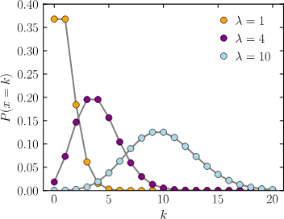

# 포아송 분포
이전에는 사건이 일어남/일어나지 않음 을 기반으로 한 이산형 기본 분포에 대해서 알아보았습니다. 
이번에는 사건 발생 횟수 계열 분포를 알아보려 합니다.

사건 발생 횟수 계열 분포는 
> 정해진 시간/공간/구간 안에서 어떤 사건이 몇번 발생하는가 에대한 이야기입니다.

가장 기본적인 범위 내에서 몇번 일어나는지에 대한 것을 다루는 분포가 **포아송 분포**입니다.

예를 들면 `서버 에러가 1시간에 평균 3번 발생한다`에 따른, `1시간 동안 n번 발생할 확률`등을 예측할 수 있는 모델을 추정할 수 있어집니다.

기호는 보통 `X ~ Poisson(λ)`와 같이 작성합니다.

## 계산
### 확률 공식
포아송의 공식은 다음과 같습니다. `P(X = k) = (e^-λ) * λ^k / (k!)`

위 공식을 사용하면, 로그를 돌려보았을 때, 1시간에 에러가 3번 일어났다는 결과를 확인하였을 때, `λ`에 `3`을 넣고, 1시간동안 에러가 2번 발생할 확률을 구하기 위해 `k`에 2를 대입하면
`P(X = 2) = (e^-3) * (3*2) / (2!)`가 나오게 됩니다. (찾아보니 약 15%정도 되는것 같습니다.)

### 평균과 분산
포아송 분포의 중요한 특징은 분산과 평균이 동일하게 `λ`라는 것입니다.

## 포아송 분포를 쓰는 조건
포아송 분포는 아무 횟수 데이터에나 쓰는 것이 아닌, 아래와 같은 조건이 맞을 대 잘 맞습니다.
- 사건이 독립적이다
- 일정한 평균 발생률 `λ`가 있다
- 이상치와 같은 한 구간에서 평균을 왜곡하는 사건 횟수가 존재할 확률이 낮다
- 관심 대상이 성패 여부가 아닌 발생 횟수이다.

## 이항분포와의 차이
대표적으로 바슷한 분포가 **이항분포**로, 이항분포는 대체로 n번중 k번 성공할 것인지에 대한 이야기였다면 포아송은 그 범위가 연속적이며 그동안 사건이 몇번 발생하는가에 대해서 이야기하고 있습니다.

또한, 이항분포와 다르게 모수가 `p`만 존재한다는 특징이 존재합니다. 포아송 분포는 평균을 구한 기준 자체가 포아송 분포의 평균 기준이 됩니다.

> 이항분포와 포아송분포는 엄연히 다르지만, 이항분포의 시도 횟수가 극단적으로 높고, 성공 횟수가 적어질수록, 두 분포의 모습은 유사해집니다.

## 포아송 분포의 모양
포아송 분포의 `λ`가 작으면 0, 1, 2 근처에 확률이 모입니다. 
하지만 `λ`값이 커질수록, 중심이 오른쪽으로 이동하며 점점 정규분포를 따라가게 됩니다.

