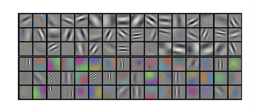

# 심층 합성곱 신경망을 이용한 ImageNet 분류
> 논문을 읽으며 생각을 정리해보는 글입니다.

## 초록
해당 부분은 어떤 데이터를 이용하여 어떤 결과를 만드는 모델을 만들었는지에 대한 설명입니다.

여기에서 특별하게 보이는 것은 LSVRC - `ImageNet Large Scale Visual Recognition Challange`라는 대규모 스케일 시각 탐지 대회를 말하는 점입니다.

또한 1000개 종류의 클래스를 분류하는 softmax를 사용하며 비포화 뉴런 (이는 아마 학습률이 0에 가까워지는 현상을 막았다는 것을 말하는 것 같습니다.)과 GPU 기반 합성곱 구현 (GPU를 활용하였다는 이야기 같습니다.)을 이용하였다고 말합니다.

> 확인해보니 non-saturating neurons는 학습률 포화가 아닌 ReLU를 사용했다는 것을 말합니다. 향후 밑에서 말합니다. 이를 통해서 학습 속도가 빨라졌음을 시사합니다.

또한 정규화 또는 규제 레이어로 알려져있는 Dropout를 사용하여 일부 노드들을 비활성화시켰다고 합니다.

2010 대회의 우승 모델은 1개만 정확히 맞출(정답을 가장 높은 확률로 예측할) 확률이 62.5%, 상위 예측 5개중 맞출 확률이 83%로 1000개 분류중에서 하나 또는 5개를 제안하는 것에 대해 효력있는 선택을 한 것으로 보입니다.

2012년 대회에서는 조금 더 개선된 모습을 보였습니다.

## 1. 서론
### 1.1문단
현재 객체인식 방식의 기술에 대해 설명합니다.

성능을 높이기 위해 데이터셋의 양과 모델의 성능을 향상시키며 과적합 방지 기법을 잘 활용할 수 있다고 합니다.

> 이러한 맥락으로 보았을 때 Dropout 또는 모종의 활성화함수 등을 이용한 과적합 방지 + 많은 epochs를 이용할 수 있지 않을까 생각이 듭니다.

이전에는 비교적 적은 데이터 규모 (수만장)를 가지고 있으며 증강에 대해서도 학습 데이터와 실제 사용 환경에서 차이가 있을 수 있기 때문에 다양한 환경의 데이터가 필요성을 더욱 강조하고 있습니다.

이에 따라 22,000개가 넘는 범주에 1,500만장 이상의 라벨된 고해상도 이미지를 포함하는 **ImageNet** 데이터셋에 대한 이야기를 언급하였습니다.

### 1.2문단
데이터가 많아도 이를 학습할 수 있는 용량이 큰 모델에 대해서 이야기합니다.

이는 모델의 깊이(레이어)와 너비(가중치 및 채널)을 키움으로써 제어할 수 있다고 합니다

또한 **이미지의 성질**(통계의 정상성 - 같은 종류의 filter/edge가 동일한 패턴을 잡을 수 있다는 가정)과 픽셀 의존성이 국소성에 대해 강하고 대체로 타당하다는 가정을 둔다

> 이는 특정 커널들(필터/엣지)가 서로 다른 이미지들에서 유효할 것이라는 가정임을 의미합니다.

이를 통해 일반 신경망보다 파라미터가 적은 CNN의 특징을 이용하여 효율적인 성능을 기대한다고 합니다. (성능은 약간 떨어지지만 학습은 매우 효율적)

### 1.3문단
작은 커널을 통한 특징 추출은 장점이지만 픽셀이 너무 많아서 모델 학습에 어려움이 있다고 하였습니다.

다행히도 라벨링 데이터가 많아서 문제 없이 학습시킬 수 있었다고 합니다.

### 1.4문단
대표적인 기여에 대한 이야기를 하는 것으로 보입니다.

2차원 합성곱과 CNN네트워크에 성능을 높이고 학습 시간을 줄였지만 120만개의 라벨 학습 예제에도 불구하고 과적합이 큰 문제가 되었다고 합니다.

과적합 방지를 위한 여러 기법 사용하였으며 4절에서 설명한다 합니다.

모든 레이어는 전체 파라미터의 1% 이하만 포함하지만 그 모든것이 중요하다 합니다. (아마 CNN레이어가 FC 레이어에 비해 파라미터가 적은게 당연해서 그런 것으로 보입니다.)

### 1.5문단
`GTX 580 3GB GPU` 2장으로 5~6일이 걸렸다고 하니 매우 적은 자원으로 구현한 요소라고 생각합니다.

## 2. 데이터셋
22,000 범주, 1,500만장 이상의 고해상도 라벨링 이미지 데이터셋을 썼다고 합니다. (양이 굉장히 많습니다.)

출처는 웹이며 `Amazom Mechanical Turk` 크라우드 소싱 도구를 이용하여 사람이 직접 라벨링을 했다고 합니다.

`ILSVRC` 에서는 그중 1,000범주, 120만/5만/15만 장의 학습/검증/테스트 데이터셋을 사용하였습니다.

top-1/5 오류율로 보고했다고 합니다. (ImageNet에서 일반적인)

제각각인 해상도를 256x256의 고정된 해상도로 다운샘플링 하였다고 합니다. 방식은 자르기로 리사이징이 아니였습니다. 또한 RGB 픽셀 (3채널)을 그댈 사용하였습니다.

## 3. 아키텍처
아키텍처는 유명한 CNN레이어 5개, FC레이어 3개로 이루어져있습니다.

### 3.1 ReLU 비선형성
$\operatorname{Tanh}$ 또는 $\operatorname{Sigmoid}$를 사용하면 포화 비선형 함수에 비해 Saturation에 의한 학습속도 감소 때문에 비포화 비선형 함수를 사용하였다고 합니다.

여기에서 사용하는 함수를 ReLU(recified Linear Unit)를 사용하였습니다. 

이를 통해 몇배를 빠르게 학습시켰다고 합니다. 이는 아마 기울기를 감쇄시키지 않으며 음수를 과감하게 지우는 것에서 나온 특징이라고 생각합니다.

반복 횟수 그래프 또한 존재하는데 에포크 횟수에 비해 Loss가 매우 감소하는 것으로 확인되었습니다. 

아래 그래프는 실선이 $\operatorname{Sigmoid}$이며 점선이 $\operatorname{Tanh}$였습니다. 차이는 약 6배라고 합니다.

> 이에 착안하여 초반에 ReLU, 나중에 포화함수로 변형하는 것도 괜찮을까? 라는 생각이 들었습ㄴ디ㅏ.

이전 `Jarret et al`에서도 고정 정규화 적용 때 $|tanh(x)|$가 효과가 좋지만 속도 때문에 비포화 비선형 함수를 사용하였다고 합니다.

### 3.2 다중 GPU 학습
위에서 이미 2장의 GPU를 사용하였다고 합니다.

여기에서 학습 가능한 네트워크 최대 크기라고 말하는데 이는 대역폭에 가깝다고 생각할 수 있습니다.

또한 cpu 메모리에 거치지 않고 서로다른 gpu끼리의 통신이 되어 병렬화에 더 좋았다고 합니다.

이때 레이어를 이동할 때마다 서로의 피처맵을 알기 위해서 통신해야하는 비용을 줄이기 위해서 특정 레이어에서 서로의 데이터를 공유하고 다시 나누어져 학습을 하는 방향으로 잡았습니다.

이러한 방식은 결국 `Cire¸sanet al`의 결과와 비슷하지만 저자의 모델의 컬럼이 독립적이였다는 것을 나타냅니다.

위 특징을 이용해서 `top-1/5` 에러를 각각 1.7%, 1.2%로 줄였다고 합니다.

### 3.3 국소 응답 정규화
ReLU는 비포화이기 때문에 다시 정규화를 하지 않아도 괜찮지만 일반화를 위해 국소ㅗ 방정식을 사용하였다 합니다.

이 수식을 보면 구하는 활성값의 전체 제곱합 평균의 상수 및 지수를 통한 조절을 분모로 가져 정규화를 하는 것으로 보입니다. 사용 상수값은 `k=2, n=5, α=10^-4, β=0.75`라고 합니다.

이는 국소 대비 정규화와 비슷하지만 해당 방식은 밝기 정규화에 가깝다고 합니다.

국소 대비 정규화는 원래 값에서 평균을 빼지만 밝기 정규화는 평균을 빼지 않아 차이가 강조되지 않는다고 합니다.

> 해당 방식으로 4레이어 CNN의 테스트 오류율이 약 2% 감소하였다고 합니다. `top-1/5` 오류율은 1.4%, 1.2% 줄였다고 합니다.

### 3.4 중첨 풀링
전통적인 방식은 `스트라이드=커널크기`이지만 해당 네트워크에서는 `s=2, z=3`을 사용하여 `s=2, z=2` 대비 0.4%, 0.3%를 낮추었습니다. 하지만 과적합이 약간 더 어렵게 발생하는 경향도 관찰되었다 합니다.

### 3.5 전체 아키텍처
앞에서 설명하였듯 5CNN, 3FC 레이어로 이루어져 있으며 1000-way softmax에 입력되는 구조를 가져 정답 라벨의 로그 확률을 구해 평균을 최대화한다고 합니다.

목적함수는 다항 로지스틱 회귀입니다.

또한 max-polling 레이어를 이용하여 두 응답 정규화 레이어와 다섯번째 합성곱 레이어에 위치한다고 합니다.

이는 1/2 피처맵 사이, 2/3 피처맵 사이, CNN와 FC레이어 사이로 이루어지는 것으로 보입니다.

이후에도 그림에 대한 내용을 자세히 설명해주며 첫번째 레이어에서 2개로 나뉘어지며 3번재 레이어에서 상태 병함, 이후 fc 레이어에서는 계속 서로의 상태를 주고 받다가 마지막에 1000개 logits로 반환함을 의미합니다.

## 4. 과적합 감소
해당 신경망 파라미터에는 6천만개의 파라미터가 있다고 합니다.

크기와 비교하면 얼추 맞다고 생각이 들지만 역시 많습니다.

하지만 파라미터가 많으면 과적합 문제가 발생할 수 있기 때문에 이를 줄이기 위한 방식을 사용했다고 합니다.

### 4.1 데이터 증강
가장 쉽고 흔한 방법을 사용하였다고 하며 **GPU의 학습시간동안 CPU의 파이썬 코드를 이용해서 변환**하여 원본을 재생성 없이 증강을 구현했습니다. (실질적인 추가 계산비용이 거의 없다고 합니다.)

> 이는 파이프라인 형식으로 느껴집니다

다른 방법으로는 **RGB 채널 강도 조절**로 `mean=0`, `std=0.1`의 가우시안 난수를 이용하였다고 합니다. (원본에 유사한 이미지가 많이 나오게)

### 4.2 드롭아웃
드롭아웃을 이용하여 매번 절반의 뉴런을(`p=0.5`일때) 학습 강도를 `0`으로 낮추어 매번 다른 네트워크를 이용하게 하는 방법으로 매 역전파마다 다른 아키텍처를 학습하는 형식으로 만들게 됩니다.

## 5. 세부사항
`BATCH_SIZE=128`를 사용하였으며 최적화 알고리즘으로는 `momentum=0.9`, `weight_decay=0.0005`를 사용하였다고 합니다.

> 기본적인 **SGD**는 $w_i = w_{i-1} - \operatorname{lr} \times \operatorname{gradient}$ 이지만 옵션을 통해 이전 업데이트 방향을 누적하며 가중치 감쇠또한 적용시킬 수 있습니다. 그렇게 되면 다음과 같은 형태에 가까워집니다.

$$w_i = 0.9995 \times(0.9 \times w_{i-1} - 0.1 \times \operatorname{lr} \times \operatorname{gradient})$$

실제 논문의 형태:

$$
v_{i+1}​=0.9 \times v_i ​− 0.0005 \cdot ϵ \cdot w_i ​− ϵ \cdot \nabla L(w_i​)
$$

> 이전의 이동량에 대해서 현재 학습량 + 기울기를 아주 조금 적용하여 더해주는 방식입니다. SGD의 특징인 튀는 값에 민감한 부분을 감쇠하는 수식입니다.

또한 모든 가중치를 `mean=0`, `std=0.01` 정규분포에서 뽑았다고 합니다.

2, 4, 5 Conv/FC 레이어는 `bias=1`로 시작하였으며 다른 레이어는 `bias=0`를 사용하였습니다. 여기에서 `bias=1`로 시작하는 레이어는 **ReLU**를 사용하는 레이어로 이는 초기부터 **ReLU** 뉴런이 비활성화 될 가능성을 낮추기 위함입니다.

## 6. 결과
SIFT, Saprse Coding은 CNN이 유행하기 전, 이미지 특징을 뽑는 대표적인 방법으로 

- SIFT: Scale Invariant feature Transform 으로 이미지에서 코너나 무늬같은 눈에 띄는 지점을 찾고, 그 주변의 경계 방향/모양을 숫자 벡터로 표현하는 것을 말합니다. 물체의 특징을 잡아내느 방식입니다.
- Sparse Coding: 희소코딩이라는 의미로 이미지의 특징을 미리 준비된 여러 기본 패턴의 조합으로 표현하는 것을 말합니다. 이미지를 간단한 패턴들의 조합으로 계산합니다.

하지만 AlexNet는 사람이 설계한 특징 추출이 아닌 **컴퓨터가 계산한 특징**을 추출하는, 추출할 특징 자체를 학습한다는 점에서 차별점이 존재함을 보입니다.

Spare coding에 비해서 약 top-1/5 오류율이 모두 약 10% 낮은 오류율을 보였으며 SIFT 방식보다 8% 낮은 오류율을 보여주었습니다.

또한 현재 만들어진 학습 방법에서 다르게 방식을 채택하면 나타나는 현상을 나타내었습니다.
- 비슷한 CNN 평균은 Top-5 오류율이 `16.4%`
- 더 큰 데이터로 사전 학습 후 파인튜닝시 오류율 `16.6%`
- 일반 CNN 5개 + 사전학습 CNN 2개를 통한 앙상블 사용 시 `15.3%`를 나타낸다고 합니다.

> 앙상블 + 추가 데이터를 통해 더 좋은 성능이 나타내는 것을 볼 수 있습니다. 비고로 1,500만 이미지를 학습할 때에는 Conv5 이후에 Conv6를 임시로 추가하여 표현력을 늘렸습니다.

### 6.1 정성적 평가
논문에는 `그림3`이 존재합니다.

이는 2장의 GPU가 각각 데이터를 학습한 것을 나타내며 네트워크는 다양한 주파수 및 방향 선택적 커널, 여러 색상 블롭을 학습하였다고 합니다.

GPU1(위쪽 흑백분위기)은 색상과 무관하게 패턴을 학습하였으며 GPU2는 색상에 상대적으로 민감하다는 것을 확인할 수 있습니다.

> 해당 결과는 사람이 두 GPU가 다른 특징을 추출하게 한것이 아닌, GPU 사이의 연결을 일부 제한하여 학습 결과가 자연스럽게 전문화된 것이라는 것을 알 수 있습니다. 특징적인 것은 GPU 번호가 바뀌는 경우를 제외하면 무작위 가중치 초기화를 해도 동일한 현상이 등장했다는 것입니다.

