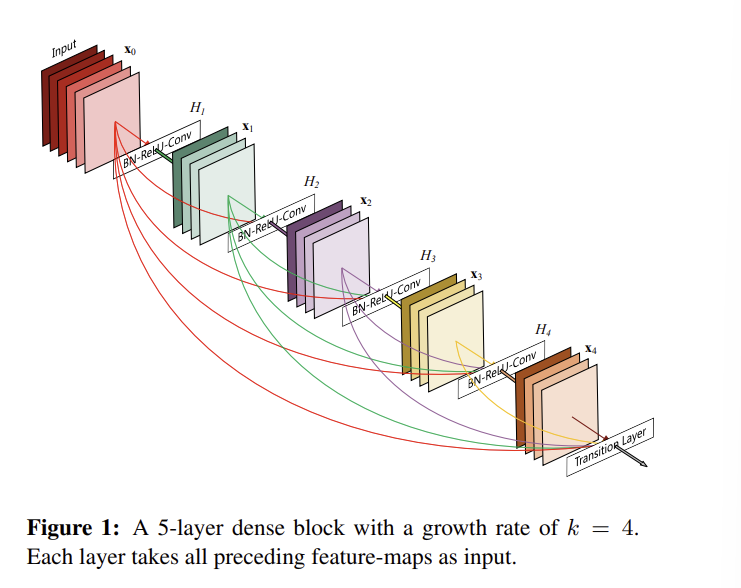
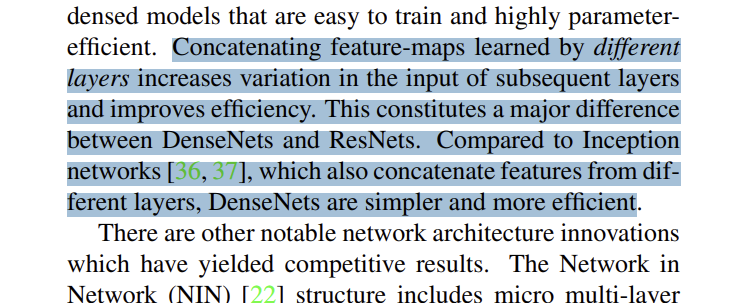
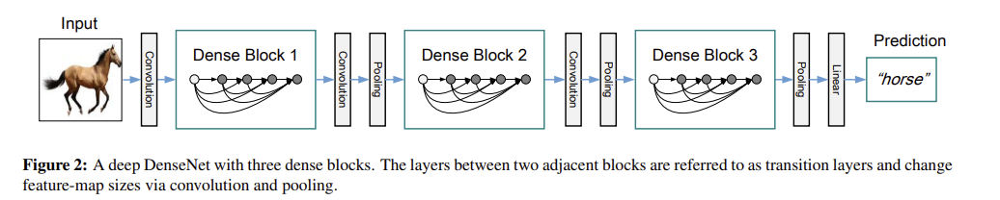

# [논문] DenseNet 공부 
CNN의 발전은 AlexNet에서 큰 변화를 시작으로 여러 모델이 나왔습니다.

| 연도 | 모델명 | 새로운 요소 | 
|---|---|---|
| 2012년 | AlexNet | CNN을 모델이 직접 학습하는 형태로 만들었습니다. |
| 2014년 | VGC | Convolotion Kernel의 크기를 3x3 으로 통일하고 이를 깊게 쌓았습니다. 성능이 좋아졌지만 과적합 문제가 있습니다. |
| 2015년 | ResNet | residual connection을 사용하여 입력값에 적용해야할 변화량을 학습시켰습니다. |
| 2015년 | DenseNet | ResNet과 다르게 이전 **모든** layer을 연결하여 학습시켰습니다. |

이번에는 위 모델들 중 하나인 DenseNet의 논문을 읽고 정리하는 글을 작성해보겠습니다.

## DenseNet의 철학

[논문 링크](https://arxiv.org/pdf/1608.06993)

DenseNet의 핵심 철학은 **Feature Reuse**입니다.

첫번째 레이어에서 `edge`를 학습, 두번째 레이어에서 `texture`를 학습, 세번째 레이어에서 `shape`를 학습한다고 하면 네번째 레이어에서 이를 모두 확인하는 구조를 만들어주게 됩니다. (앞의 설명은 예시입니다. 실제로는 알 수 없는 커널의 연속이 이뤄지게됩니다.)

DenseNet를 읽기 전 알아둘 주요 요점 미리 알아두기
- Vanishing Gradient: 기울기가 제대로 전달되지 않는 문제
- Feature Propagation: 앞에서 만들어진 feature가 뒤쪽 네트워크로 얼마나 잘 전다로디는가
- Feature Reuse: 앞에서 이미 학습한 feature를 뒤쪽 layer가 다시 사용하는 것
- Skip Connection: 중간 layer들을 뛰어넘어 직접 feature을 연결하는 방식
- Concatenation: 이전 feature map들을 channel 방향으로 붙이는 것
- Growth Rate: 지속되는 concatenate에 의해서 증가된 채널을 설정하는 양입니다.

## DenseNet 목차
DenseNet는 다른 논문과 비슷한 형태의 목차로 이루어져있습니다.
요약
1. 소개
2. 비슷한 작업들
3. DenseNet 소개
4. 실험
  - 데이터셋
  - 훈련
  - CIFAR과 SVHN을 대상으로 한 분류
  - ImageNet에 존재하는 분류
5. 논의
6. 결론
7. 참고

## Abstract
내용은 근래의 CNN에서는 레이어간 거리가 짧을수록 정확하고, 효율적인 모습을 보였다고 합니다.

이번 연구에서는 각 레이어가 모든 다음 레이어를 대상으로 연결되어있는 것에 대한 이야기를 하고 있습니다.

이에 따라 모든 레이어간에 연결이 활성화되어있는 꼴이며 $\frac{L \cdot (L+1)}{2}$ 와 같은 직접적인 레이어간 연결이 존재한다고 하였습니다. (지금까지 제가 봤던 모델은 보통 $L-1$ 개 연결이 존재하였습니다.)

이를 이용하여 vanishing-gradient 문제를 해결하였다고 합니다. (가중치가 너무 적어서 사라지는 문제입니다.)

또한 피처 맵에서의 순전파 강도를 높일 수 있었다고 합니다.

해당 모델을 측정할 때 사용할 이미지셋을 다음과 같이 설정하였다고 합니다.
- CIFAR-10
- CIFAR-100
- SVHN
- ImageNet

Abstract의 마지막 부분에는 의미있는 개선사항과 함께 `state-of-the-art`라는 표현을 사용하며 적은 계산대비 높은 성능을 낸다고 합니다.

[모델 깃허브 주소](https://github.com/liuzhuang13/DenseNet)

## 1. 소개
CNN은 객체 탐지 계열에서 지배적인 입지를 다져왔다고 하며 20년동안 기본 베이스로 소개되었다고 합니다.

또한 컴퓨터 하드웨어 자체의 발전과 신경망 구조가 개선되며 정말 깊은 모델 또한 만들어졌다 합니다.

기본적인 모델인 LeNet5에는 5개의 레이어가, VGG에는 19개, ResNet는 100개 이상의 레이어를 사용했다고 합니다.

논문에서는 `surpassed the 100-layer barrier`이라고 설명하였습니다.

또한 아래의 이미지에서 설명하는 것은 `k` 상수를 설정해줌으로써 각 레이어에서 앞으로 있을 레이어에 전달하는 채널(피처맵) 개수를 명시해주었습니다.



이후에는 CNN이 깊어짐에 따라 가중치의 기울기가 소실되는 문제에 대해 이야기를 재기하며 한 레이어를 skip 하여 입력값을 넘겨주는 ResNets에서 훈련 과정에서 랜덤하게 레이어와 가중치 흐름을 drop 시킴에 따라 깊은 레이어의 깊이가 큰 의미를 갖지 못하였다고 합니다.

최종적으로, 이런 여러 요소들은 모두 `short paths`를 가진다는 이야기를 하고 있습니다.

해당 모델의 직관적인 요소은 **적은 파라미터를 요구한다는 것**아리는 특징이였다고 합니다.

ResNet과 비교하면 ResNet의 경우에는 많은 레이어들은 서로 조금씩만 기여한다고 하며 펼쳐진 순환형 네트워크 방식과 비슷한 효과를 낸다고 합니다. 그에 반해 ResNet는 각 레이어가 자신의 파라미터를 그대로 사용하기 때문에 더 많은 파라미터를 사용한다고 합니다.

> 운이 좋게도 프로젝트 과제에서 DenseNet과 RestNet를 다루고있어서 한번 비교를 해보았는데 다음과 같은 파라미터 개수가 있었습니다. (마지막 레이어에 의해서 차이가 조금 있습니다.) 파라미터 자체가 약 400만개정도(약30%) 차이가 있었습니다.

```bash
C:\LANG_CHAIN_2026\2026-05-19_KDT_lang_chain\workspace\.venv\Scripts\python.exe C:\LANG_CHAIN_2026\MidProject_subject\FC\Desnetver2\train.py 
장치: cuda
원본 데이터: C:\LANG_CHAIN_2026\MidProject_subject\FC\CAP\face_dataset (존재: True)
클래스: ['윤**', '이**', '최**', '허완']
학습 320장 / 검증 80장
[build_model] [load_state_load] 학습 상태를 불러왔습니다..
학습 파라미터: 4,100 / 전체 6,957,956
```

```bash
C:\LANG_CHAIN_2026\2026-05-19_KDT_lang_chain\workspace\.venv\Scripts\python.exe C:\LANG_CHAIN_2026\MidProject_subject\FC\Resnet\Resnet.py 
장치: cuda
원본 데이터: C:\LANG_CHAIN_2026\MidProject_subject\FC\CAP\face_dataset (존재: True)
클래스: ['윤**', '이**', '최**', '허완']
학습 320장 / 검증 80장
Downloading: "https://download.pytorch.org/models/resnet18-f37072fd.pth" to C:\Users\hurwa/.cache\torch\hub\checkpoints\resnet18-f37072fd.pth
100%|██████████| 44.7M/44.7M [00:01<00:00, 28.2MB/s]
학습 파라미터: 2,052 / 전체 11,178,564
```

---

전통적인 순전파 아키텍처들은 레이어간 상태변화를 통해 관측할 수 있었습니다.

각 레이어는 순전파 기준 자신 이전의 레이어를 읽고 다음 레이어에 입력으로 넣어줍니다. (state=feature_map 을 비유적으로 표현한 것)

최근 ResNet의 연구에서는 많은 레이어들이 훈련에서 사용되지 않거나 큰 영향을 미치지 않는 것으로 확인된다고 합니다.

> 여기에서 생각해 볼것은 실제로 ResNet는 직전 레이어의 상태만 가져오고 DenseNet는 모든 이전 레이어들의 상태를 가져온다는 점입니다. 잠깐 DenseNet의 파라미터가 많아야하는것이 아닌가 싶었지만 K 레이어의 이전 레이어들에 대한 상태들은 결국 각 레이어의 가중치로 합산되기 때문에 학습 파라미터가 늘어나는 것은 아니라고 이해하였습니다

DenseNet 레이어는 굉장히 좁으며 한 레이어당 필터를 12개만 추가하며 기존의 피처맵이 변하지 않게 유지해주게 됩니다.

## 2. 비슷한 작업
현대의 모델이 점점 깊어질수록 각 레이어간의 연결 방식의 변화를 촉구하고 있다며 목차가 시작됩니다..

이미 DenseNet과 비슷한 연구가 1980년대 근처에 연구되엇다고 합니다. 해당 연구는 CNN이 아닌 MLP 에 대한 내용으로, 작은 데이터셋에도 수백개의 파라미터를 이용하여 유용한 성과를 내었다고 합니다.

이러한 연구들은 다양한 비전 작업에 유효하다고 하며 현재 작업의 평행적으로 `cross-layer connections` 형식 또한 DenseNet 연구와 유사하다고 합니다.

`Hightway Networks`은 100개 이상의 레이어에서 의미있는 성과를 낸 첫 아키텍처라고 합니다. `gating units`를 이용하여 최적화가 어렵지 않게 되었다고 합니다. 또한 `1202-레이어 ResNet`에서 몇 레이어를 빼고 진행을 하여도 성능이 큰 영향이 가지 않았다고도 합니다.

ResNet은 깊이가 충분히 깊다면 단순하게 필터의 개수를 늘리는 것 만으로도 성능이 향상될 수 있다고 합니다.

핵심적으로 해당 논문에서는 피처맵을 `concate`하여 `width`를 늘리는 방식을 이용하여 더욱 단순하고 효율적이라 설명하고 있습니다.



## 3. DenseNets에 대한 설명
$x_0$ 입력에 대해서 $L$ 레이어를 거치며 각 레이어는 선형변환이 아니라고 합니다.  $H_l(\cdot)$는 합성함수를 의미한다고 하며 구성 요소를 설명해줍니다.

### ResNets
전통적인 합성곱 순전파 네트워크로 기본적으로 $x_l = H_l(x_{l-1})$ 을 사용하며 `skip-connection`이 적용될 시에 $x_l = H_l(x_{l-1}) + x_{l-1}$ 과 같은 모습을 나타낸다고 합니다.

### Dense connectivity
정보의 흐름을 개선하기 위해 레이어간의 다른 연결 패턴을 사용하였다고 합니다.

여기에서 **어떤 레이어에서도 연결할 수 있는 방식**을 소개한다고 합니다.

이를 수식으로 풀어내면 $x_l = H_l([x_0, x_1, ..., x_{l-1}]),$ 이라고 합니다.

여기에서 $[x_0, x_1, ..., x_{l-1}]$는 다른 피처맵과의 `concatenation` (옆으로 붙이기)을 의미합니다.

### Composite function
합성 함수를 의미하여 $H_l(\cdot)$를 **BatchNorm**, **ReLU**, **$3\times3$ Conv**를 통틀어 의미한다고 설명합니다.

### Pooling layers
위에서 설명한 $H_l(\cdot)$ 에서 연산 이후, 피처맵의 사이즈를 변형해주게 됩니다.

해당 Pooling Layers는 $\operatorname{transition lasyers}$ 사이사이에 들어가서 동작한다고 말하고 있습니다.

전통적인 레이어들로는 $2\times2$ 평균 풀링 레이어 뒤에 따라오는 $1\times1$ 합성곱 레이어로 이루어져있다고 합니다.

**아키텍처 시각화**


### Growth rate
각 함수에서 $k$개의 피처맵을 반환한다면, $l^{th}$ 레이어는 $k_0 + k \times (l - 1)$ 개의 입력 피처맵을 가진다고 합니다.

중요한 차이로는 DenseNet의 레이어는 커널이 총 12개인 레이어들로 이루어져있다고 말합니다.

이러한 적은 레이어당 커널 수 (하이퍼파라미터)의 적은 학습량은 기존 최고수준의 논문에 포함하기 부족하지 않은 상관관계를 가진다고 설명합니다.

아래의 평가 결과 이미지에서도 파라미터 수가 굉장히 적어짐에도 불구하고 ResNet보다 성능이 잘 나온것을 확인할 수 있습니다.

# 다음에 계속
일단 정리하던 내용은 DenseNet를 구성하는 요소이며, 이후에는 DenseNet의 구성요소에 대한 설명을 마무리 짓고 훈련과 검증, 논의 부분에 대해서 정리를 해오도록 하겠습니다.