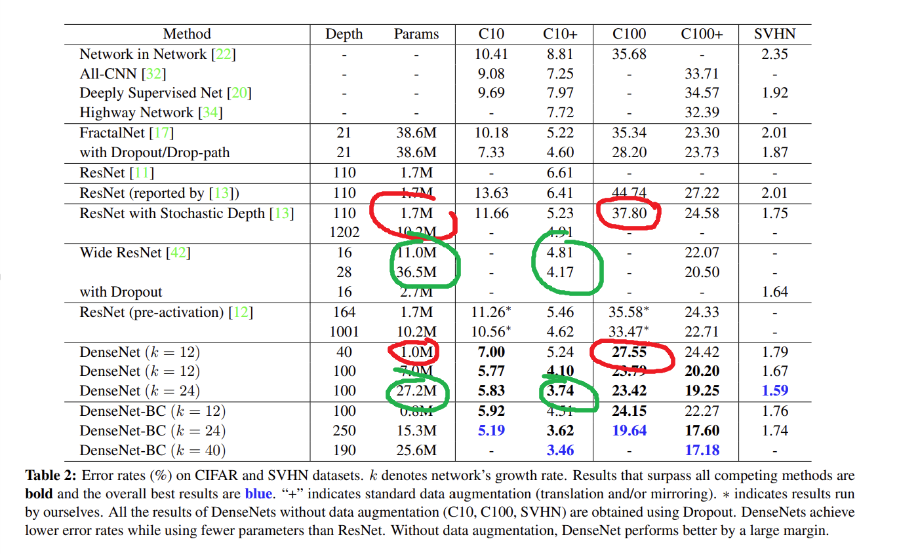
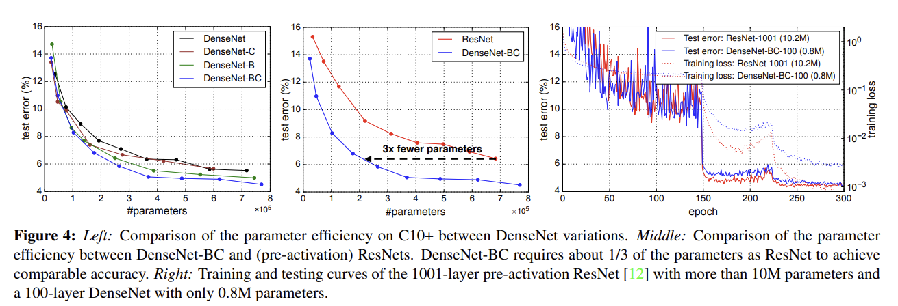
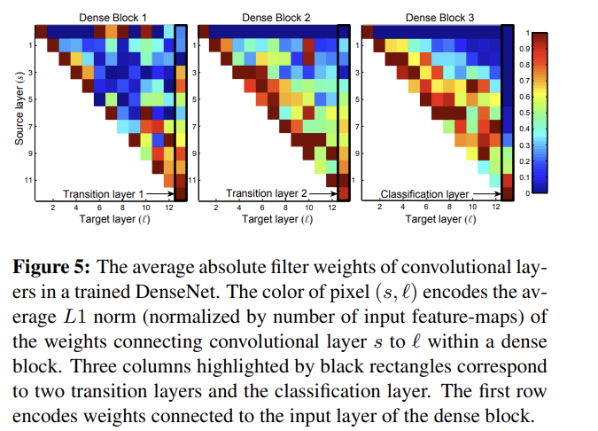

# [논문] DenseNet 공부 02
> 이번에는 이전 [DenseNet 포스팅](https://hurwan.tistory.com/131)에 이어서 글을 작성해보도록 하겠습니다.

이전 글의 내용을 요약하면
- DenseNet은 깊어지는 것에 초점을 맞춘 것이 아닌 넓어지는 것에 초점을 잡았다.
- DenseNet은 이웃한 레이어끼리만 feature을 skip하는 것이 아닌 모든 레이어에서의 skip를 시켜서 모든 레이어의 feature 결과를 보존한다.
- 위 특징을 통해 적은 파라미터 종류로도 좋은 성능을 낸다.

와 같은 요소가 있습니다.

이제 DenseNet의 특징 설명을 이어서 정리한 뒤 다음 요소까지 정리해보겠습니다.
4. 실험
5. 논의
6. 결론

## 3. DenseNet의 특징들
이전 글에서의 DenseNet의 특징으로는 `ResNets`의 특징을 강화하였다, `Dense connectivity`, `Composite function`, `Poolinglayers`에 대해서 이야기하였습니다.

### Growth rate
**Growth rate**는 모든 레이어에서 DenseNet의 하이퍼파라미터인 $k$. 즉, 하나의 레이어에서 사용하는 커널의 수를 의미하며 예를 들어, 레이어 $L$이 받는 입력의 크기는 $k_0 + k \cdot (L-1)$ 이며 ($k_0$은 최초로 입력받는 feature map 수를 말합니다.) 자신의 커널 $k$ 개를 통해 자신의 독자적인 피처맵 $k$개를 추가하여 다음 레이어로 $k_0 + k \cdot L$ 개의 피처맵을 입력으로 생성하게 됩니다.

이렇게 점점 width 값이 커지는 것을 Growth rate라고 부르게 됩니다.

### Bottleneck layers
`Bottleneck` 이라는 단어는 신경망에서 width가 좁아졌다가 다시 넓어지는 패턴을 의미합니다.

이는 지속적으로 넓어지는 DenseNet 속에서 $1 \times 1 \operatorname{Conv}$ 를 이용하여 feature 맵을 주리는 패턴을 의미합니다. 

해당 $1 \times 1$ 커널의 경우에는 `Conv`, `Pool`, `Dense`, `1x1`, `Pool`, `Dense`, `1x1`, `...` 등과 같이 사용이 되었습니다.

### Compression
모델의 성능을 증진시키기 위해 전통적인 레이어에서 피처맵을 줄이는 방식을 사용하였다고 합니다.

이를 구현한 방법은 출력되는 `feature map`의 개수가 `m`개라면 그 출력되는 피처맵의 개수를 $[\theta m]$으로 변경하는 방식을 사용하였다고 합니다.

해당 방법은 앞에서 설명하였던 $1 \times 1 \operatorname{Conv}$ 를 이용하여 이루어졌습니다.

*DenseNet에서는 $\theta = 0.5$로 설정하였다고 합니다.

### Implementation Details
구현의 상세 사항으로는
1. 입력 Conv 이후 Dense Block에 들어가는 이미지의 크기를 각각 $32^2, 16^2, 8^2$ 로 설정하였음
2. 기본 DenseNet의 설정은 ${L = 40, k = 12}$, ${L =100, k = 12}$, ${L = 100, k = 24}$ 이였으며 DenseNet-BC에서는 ${L = 100, k = 12}$, ${L =250, k = 24}$, ${L = 190, k = 40}$ 이라고 합니다.

## 4. 실험
실험 방식 또는 환경에 대해 말하고 있습니다.
### 1. Dataset
1. CIFAR: `32x32` 컬러 이미지 10, 100 클래스에 대해서 모두 `50,000 train` 중에서 `5,000`개 데이터를 검증에 썼으며 `10,000`을 테스트에 사용하였다고 합니다.
2. SVHN: `32x32` 컬러 이미지에 대해서 약 7만여장의 훈련 데이터셋과 2.6만장의 테스트 셋을 사용하였으며 약 53만장을 추가적인 학습에 썼다고 합니다. val 오류율이 낮은 것을 대상으로 선택하였으며 0~1 정규화를 하였다고 합니다.
3. ImageNet: 120만 이미지로 훈련하여 5만개의 이미지로 검증을 하였다고 합니다. 또한 `single-crop` 및 `10-crop` 방식을 사용하였다고 합니다. `10-crop`는 `Test-Time Augmentation`으로 10개의 테스트를 짜서 만든 것을 의미합니다.

### 2. 훈련
훈련에서는 SGD (확률적 경사 하강법)을 사용하였으며, CIFAR에 대해서는 `64 BATCH_SIZE`, `300-epochs`를 사용하였고, SVHN 에서는 `64 BATCH_SIZE`와 `40-epochs`로 설정하였다고 합니다. 데이터셋 학습 난이도와 연관이 있으며 모두 `lr=0.1`에서 시작해서 50% 시점과 75% 시점에 `0.1배` 해주었다고 합니다.

가중치 감쇠율로는 `1e-4`를 주었으며, **Nesterov** 이라는 이름의 모멘텀 방식으로 관성대로 조금 앞으로 가있을거라고 예상하고 그 위치에서 기울기를 보는 방식을 사용하였습니다.

위와 같은 관성대로 갔음을 예상하는 방식은 수학적으로 가중치 변화율에 따른 손실함수를 구할 때, 가중치 변화율에 이전 모멘텀을 적용하여 미분값을 구하는 방식으로 이루어져있습니다.

### 정확도

아마도 가장 눈에 띄는 경향으 DenseBC에서 L=190, k=40을 사용한 모델이 CIFAR 데이터셋에서 지속적으로 연구 최고수준을 유지하였다는 것입니다.

해당 CIFAR-10에서의 오류율은 3.46%이며, CIFAR-100에서의 오류율은 17.18% 였습니다.

C10, C100에서의 우리의 최고 모델은 더 강력했습니다. 모두 drop-path 정규화를 사용한 Fractal-Net보다 오류율이 이전에 비해 30% 낮게 책정되었으며
> drop-pathh가 dropout 하고 다른건지? 
- 네트워크 shortcut를 랜덤으로 끄는 방식

SVHN에서는 드롭아웃을 함께 사용하였을 때, L=100, k=24를 사용한모델 또한 ResNet의 현재 최고 기록보다 아득히 능가하엿습니다.

최종적으로, 250 레이어의 DenseNet-BC는 더 짧은 깊이의 모델보다 성능이 많이 개선되지 않았습니다.

이것은 SVHN이 간단한 작업이고, 너무 깊은 모델은 과적합을 시킬 수 있는 문제가 존재하기 때문입니다.

### 성능
copompression 혹은 bottleneck layers을 빼면, 레이어와 출력 피처맵 수에 비해 좋은 성능을 나타낸다는 것을 보여주었습니다.

우리는 이것이 모델의 성능이 좋아지는 주요 요소라고 보았습니다.

여기에서 확인할 수 있는 사실은 DenseNet의 Feature들에 대한 표현 방법이 매우 안정적이라고 볼 수 있습니다.

이것은 C10+와 C100+ 에서 가장 잘 드러났습니다.

C10+에서 오류율은 5.25에서 4.10으로 줄었으며 최종적으로 3.74%로 줄었습니다. 이 과정에서 파라미터는 100만개에서 700만개로 늘어났고 최종적으로 2720만개가 되었습니다. C100에서는 비슷한 경향 또한 발견하였으며 이것은 DenseNets의 특징이 더 크고 깊은 모델에 추가적인 날개를 달아줄 수 있을 것으로 확인되었습니다.

이것은 잔차 네트워크에서의 최적화 방식 또는 과적합 때문에 신경을 써야할 부분을 줄여주는 효과 또한 보여주었습니다.

### 파라미터 효율성
DenseNet는 표 2에서 확인하였을 때 파라미터 대비 더 강한 성능을 나타내는 것을 알 수 있습니다.

Bottleneck 구조가 존재하고 차원 축소를 전통적 레이어에서 사용하였을 때, 특히 성능이 좋아졌습니다.

예를 들어 250 레이어 모델에서 1530만개의 파라미터를 사용하였는데 파라미터가 300만개 이상의 파라미터가 있는 FractalNet과 Wide ResNet와 비슷한 성능이 나왔습니다.

> 이는 Bottleneck와 차원축소 기법이 특징을 지속적으로 유지하지만 width가 멈춤없이 불어나는 DenseNet의 약점을 보안하며 나타난 특징이라고 볼 수 있습니다.

### 과적합
DenseNet의 장점중 하나는 파라미터를 사용함에 있어 과적합 경향이 낮다는 것입니다.

데이터 증강 없이 관측을 해보았을 때, DenseNet 구조의 개선도는 명백히 이전 작업들을 뛰어넘었습니다. C10에서는 29%만큼 오류율이 개선되었으며, 이는 7.33%에서 5.19%로 줄었음을 의밓바니다. C100에서도 28%에서 19.64%로 오류율이 감소하였다고 합니다.

또한 C10 실실험에서 k=12에서 k=24로 출력 피처맵 수를 늘린 경우, 파라미터는 약 4배정도 많아졌고, 오류율이 5.77%에서 5.83%로 늘었났습니다. 이는 Bottleneck와 압출레이어를 통해 해결할 수 있습니다.

### 4. 이미지넷에서의 분류 결과
연구자들은 DenseNet-BC를 다른 깊이와 `growth rates`를 이용하여 이미지넷의 분류 작업을 실험하였다고 합니다.

그리고 ResNet으르 대상으로 빅교하였다고 합니다.

그리고 동일한 한경에서 작업을 확실하게 하기 위해 전처리와 최적화 함수 등을 균일하게 설정하였다고 합니다.

결과 지표로는 `single-crop`와 `10-crop` 검증 오류율을 사용하였습니다.

그림 4에서는 DenseNetBC의 파라미터 대비 오류율이 가장 낮은것으로 나타났으며, DenseNet-BC의 파라미터가 ResNet보다 3배정도 적었다고 합니다. 또한 테스트 오류율은 비슷하게 책정되었습니다.

해당 실험은 ResNet에 맞추어진 옵티마이저로 사용을 하였음에도 불구하고 적은 파라미터로 더 나은 성능을 나타내었다는 것에 의미가 있습니다.

## 논의
표면적으로 DenseNet은 ResNet과 수식적으로 상당히 비슷하지만 $H_l(\cdot)$에 들어가는 입력들은 합산 대신 `concatenate` 방식을 사용한다는 점만 다르다고 알 수 있습니다.

### 모델 영향도
concate 방식의 직접적인 인과관계로는 특정 피처맵은 그 피처맵 이후의 모든 레이어로부터 학습이 될 수 있음을 나타냅니다.

아래 세 도면에서의 왼쪽 도면은 DenseNet의 모든 평수에 대한 파라미터 효율성을 나타내며 가운데에는 ResNet아키텍처를 보여줍니다. 

연구진은 다수의 작은 네트워크를 C10+을 대상으로 훈련하였으며 그것의 테스트 정확도를 네트워크 파라미터들의 그래프로 나타내었 습니다.

또한 비교를 ResNet을 대상으로 한 이유는, 기존의 대중적인 AlexNet과 VGG-net보다 ResNet이 적은 파라미터로 좋은 결과를 냈기 때문이라고 합니다.

### 확률적/결정적 연결
깊이 정규화 (레이어 비활성화)에서 확률적 레이어 정규화와 결정적 레이어 정규화는 흥미로운 관계가 있습니다.

확률적 깊이 정규화는 직접적인 연결이 없던 Dense 레이어 사이의 레이어들을 삭제시켜 두 레이어가 직접적인 연결을 하게 하는 효과를 만들기도 하였습니다. 

그럼에도 불구하고 모델은 문제 없이 동작하였으며 이는 항상 떨어진 레이어들이 이어진 상태를 유지하였기 때문입니다.

# 결론

최종적으로 해당 연구에서 말하는 내용은 각 DenseBlock의 마지막 레이어에서 첫번째 레이어의 출력을 실제로 유의미하게 사용하고, Weight 크기가 잘 전달 되는지에 대해서 확인한 것입니다. 

이때 아래 이미지에서 확인 가능한 내용은 `layer-1` 쪽에 존재하는 가중치에 대한 절대 합은 마지막 FC 레이어의 평가에서 유의미하게 사용되지 않았으며, 마지막으로 갈수록 `high-level features`가 생기는 것으로 확인된다고 말합니다.

