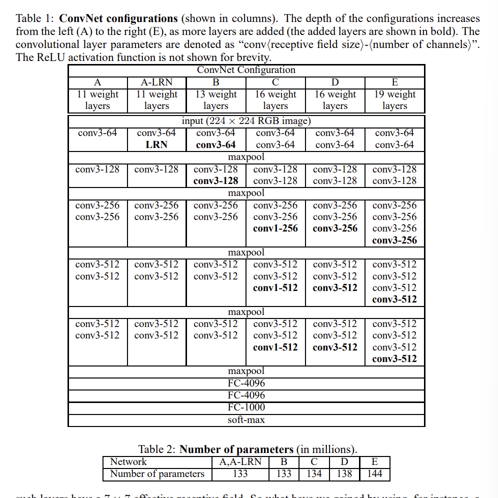

# [머신러닝] VGG 읽기
> 가볍게 VGG 논문을 읽으면서 느낀점 또는 원리를 이해하며 작성한 글입니다. [논문 링크](https://arxiv.org/pdf/1409.1556)

## 1. 개요
ConvNet가 이전에 큰 이미지를 대상으로 좋은 결과를 냈었다고 합니다. 이것은 ImageNet같은 큰 공공 이미지 저장소가 있었기 때문이라고 하며 고성능 컴퓨터 또한 존재했기 때문이라고 합니다. (예를 들면 분산 클러스터링이 되는 GPU라던가)

부분적으로 심층 시각적 인식 구조는 `ImageNet Large-Scale Visual Recognition Challenge`에서도 다뤄졌다고 합니다.

아무튼 ConvNet가 컴퓨터 비전 분야에서 더 대중적이 되면서 여러 시도들이 기존의 구조를 개선시킬 수 있었습니다. (더 높은 정확도로) 

일시적으로 최고 성능을 보여준 모델은 작은 커널을 커널을 사용하였으며 네트워크를 깊이 사용하였습니다.

이번 논문에서는 ConvNet 설계 구조의 다른 중요한 면인 **깊이**에 대해서 다뤘다고 합니다.

결론을 먼저 말하면 파라미터를 조금 고쳤으며 Conv레이어를 통해 꾸준히 깊이를 증가시켰다고 합니다.

이는 작은 커널 크기인 3x3 Conv를 사용하여 이렇게 실현할 수 있었습니다.

결과적으로 ConvNet의 정확한 구조를 도출했다고 합니다.

*해당 논문에서의 2번째 목차에서는 ConvNet의 설정값 대해서 설명하며 디테일과 분류 학습, 평가와 관련해서는 3번째 목차에서 사용한다고 합니다. 그리고 설정값들은 ILSVRC 분류와 비교된 것을 목차 4, 5에서 확인할 수 있습니다. 최종적으로 ILSVRC-2014 객체 지역화 시스템에 대해서 설명을 하며 아주 깊은 특징에 대해서 설명한다고 합니다. (각각 부록 A, B)

## 2. ConvNet의 설정값
ConvNet의 깊이의 변형에 따른 적절한 평가를 위해서 이번 COnvNet 레이어 설정은 기존과 동일한 특징을 사용하였다고 합니다.

이번 목차에서는 해당 논문의 설정에 대해서 설명한다 하며 평가 단계에서 사용된 특징적인 세부사항들에서 이야기한다고 합니다.

### 2.1 구조
이번 논문에서는 224*224 크기의 RGB 이미지를 받으며 해당 연구에서 만든 전처리는 RGB 값을 추출하는 것 뿐이였습니다.

아주 작은 수용 영역인 3x3을 통해 상하좌우를 잡을 수 잇었다고 하며 1x1 합성곱 필터를 이용해서 입력 채널 수 를 바꿀 수 있었다고 합니다.

stride는 1로 고정되어잇으며 padding 또한 1로 들어가있다고 합니다. 공간적 풀링의 경우에는 2x2 커널로 이루어졌으며 stride=2 라고 합니다. (일반적인 CNN에서 보통 쓰는 패턴으로 보입니다.)

합성곱 레이어에서 FC 레이어는 3개 존재했다고 했으며 4096, 4096, 1000 출력을 반환한다고 합니다.

또한 모든 은닉레이어는 rectification(ReLU)를 가지고있다고 합니다. 또한 정규화 또한 하는 형태라고 합니다.

목차 4에서 설명한다고 하지만 정규화 레이어의 경우에는 ILSVRC 데이터셋에서 성능을 증가시키진 않지만 메모리를 사용하였다고 합니다.

### 2.2 설정들
ConvNet 설정에서는 `표1`에서 표시되었다고 합니다.

하나의 파라미터들은 A, B, C, D, E에서 각각 1.33, 1.33, 1.34, 1.38, 1.44 억 개씩 존재한다고 합니다.

모든 설정은 일반적인 설계 디자인을 따랐으며 깊이만을 바꾸어 11~19개의 가중치 레이어를 추가했다고 합니다. 

첫번째 레이어에서 64 채널로 시작해서 최대 풀링 레이어 이후 2배로 늘려가면서 최종적으로 512 채널을 사용하였다고 합니다.

### 2.3 논의 
ConvNet 설정은 ILSVRC-2012에서 최고 성능으로 사용됐던 것과 다소 다르다고 합니다.넓은 수용 필드 (커널)을 사용하기 보다는 모든 레이어에 걸쳐 3x3을 사용하엿다고 하며 모든 픽셀에 대해서 합성곱을 싫행하는 방식이라고 합니다. (stride 또한 2에서 1로 줄었습니다.)

이곳에서 3x3 레이어가 2개 있으면 적은 메모리 및 연산을 통해 5x5를 구현할 수 있으며 3개를 통해 7x7 레이어를 표현할 수 있다고 말하고 있습니다.

또한 중간중간에 활성화 함수를 넣을 수 있다는 이점 또한 생기게 됩니다.

## 99. 궁금했던 내용들 정리

- ConvNet가 무엇인지: Convolutional Neural Network 라고 하는 기존에 알고있던 CNN을 의미하는 모델을 말합니다.
- GPUs of large-scale distribution clusters가 무슨 뜻인지