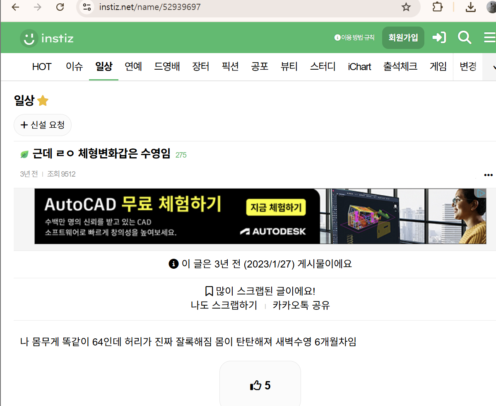

# Moti Physio에 대해서
모티 사이코는 전문 장비 기반 3D 체형 분석기 포지션

> 분석 장비에 가까운 소프트웨어보다는 하드웨어가 더 특징적인가?

- RGB-Depth 적외선 센서
- 3D 모델링
- 근육 긴장/약화 시각화
- 결과 리포트
- 운동 영상 제공
- 전후 비교
- 전문가 상담 보조 도구

> 루틴 성공률 분석 (개선도 등 알람)은 좋은 방식이지만 단기 이탈자를 막기 위한 방법도 필요할 것 같습니다. (자세 교정을 위해선 N일이 걸릴 수 있으니까. 넷플릭스의 30초 법칙과 같이)

> 전문 기업을 따라갈 순 없겠지만 몸무게, 키 등과 같이 사용자가 비교적 정확하게 측정 가능한 수치를 뽑을 수 있게 하는 것도 좋을 것 같습니다.

## 개인 추가 조사 (Moti Physio)
- 근육의 긴장/약화 추정
- 

일반 Moti Physio 소프트웨어는 공식 FAQ/EULA에서 의료기기로 승인/등록된 소프트웨어가 아니며 의료용 사용은 금지된다

> 아니면 아예 **허리 피세요**같은 이름의 서비스로 웹 캠에서 그냥 `넛지` 해주는 알림 서비스는 어떤가 (주력 기술로는 부실한 기분이지만 서비스로는 좋은듯)

> 위의 사진과 같이 뭔가 관련 소셜 미디어를 보여주는 것은? 물론 AI가 뭔가 심리를 조작한다는 윤리적 문제는 사용자의 설정 가능을 풀어줌으로써 해결하고.

> 사용자가 AI가 스스로를 어떻게 판단하고있는지를 확인할 수 있게 `AI가 보는 나`라는 탭을 추가해서 오류 및 신뢰도 문제를 없애주기

> 