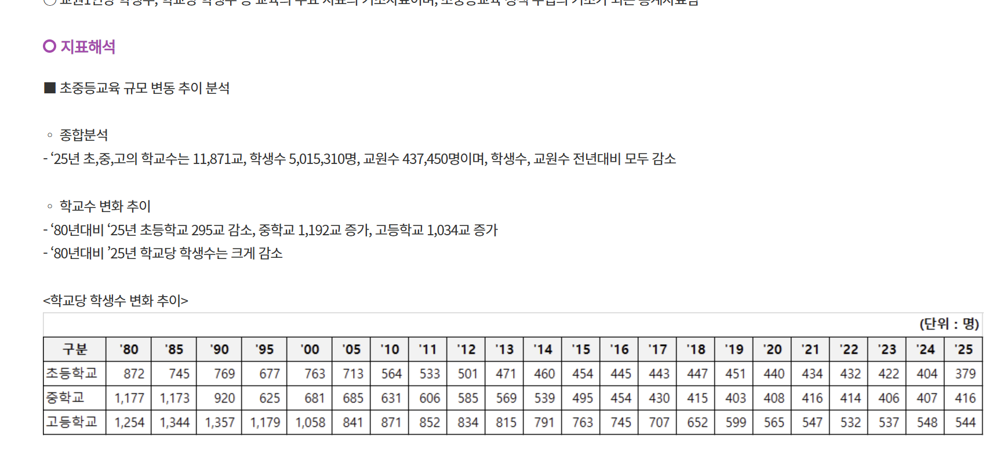

ai를 통해서 해결할 수 있을만한 요소들은 어떤것이 있을까?
- 암 의심부위
- 이미지처리를 통한 의료 사고 예방
- 스팸/피싱 메일 탐지
- 사기 및 부정 행위 방지
- 전력 수요 예측
- 학생 데이터 기반 조기 경고 시스템
- 학생 데이터를 통한 교사 대응 방법 또는 법적 지식 제공
- 서류작업 해결
- 이상감지 시스템
- 접근성 해결 문제

# 첫 아이디어
`교육분야에서 종사하는 교사들에 대한 지원`

### 자료 수집
[학교당 학생수 감수지표](https://www.index.go.kr/unity/potal/main/EachDtlPageDetail.do?idx_cd=1537)

[교권침해를 받아본 교사가 약 80%](https://www.yna.co.kr/view/AKR20260625108600061?utm_source=chatgpt.com) 2026-06-25 연합뉴스

1. [부족한 교사 상담 인원](https://www.tbc.co.kr/news/view?pno=20260630133125AE01692&id=207872&c1=code&c2=)
2. [교사 70%가 교권침해 경험이 있다고 함](https://v.daum.net/v/3ViraqoMIo)
3 

### 해결 아이디어 1
> 학생 및 학부모와의 대화 음성 파일 기반의 학생 성향 분석 및 문제 해결 제안 솔루션