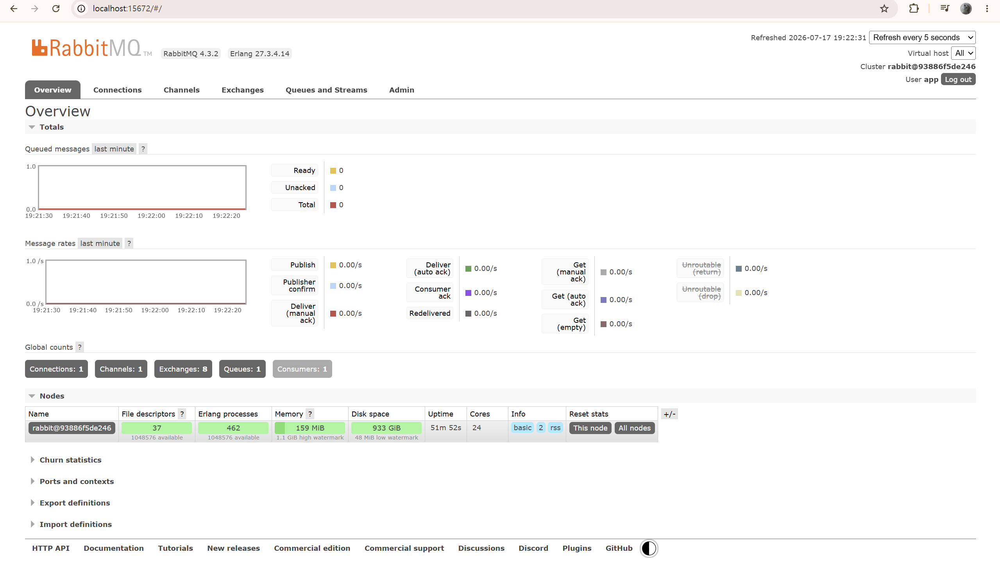
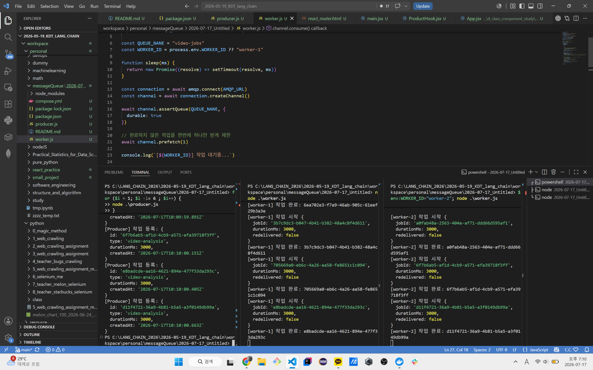
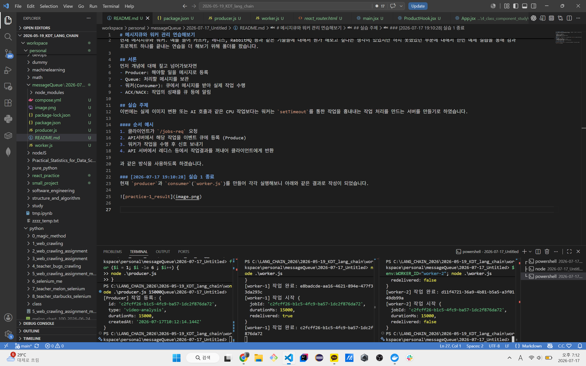

# 메시지큐와 워커 관리 연습해보기
현재 메시지큐와 워커. 예를 들어 카프카, 레디스, RabbitMQ 등과 같은 기술들에 대해서 뭔가 해보고 싶다는 생각이 있었지만 하지 못했었던 부분에 대해서 한번 예제 실습을 통해 감과 프로젝트 하나를 끝내는 연습을 더 해보기 위해 폴더를 팠습니다.

## 서론
먼저 개념에 대해 짚고 넘어가보자면 
- Producer: 해야할 일을 메시지로 등록
- Queue: 처리할 메시지를 보관
- 워커(Consumer): 큐에서 메시지를 받아 실제 작업 수행
- ACK/NACK: 작업의 성패를 큐 등에 알림

## 실습 주제
이번에는 실제 이미지 변환 또는 AI 호출과 같은 CPU 작업보다는 워커는 `setTimeout`를 통한 작업을 흉내내는 작업 처리를 만드는 서버를 만들기로 하였습니다.

이를 통해 `Docker`을 이용하여 `rabbitmq:4-management` 이미지를 활용하여 `RabbitMQ`를 활용하였습니다. 이때 `management` 버전의 특성상 `tcp:15672` UI 포트가 열려 직접 처리 현황을 확인할 수 있었습니다.

또한 `producer`로써 RabbitMQ에 접속하는 `producer.js`와 워커(Consumer)로써 RabbitMQ에 연결하는 `worker.js`를 생성하여 몇가지 실험을 해보았습니다.

### [2026-07-17 19:10:28] 실습 1 종료
현재 `producer`과 `consumer`(`worker.js`)를 만들어 각각 실행해보니 아래와 같은 결과로 작성이 되었습니다.

또한 `worker-2`가 실행중인 `15000ms` 작업을 작업 도중 `Ctrl + C`를 통한 중지를 시키지 즋 `worker-1`이 해당 작업을 받아서 실행하는 것을 확인할 수 있었습니다.

> producer가 생산자로써 RabbitMQ 컨테이너 포트에 붙어서 이벤트를 주고 worker.js들이 RabbitMQ 워커로 포트에 붙어서 RabbitMQ가 이걸 중개해주는걸로 보입니다. 생각보다 엄청나게 고급 기술인줄 알았는데 막상 사용해보니 개념적으로는 이해에 큰 어려움이 없어서 오히려 당황스러웠습니다.