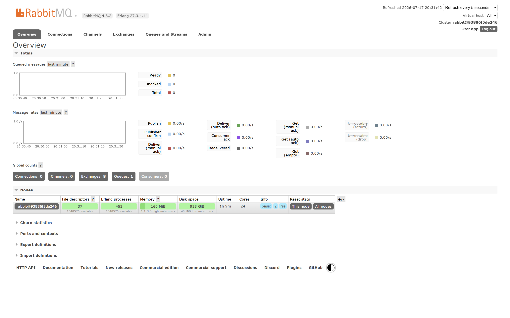
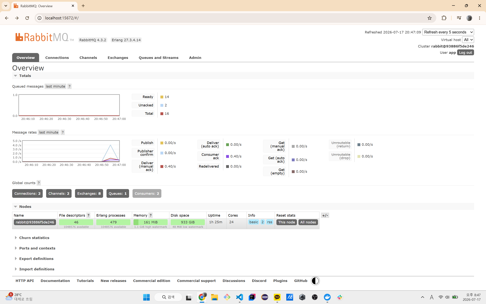
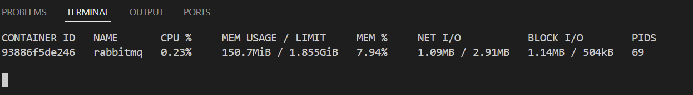
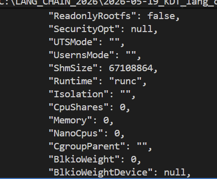
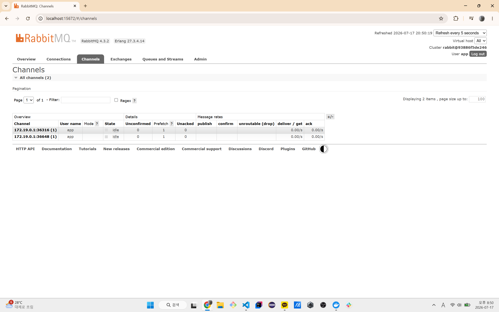

# AMQP 프로토콜과 RabbitMQ

기본적으로 RabbitMQ를 처음 사용하였습니다. 도커로 `management` 버전 이미지를 사용하니 `15672` UI 포트를 포워딩하여 대시보드를 확인할 수 있었습니다.



아무래도 처음으로 보는 화면이라 약간 알듯 하면서도 신기하기도 하고 모르겠기도 하였습니다.

일단 순서대로 **AMQP**프로토콜과 RabbitMQ가 맡아주는 여러 역할 및 라이브러리/프레임워크의 형태 등등을 개념적으로 알아보는 시간을 한번 가져보겠습니다.

## RabbitMQ 대시보드
위 사진에서 확인되었듯 해당 화면은 웹 관리 화면으로 아래와 같은 요소들을 조회 및 관찰하는 용도로 사용할 수 있습니다.
- Queue
- Exchange
- Connection
- Channel

또한 메시지 처리량, 노드 자원을 관찰할 수 있습니다.

RabbitMQ에는 여러 버전이 존재하며 `1.0`, `0-9-1` 과 같은 버전이 있습니다.

여기에서 사용된 `RabbitMQ 4.3` 은 `1.0`, `0-9-1` 연결을 받을 수 있다고 하며 이전에 사용하였던 `node`의 `amqplib` 패키지의 경우에는 **AMQP 0-9-1 클라이언트**라고 합니다.

여기에서 `RabbitMQ` 자체는 서버로서 역할을 하게되며, `Consumer/Producer`은 모두 클라이언트로 해당 서버에 연결되게 됩니다.

> 다시 한번 화면으로 돌아가 보겠습니다.



여기에서 확인 가능한 요소는 
- rabbitMQ의 버전은 4.3.2이다
- Erlang 27.3.4.14 버전으로 작성되어있다 (동시성/분산처리/장애복구에 강하게 만들어진 언어)
- user은 app이며 큐는 하나가 존재한다.
- consumer이 2개가 돌아가고있다
- publish 속도와 처리량
- 노드

또한 주목할 요소로는
- Name:             rabbit@93886f5de246
- File descriptors: 36
- Erlang processes: 451
- Memory: 약 159 MiB
- Disk space: 약 933 GiB
- Uptime: 약 1시간
- Cores: 24

부분이였는데 여기에서 얼랭 프로세스는 원래 가벼운 프로세스라서 둘째쳐도, RabbitMQ가 확인할 수 있는 cpu/디스크 크기가 매우 큰것을 확인할 수 있습니다. `docker stats`의 결과는 아래와 같고



실제로 점유하는 값의 경우, `docker inspect rabbitmq`를 통해 보았을 때



제한이 걸려져있지 않는 것을 확인할 수 있었습니다.

RabbitMQ에 `disk_free_limit`라는 메시지 발행 차단 안전장치가 존재하긴 하지만 다음번에는 도커에서 실행하거나 직접 설치/실행할 경우 유의하는 것이 좋을 것 같습니다.

> 채널에 접속해보겠습니다.



여기에서 확인할 수 있는 것은 하나의 Docker 네트워크의 IP 네트워크에 존재하는 RabbitMQ 서버(`172.19.0.2/16`)에 대해서 worker의 생산 포트가 2개 뚫려있는 것을 확인할 수 있습니다. (도커 IPAM 게이트웨이를 통해)

또한 prefetch가 1로 설정되어있어 하나씩 작업을 가져간다는 것을 알 수 있습니다.

## AMQP의 형태
AMQP의 경우, 다음과 같은 통신 규칙을 정의하게 됩니다.
- 연결 방식
- 사용자 인증 방식
- Channel만드는 규칙
- Exchange와 Queue 선언 방법
- 메시지 발행 위치
- 메시지 소비 방법
- 성공 및 실패 규칙

방금 했었던 실습의 경우에는 
- `channel.assertQueue()`: 큐 생성
- `channel.sendToQueue()`: 작업 보내기
- `channel.consume()`: 특정 큐의 작업 시작
- `channel.ack()`: 작업 완료신호

등과 같은 메서드를 통한 사용을 하였었습니다.
### AMQP 통신 순서
> Producer의 메시지 송신
1. TCP 여결
2. AMQP 프로토콜 버전 협상
3. 사용자 인증
4. Virtual host 접속
5. Channel 생성
6. Exchange / Queue 선언
7. 메시지 Publish
8. RabbitMQ의 Publisher Confirm 수신

> Consumer의 등록 및 작업
1. TCP 연결
2. AMQP 연결 및 인증
3. Channel 생성
4. Queue 선언
5. Prefetch 설정
6. Queue Consume 등록 (어떤 큐에 대해 작업할지)
7. RabbitMQ의 메시지 전달
8. Worker의 작업 실행
9. ACK/NACK 전송

여기에서 Consumer은 Producer로부터 실행파일/함수 자체 등을 받는건 당연히 무리고 담당한, 등록/설치되어있는 작업만을 수행할 수 있습니다.

또한 Producer가 직접 Queue에 보내는 것이 아닌, Exchange라는 라우터가 Producer가 보낸 메시지를 어떤 Queue로 보낼지 판단하여 보내게 됩니다. 여기에서 Producer은 `메시지` + `routing key`를 보내는데 

### Produce와 exchhange
위에서 Prodcuer의 Queue 등록 시 과정이 살짝 햇갈려서 정리를 해봤습니다.

기존에는 Exchange가 어떤 key를 가진 작업을 어떤 Queue로 보낼지 설정되어있습니다. 이때 Producer이 Routing key와 함께 작업에 대한 메시지를 보냅니다. 이후, Binding key라는 Queue의 등록 문자열과 함께 해당 작업들을 등록하게 됩니다. 

`amqplib` 패키지를 기준으로 다음과 같은 작업을 통해 이루어집니다.

```js
import amqp from "amqplib"

// RabbitMQ와 만든 TCP 연결
const connection = await amqp.connect("amqp://사용자:비번@localhost:5672")
// AMQP 명령을 주고받는 자신(클라이언트)-서버의 통로
const channel = await connection.createChannel()

// Exchange 준비하기
await channel.assertExchange(
  "task_exchange", // 원하는 exchange 이름
  "direct", // exchange 타입
  {
    durable: "RabbitMQ가 재시작되어도 채널을 지속할지" ? true : false
  }
)

// 큐 준비하기
await channel.assertQueue(
  "image_worker_queue",
  {
    durable: true
  }
)

await channel.bindQueue(
  "image_worker_queue", // 큐 이름
  "task_exchange", // exchange 이름
  "image.resize" // 바인딩 키
)

channel.publish(
  "task_exchange", // 해당 exchange에게
  "image.resize", // routing_key를 붙여
  Buffer.from(JSON.stringify(job)), // 메시지를 작성하며
  { // 메시지를 영속 메시지로 등록
    persistent: true
  }
)

// 최종적으로 Exchange가 image.resize를 보고 알맞은 queue에 등록
```
가 됩니다.

따라서 이전에 작업한 `worker.js`, `producer.js`, `docker-rabbitmq`를 복기해보면

producer의 경우에는 exchange 생성 없이 assertQueue를 통해서 사용자가 삭제하지 않으면 계속 존재하는 큐를 생성한뒤, exchange/queue의 키를 설정하지 않아서 큐 자체가 키가 되고, 만들어진 큐 이름으로 데이터를 넣으려면 Buffer 타입으로 넣어야해서 json을 버퍼로 바꾸어서 에러가 나거나 서버가 멈춰도 보존되는영속성 메시지를 보내며, 이후에 서버는 이를 해석하긴 해야하니까 contentType도 같이 보내게됩니다. 그리고 해당 만들어진 프로세스는 기존 채널로부터 응답을 무한정 대기하고(await때문에) 끝나면 연결을 끊어주는 메서드를 사용해서 채널과 서버의 자원을 소모되는것을 막아주며 워커의 경우에는 프로듀서가 주는 작업 이름인 QUEUE_NAME에 대해서 어떤식으로 작업을 처리할 것인지를 등록하는 consume를 주게 되고, 이것도 채널에 접속하는 과정 자체는 똑같은데 워커인 경우에는 prefetch()를 등록하고, consume까지 작성하게 됩니다. 이후에는 nack또는 ack를 보낼 수 있는거 nack, ack는 consume안에서만 사용하게 되어있는 컴파일러수준이나 에러가 나진 않아도 규칙상 지키는걸 권장하게됩니다. 최종적으로 ack/nack에는 값 + 추가 정보를 통해 성패 여부를 알려주어 producer의 waitForConfirms에 가겠지.

> 정확히 Exchange가 없는 경우에는 "" 형태의 Exchange를 사용하며 `QueueName`가 `binding key`(`routing-key`)가 됩니다.