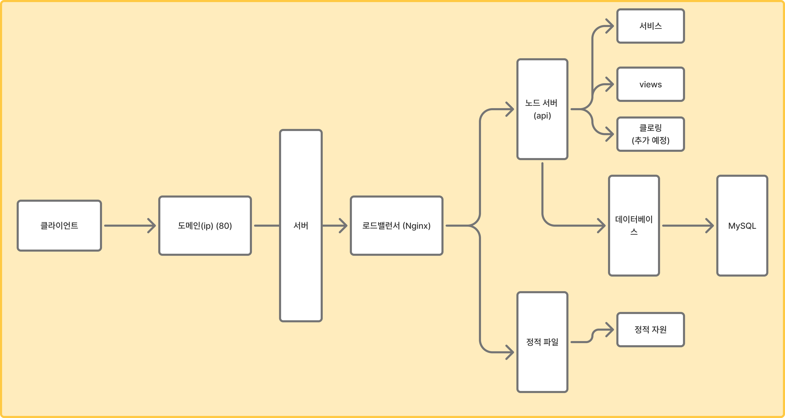

# 여러 기술들 사용해보기
아래와 같은 구조로 제작 예정

한번 `Nginx`와 정적 파일, 노드의 `ejs`를 한번 사용해보기 위해서 만든 프로젝트 입니다. 하는김에 도커도 사용할 예정입니다.

## 써보고 싶은 기술들
1. ejs - ssr
2. 크롤링
3. api 한두개?
4. 배포
5. 도커
6. 젠킨스
7. 정적 파일 서버
8. 로드밸런서

## 설정 상태
[2026-06-26 14:03:22]: 노드 서버 포트 `8099`로 설정