# 우분투에 대해서
우분투는 Linux 커널을 기반으로 만든 운영체제입니다.

대략적으로 리눅스 커널에 아래 요소들이 추가되어 있습니다.
- 기본 명령어
- 패키지 관리 도구
- 시스템 서비스
- 설치 프로그램 (우분투)
- 기본 설정

> 이는 Windows Server 처럼 서버 운영체제로 사용할 수도 있으며 일반 PC용 데스크톱 운영체제로도 사용할 수있습니다. 이는 `Canonical`이라는 회사의 오픈소스 커뮤니티가 개발 및 관리합니다.

## Desktop과 Server
우분투에는 Desktop과 Server이 존재하는데 `Ubuntu Desktop`의 경우에는 그래픽 화면이 있으며, 마우스와 창으로 조작 가능, 브라우저/파일 탐색기등이 존재합니다. 이에 따라 자원 사용량이 더 많은 편입니다.

`Ubuntu Server`의 경우에는 기본적으로 그래픽 화면이 없는 CLI기반의 운영체제이며 터미널 명령어로 조작하게 됩니다. 자원 사용량이 비교적 적습니다.

우분투의 버전 체계의 경우에는 `Ubuntu 26.04 LTS`와 같이 작성되며 숫자의 경우에는 `YY.MM` 과 같은 형태를 가집니다. `LTS`의 경우에는 2년마다 출시되며 기본 보안 유지보수 기간은 5년을 가집니다. 일반 버전의 경우에는 그냥 최신 기능을 사용해보고 싶을때 깔아서 해보는 것이 좋을 것 같습니다.

설치는 [여기](https://ubuntu.com/download/server/thank-you?version=26.04&architecture=amd64&lts=true)에서 하였습니다.

26버전의 경우에는 지원하지 않는 프로그램이 있을 수 있지만 현재 작업할 `ssh`, `systemd`, `Nginx`, `Docker`은 문제 없다고 하기 때문에 `26.04`버전을 채택하였습니다.

## 설치 시작 후 기다리면서 사전조사
`2026-07-14 08:47:25` 기준 설치를 시작하였지만 아무래도 3기가바이트 크기이다 보니 다운로드에 시간이 좀 걸릴 것으로 보입니다. (학원이라 속도도 좀 느린거같네요)

### Linux란?
`Linux`의 경우에는 커널 이름을 의미합니다. 보통 `Linux`커널을 사용하는 운영체제 계열 전체를 리눅스라고 부른다고 합니다.

리눅스 커널은 하드웨어를 직접 관리하고 프로그램에 기능을 제공하는 운영체제의 핵심 부품입니다. 일반적으로 쉘 및 사용자 프로그램의 시스템 콜을 모두 커널(`Linux` 등)에서 받아 처리한다고 볼 수 있습니다. 이는 곧 `cpu`, `메모리`, `디스크`, `네트워크`, `io장치` 등의 안정적인 관리로 직결되어 매우 중요한 역할을 한다 생각할 수 있습니다.

주로 언급되는 용어들을 살펴보면
- 프로세스와 스레드 실행 및 관리
- CPU 스케줄링
- 메모리 및 가상 메모리 관리
- 파일 시스템 관리 (보안과 무결성, 속도)
- 네트워크 통신
- 장치 드라이버 관리 및 인터럽트 관리
- 사용자 권한과 프로세스 격리

등의 내용을 다룹니다. 이는 매우매우 개인적으로 관심이 있고 매력적이다 생각하는 부분이지만 일단 너무 깊게 들어가진 않겠습니다. (아마도..?)

### 우분투의 구성요소
우분투는 커널을 리눅스로 가지며 그 외의 요소들을 조합한 운영체제라고 볼 수 있습니다.

- `kernel`: `linuxKernel`
- `shell`: `bash`
- `initSystem`: `systemd`
- `packageManager`: `apt`
- `utilities`: `gnuTools`
- `repositories`: `ubuntuRepositories`

와 같은 구성요소를 가집니다. 이외에도 각각의 운영체제는 다른 기본 프로그램, 설정방식, 업데이트 정책, 서버 운영 처학 등을 가질 수 있습니다.

### 커널
> 앞서 설명하였듯 우분투는 리눅스 커널을 사용합니다. (생략)

### 부트로더
컴퓨터가 켜졌을 때 `Linux커널`을 메모리에 올려주는 프로그램이 필요하며 여기에서 Ubuntu는 일반적으로 `GRUB`를 사용합니다.

따라서 전원을 킬 시 `BIOS` 또는 `UEFI`를 통해 `GRUB`가 로딩되며 이를 통해 `Linux` 커널과 `initramfs`가 로딩됩니다. 이렇게 `systemd`가 실행되며 각종 서비스가 실행되게 됩니다.

> `initramfs`는 초기 램 파일시스템으로 커널이 본격적인 루트 파일 시스템에 접근하기 전에 사용하는 임시 초기 파일 시스템입니다. 이를 통해서 핵심 드라이버, 암호화를 임시로 제공하며 이를 통해 실제 디스크와 루트 파일 시스템을 발견할 수 있게 해줍니다.

> `init system`의 경우에는 커널이 실행된 다음에 사용자 공간의 프로그램을 시작시켜주는 시스템으로 일반적으로 PID가 1입니다. 이를통해 타이머작업, 백그라운드 서비스 시작과 종료, 서비스 의존관계, 로그 관리의 일부 등을 담당하게 됩니다. 운영체제 또는 배포판마다 `init system`은 달라질 수 있지만 대표적으로 `systemd`가 존재합니다.

> `shell`은 사용자가 입력한 명령어를 해석하고 프로그램을 실행하는 명령어 인터페이스로 사용자가 해당 쉘에 명령어를 입력하면 쉘이 해당 명령어를 해석하여 프로그램 실행 요청을 하여 최종적으로 Linux 커널이 프로세스를 생성해주게 됩니다. 대표적으로 `bash`라는 기능이 많고, 자동완성, 명령어 기록, 배열등의 기능을 제공하는 쉘이 존재합니다. 우분투에는 `/bin/sh`가 가리키는 가볍고 빠른 `Dash` 쉘이 존재합니다.

> `패키지 관리자`는 프로그램을 설치/업데이트/삭제하며 프로그램 간 의존성을 관리하는 도구입니다. 우분투의 경우에는 `apt`를 통해 저장소에서 패키지를 검색하고 필요한 의존성을 함께 해결하는 고수준 도구이며 `dpkg`는 `.deb` 패키지를 실제로 설치/제거 해주는 저수준 도구입니다. 일반 `npm`, `pip`과 다른점은 관리의 범위가 특정 언어인지, 운영체제인지에 대한 차이를 말합니다.

> `서비스`와 `daemon`의 경우에는 서버에서 사용자가 직접 실행하지 않아도 계속 동작해야하는 프로그램으로 전통적으로 이런 백그라운트드 프로그램을 `daemon`이라고 부릅니다. 예를 들어 `sshd`, `nginx`, `cron`, `dockerd`, `postgres` 등이 존재합니다. 이들을 `systemd`가 서비스 단위로 관리하게 됩니다. 예를 들어 `systemctl status nginx` 를 통해 해당 백그라드 프로세스를 확인할 수 있습니다.

### 파일시스템
리눅스는 윈도우처럼 특정 `C:`, `D:`과 같이 드라이브 문자로 자주지 않으며 `/`라는 루트 디렉터리 아래에서 `bin/`, `dev/`, `etc/`, `home/`, `sys/` 등의 형태로써 파일을 관리하게 됩니다.
 
역할은 대강
- `etc/`: 시스템과 프로그램 설정파일
- `home/`: 일반 사용자의 홈 디렉터리
- `var/`: 로그, 캐시, DB와 같은 변경되는 데이터
- `boot/`: 커널과 부팅 관련 파일
- `dev/`: 디스크, 터미널 등의 장치를 파일처럼 표현
- `proc/`: 프로세스와 커널 정보를 가상 파일로 제공
- `sys/`: 장치와 커널 서브시스템 정보
- `tmp/`: 임시파일
- `root/`: 루트 사용자의 홈 디렉터리

## VM 설치하기
이제 `.iso` 파일이 설치되어 VM을 만들기 시작했습니다.

일단 작업을 직접 해보기 위해 커스텀으로 생성하였으며 하드웨어는 최신버전을 선택하였습니다.

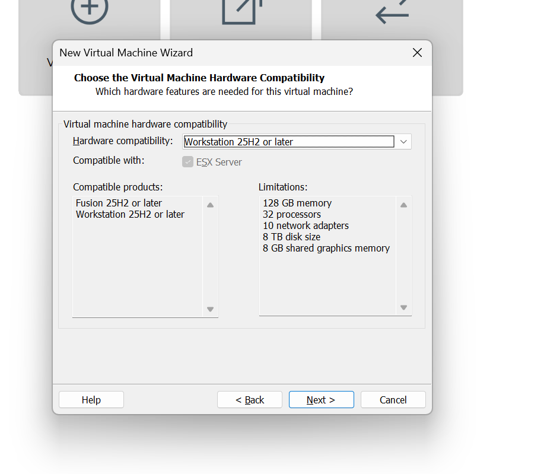

이는 VMware가 가상머신에 제공하는 가상 하드웨어 규격의 버전으로 VMware 속에 존재하는 가상머신들이 어떤 규격을 사용 가능할지 보이는 설정을 하는 것이라고 볼 수 있습니다.

> 이미지는 직접 설치과정을 보기 위해 `later`을 선택해주었습니다.

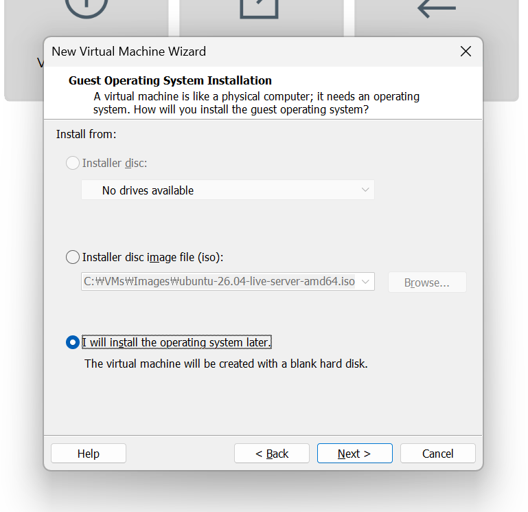

> 게스트 운영체제를 선택하였습니다. (게스트는 Host OS인 제 컴퓨터 운영체제 위 하이퍼바이저 위에 올라가는 운영체제입니다.)

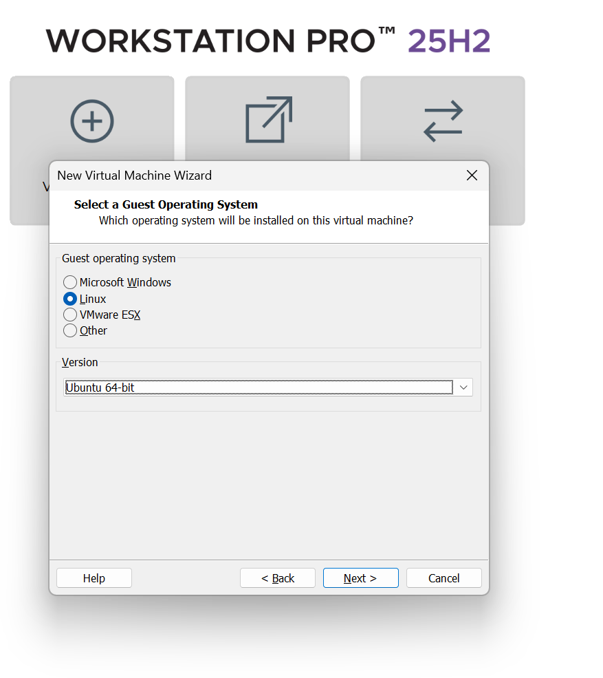

> VM 생성 위치를 지정하였습니다.

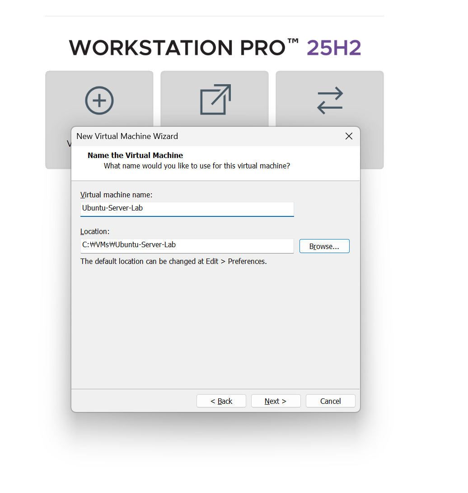

> 이후 자원을 설정해주었습니다.

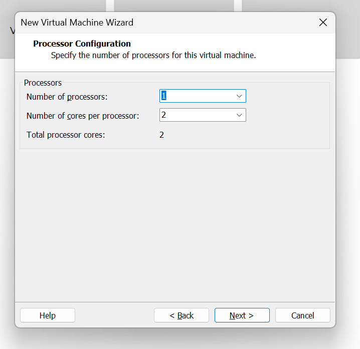

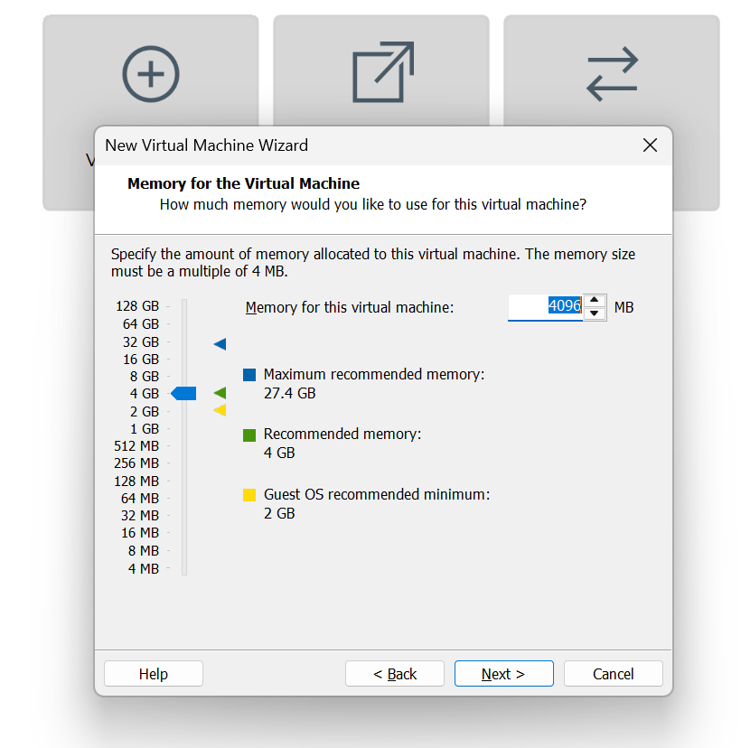

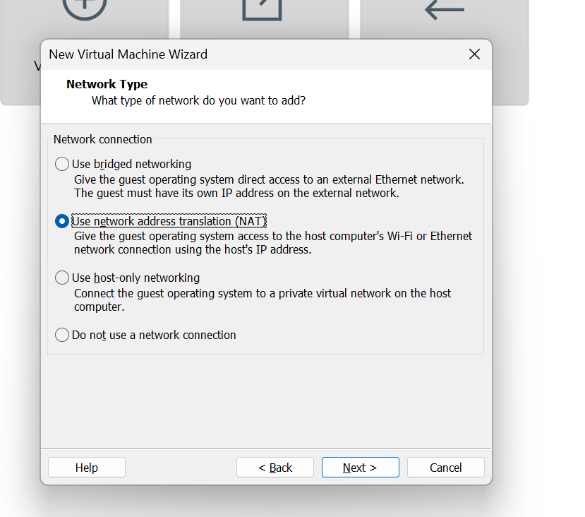

> SCSI 컨트롤러는 운영체제가 디스크에 읽기/쓰기 명령을 보내는 장치로 어떤 디스크에 갈지, 읽기/쓰기 선택, 순서 관리 등을 해주는 IO 드라이버 정도로 이해가 가능합니다.

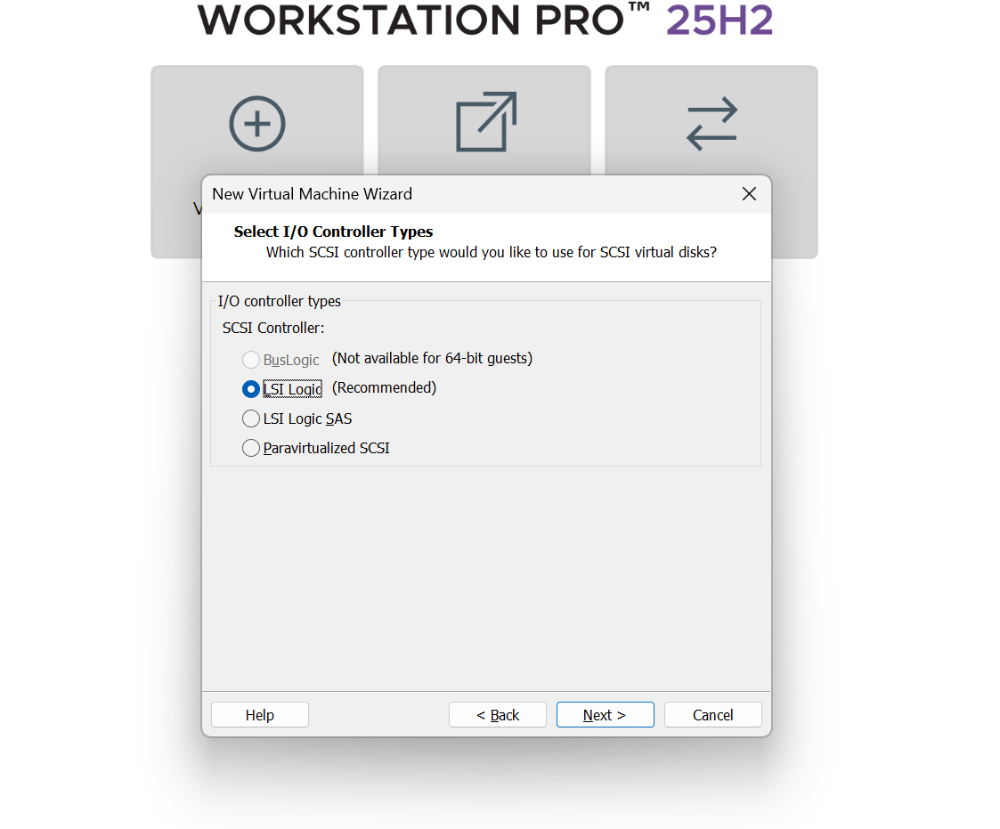

> 가상 디스크 `.vmdk`를 선택하겠습니다.

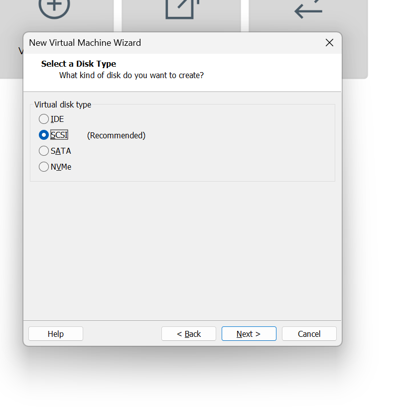

> 새 디스크 생성

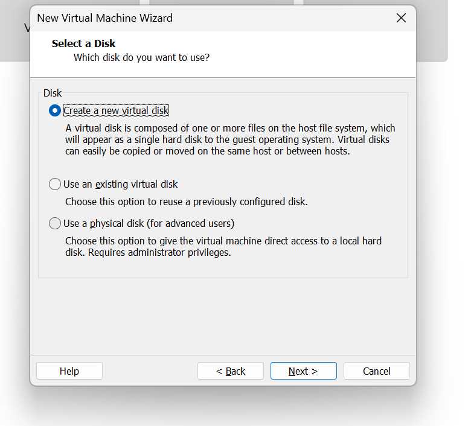

> 디스크 크기는 분할 즉시 할당으로 하겠습니다.

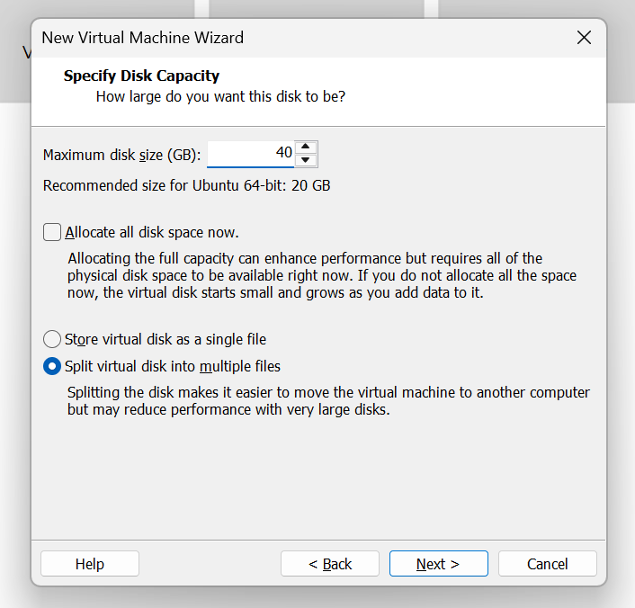

> 마지막에 직접 `.iso` 파일을 지정해주었습니다.

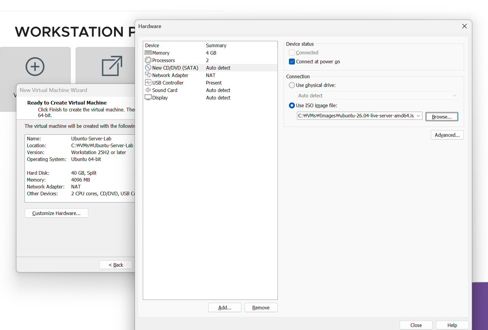

##### 실행
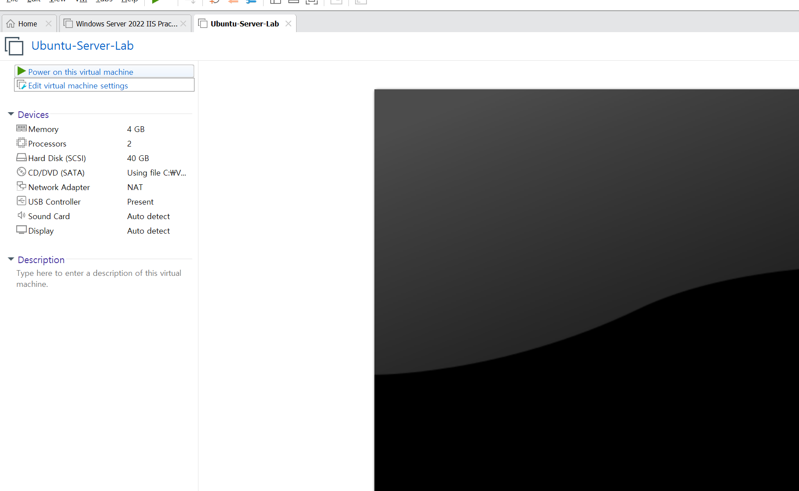

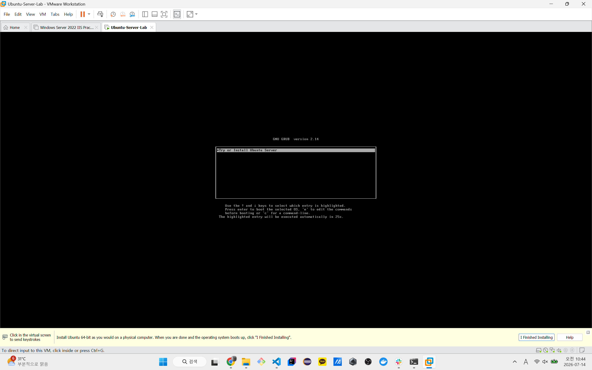

## 2026-07-17 16:15:20 - 조금씩 가지고 놀아보는중
일단 현재 이것저것(리액트, WebRTC)에 대해서 수업을 들으면서 작업을 하다보니 약간 시원하게 공부를 하지 못했던 것 같기도 합니다. 이번에는 그냥 주말이다보니 조금 더 자유롭게 리눅스를 다뤄보고 있습니다. 일단 기본적인 `python3`를 이용한 `index.html` 배포까지 해보았습니다. 