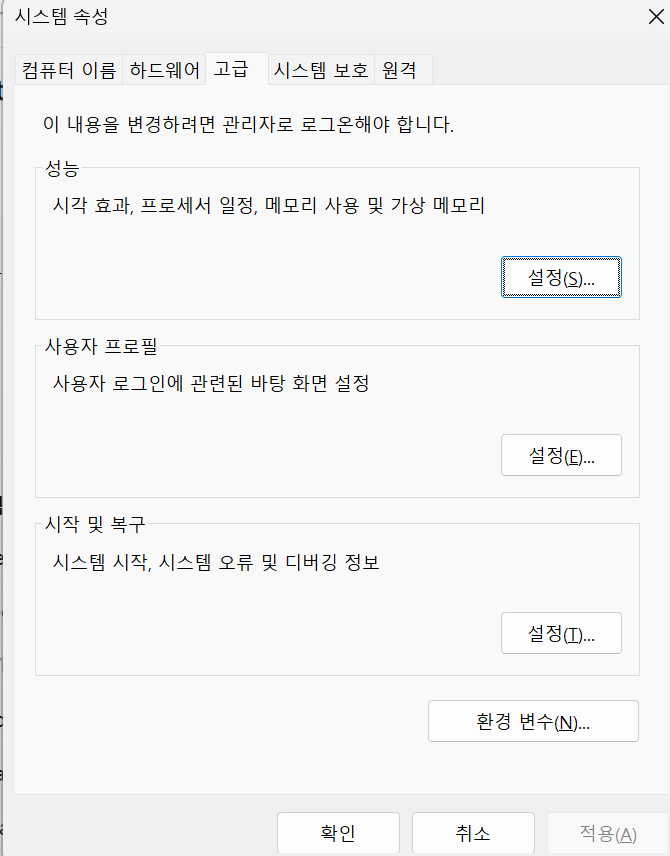

# 환경변수에 대해서
환경변수는 기본적으로 프로세스가 돌아갈 때 할당되는 메모리 안에 환경변수 블록을 생성하여 필요할 때마다 해당 변수를 읽는 방식을 사용합니다.

또한 윈도우에 존재하는 환경변수의 경우에는 모든 프로세스가 실행 될때마다 해당 데이터들을 복사하여 실행하게 됩니다.

이 때문에 자바를 깔았을 때 프로세스가 `%JAVA_HOME%`를 사용할 수 있게 이곳에 등록하는 이유가 됩니다. 항상 동일하게 접근하기 위해. 파이썬과 여러 프로그램의 경우에도 동일한 경우가 많습니다.

## `.env`
일반적으로 프로그램(프로세스)를 실행할 때 환경 변수가 필요한 경우에는 `*.env*` 형태의 파일을 사용합니다. 여기에서 해당 파일은 존재 자체로는 특별한 역할을 하지 못하며 그냥 데이터가 새겨진 파일일 뿐이 됩니다.

대표적으로 js의 `dotenv` 라이브러리가 존재합니다.

보통 `dotenv`의 `default export`인 `dotenv` 객체의 `.config()` 메서드를 작성하게 된다면 `dotenv`가 현재(루트 아님) 폴더의 `.env` 파일을 읽은 뒤 `process.env`에 변수를 넣어주게 됩니다. 예를 들어 `SECRET=12345`였다면 `process.env.SECRET`를 통해 접근이 가능하게 되며 해당 값이 존재하지 않으면 `undefined`, `.env` 이외의 파일은 `.config({ path: '.env.local'})`과 같은 다른 파일의 경로를 직접 지정이 가능하게 됩니다.

자바의 경우에는 보통 `System.getenc()` 또는 `System.getProperty()`(환경변수와 JVM 시스템 속성)이 존재하며 스프링을 사용할 경우에는 `Spring Enviroment`라는 객체를 통해 관리하게 됩니다.

## Powershell
종종 `Powershell`에서 특정 프로그램, 예를 들면 `python main.py`를 실행했을 때 실행되지 않는 경우가 있는데 이는 대체로 `python.exe`의 경로가 지정되지 않은 것이며 `$env:python`을 통해 확인 가능합니다. 임시로 설정하려면 `$env:python = [경로]`와 같이 설정도 가능합니다.