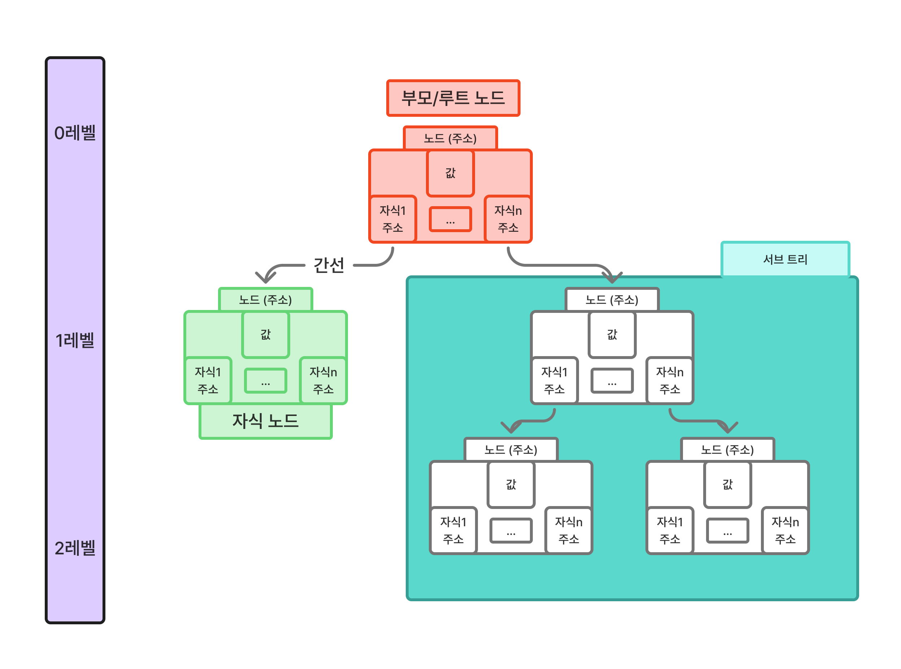
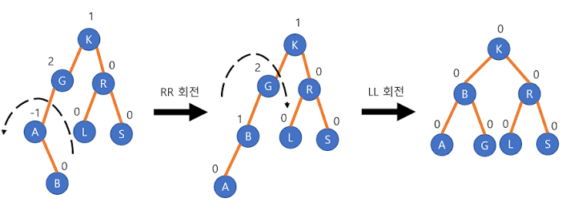
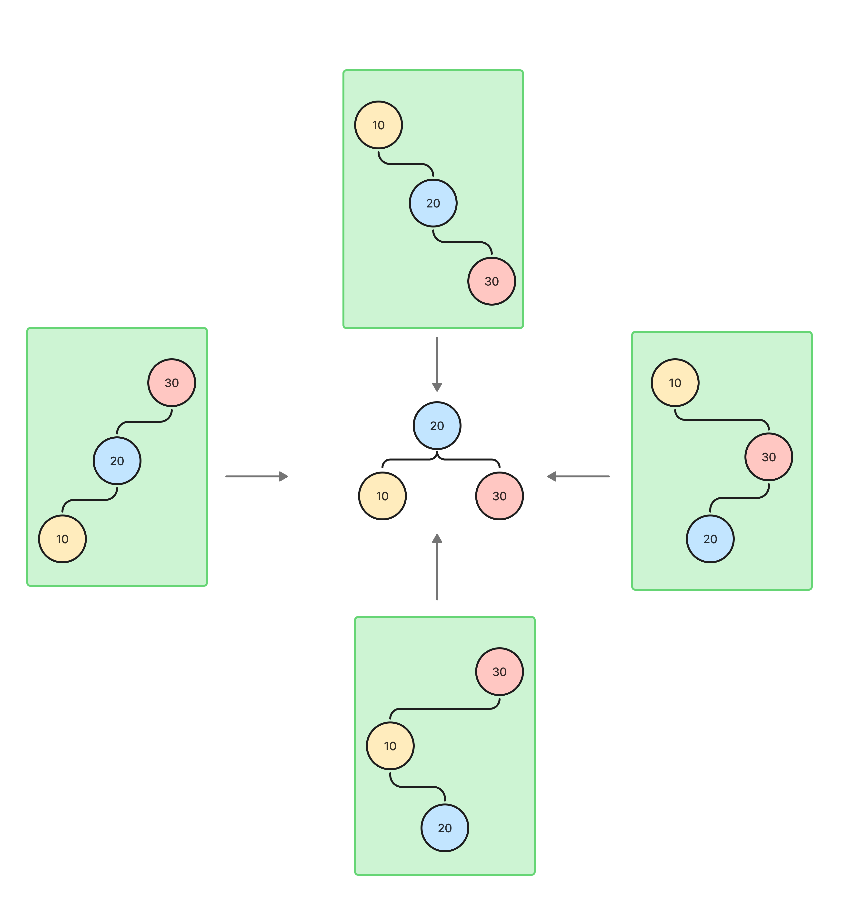
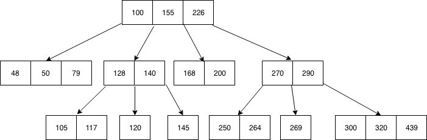

# 트리

트리는 부모/자식 관계를 가지는 노드들로 이루어진 계층적 자료구조입니다. 각 노드는 0개 이상의 자식 노드를 가질 수 있습니다.

## 트리의 기본 용어

트리는 간선과 노드로 이루어지며, 기본적으로 다음 용어들을 알고 있어야 합니다.

| 용어 | 설명 |
| --- | --- |
| 노드 | 각 데이터를 가진 객체 |
| 부모 | 상위 노드 |
| 자식 | 부모로부터 내려오는 노드 |
| 루트 | 최상위 부모 노드 |
| 간선 | 노드와 노드를 잇는 선 |
| 깊이 | 루트로부터 떨어진 간선의 개수 |
| 차수 | 특정 노드에 연결된 자식 노드의 개수 |
| 트리 차수 | 트리 내부에 있는 노드의 최대 차수 |
| 서브트리 | 트리 안에 존재하는 일부 트리 |



대부분의 트리는 위와 같은 기본 구조에서 목적에 맞게 발전한 형태로 볼 수 있습니다.

## 트리의 종류

트리에는 여러 종류가 존재합니다. 간단히 정리하면 다음과 같습니다.

| 종류 | 특징 |
| --- | --- |
| 이진 탐색 트리 | 왼쪽 자식 < 부모 < 오른쪽 자식 순서로 정렬된 상태를 유지하는 트리입니다. 삽입, 탐색, 삭제의 기본 구조입니다. |
| AVL 트리 | 높이 균형을 엄격하게 맞추며 탐색이 빠른 트리입니다. 모든 작업에 `O(log n)`의 시간 복잡도를 가집니다. 균형 유지를 위한 회전 연산이 필요하기 때문에 조회 빈도가 압도적으로 높은 시스템에 유리합니다. |
| 레드 블랙 트리 | AVL 트리에 비해 높이 균형을 조금 느슨하게 맞춥니다. 자바의 `TreeMap`에 쓰이며, 삽입/삭제 성능이 안정적입니다. |
| Splay Tree | 최근 접근한 노드를 루트 근처로 올리는 트리입니다. |
| Heap | 완전 이진 트리 기반의 트리입니다. 마지막 레벨은 왼쪽부터 차례대로 노드가 채워지며, 최댓값/최솟값 조회에 `O(1)`의 성능을 가집니다. |
| Treap | BST와 Heap의 성질을 섞은 트리입니다. |
| B-Tree | 하나의 노드에 여러 키를 저장하여 디스크 접근을 줄일 수 있게 해줍니다. DB 인덱스에 쓰입니다. |
| B+Tree | 실제 데이터를 리프 노드에 몰아두어 범위 검색 성능을 강화한 버전입니다. DB 인덱스에서 특히 중요합니다. |



아래에는 개인적으로 알지만 구체적으로 몰랐던 트리에 대한 탐구를 정리하였습니다.

## AVL 트리

AVL 트리는 기본적으로 이진 탐색 트리입니다. 왼쪽 서브트리 값 < 현재 노드 값 < 오른쪽 서브트리 값의 형태를 유지합니다. 여기에 더해 AVL 트리는 왼쪽 서브트리의 높이와 오른쪽 서브트리의 높이를 함께 봅니다.

이를 균형 인수라고 부릅니다.

```text
균형 인수 = 왼쪽 서브트리 높이 - 오른쪽 서브트리 높이
```

균형 인수는 `-1`부터 `1`까지의 범위 안에 존재해야 합니다. 이를 통해 AVL 트리는 트리 높이를 낮게 유지하고 탐색을 빠르게 할 수 있습니다.

### AVL 회전

AVL이 균형을 유지하는 원리는 회전에 있습니다. 회전은 크게 다음 네 가지 케이스로 나눌 수 있습니다.

| 케이스 | 설명 |
| --- | --- |
| LL 케이스 | 왼쪽 자식의 왼쪽 방향으로 불균형이 발생한 경우입니다. 오른쪽 회전을 사용합니다. |
| RR 케이스 | 오른쪽 자식의 오른쪽 방향으로 불균형이 발생한 경우입니다. 왼쪽 회전을 사용합니다. |
| LR 케이스 | 왼쪽 자식의 오른쪽 방향으로 불균형이 발생한 경우입니다. 왼쪽 회전 후 오른쪽 회전을 사용합니다. |
| RL 케이스 | 오른쪽 자식의 왼쪽 방향으로 불균형이 발생한 경우입니다. 오른쪽 회전 후 왼쪽 회전을 사용합니다. |

원본 정리에서는 각 케이스를 배열 형태로 표현했습니다.

```text
LL: [[10, [20],null], [30], [null, [null], null]]
RR: [[null, [null],null], [10], [null, [20], 30]]
LR: [[null, [10],20], [30], [null, [null], null]]
RL: [[null, [null],null], [10], [20, [30], null]]
```



위 방식의 반복을 통해 AVL 트리는 균형을 유지합니다. 규모가 커져도 결국 일부 노드를 다시 정렬하는 방식으로 이루어지기 때문에 같은 원리를 적용할 수 있습니다.

## 레드 블랙 트리

레드 블랙 트리는 회전과 색상 규칙은 존재하지만, AVL처럼 균형 인수는 존재하지 않습니다.

레드 블랙 트리의 특징은 모든 노드가 블랙 또는 레드 색깔을 가진다는 점입니다.

주요 규칙은 다음과 같습니다.

| 규칙 | 설명 |
| --- | --- |
| 루트 노드 | 반드시 블랙이어야 합니다. |
| 레드 노드 | 레드가 연속으로 나오면 안 됩니다. |
| NIL 노드 | 리프 노드의 존재하지 않는 두 자식은 `NIL`이라고 표현되며, 개념상 Black으로 봅니다. |
| Black 개수 | 어떤 노드에서 리프까지 가는 모든 경로의 Black 개수가 같아야 합니다. |

이를 통해 트리가 한쪽으로 너무 길어지는 것을 막습니다.

AVL이 항상 균형을 맞추는 방식이라면, 레드 블랙 트리는 사전에 어느 정도 규칙을 걸어두는 방식에 가깝습니다.

레드/블랙 트리도 회전을 통해 Red 연속, Black 개수 불일치를 해결합니다. 기본적으로 노드 삽입은 Red로 넣고, 규칙 위반이 존재하면 색을 변경하거나 회전합니다. 마지막에는 루트를 Black으로 고정합니다.

삽입 과정은 다음과 같이 정리할 수 있습니다.

1. 위치를 찾아 Red로 삽입합니다.
2. 부모가 Black이면 끝납니다.
3. 부모가 Red면 부모, 삼촌, 조부모를 확인합니다.
4. 부모와 삼촌이 Red이면 상위 레벨의 색을 변경합니다.
5. 부모가 Red이고 삼촌이 Black이면 Black 개수가 깨지거나 Red-Red가 남을 수 있어서 회전과 색 변경을 수행합니다.

이 과정을 통해 항상 노드부터 `NIL`까지의 Black 개수와 Red-Black 규칙을 만족시킵니다.

## 힙 트리

힙은 최댓값 또는 최솟값을 빠르게 꺼내기 위한 완전 이진 트리입니다.

완전 이진 트리는 다음과 같은 순서로 노드가 채워집니다.

```text
0단계: 1
1단계: 2, 3
2단계: 4, 5, 6, 7
3단계: 8, 9, 10, 11, 12, 13, 14, 15
```

힙은 오름차순/내림차순 모두 가능합니다. 하지만 이진 탐색 트리처럼 왼쪽 < 부모 < 오른쪽 관계를 만족하지 않을 수 있습니다.

힙은 전체 트리가 정렬되는 것이 아니라 부모와 자식 사이에서만 크기 관계를 만족합니다. 따라서 같은 계층의 노드들 사이에는 정렬 순서가 보장되지 않습니다.

### 삽입

1. 크기에 상관없이 먼저 다음 빈칸에 값을 넣습니다.
2. 부모와 비교해서 위로 올립니다.

### 삭제

힙에서는 보통 루트 삭제를 합니다.

1. 루트를 제거합니다.
2. 마지막 노드를 루트로 올립니다.
3. 자식 중 더 큰 값과 바꿉니다. 최대 힙 기준입니다.

힙은 우선순위 큐를 위해 자주 사용되는 자료구조입니다. 그래서 가장 큰 값이나 가장 작은 값을 계속 꺼내야 하는 상황에 강합니다.


## B+Tree

B+Tree는 대량의 데이터를 범위까지 포함해서 빠르게 탐색하기 위한 다진 탐색 트리입니다.

저는 [B+Tree를 설명하는 영상](https://www.youtube.com/watch?v=K1a2Bk8NrYQ&pp=ygUGYit0cmVl)에서 도움을 많이 받았습니다.

B+Tree는 한 노드에 여러 개의 키와 여러 개의 자식이 존재하는 트리입니다. 대부분 실제 데이터는 리프 노드에만 존재하며, 이외의 노드는 탐색을 위한 경로로서 쓰입니다.

하나의 노드가 최대 `m`개의 자식을 가질 수 있다고 한다면, 한 노드는 최대 `m-1`개의 키를 가질 수 있습니다.

예를 들어 노드에 키가 `[30, 60]`으로 존재한다면 자식은 다음과 같은 형식으로 나눌 수 있습니다.

```text
[0~29 값이 존재하는 노드]
[30~59 값이 존재하는 노드]
[60 이상 값이 존재하는 노드]
```

위 예시는 3차 B+Tree의 예시가 됩니다. B+Tree는 인덱싱을 위해 자주 사용되는 만큼, 항상 정렬된 상태로 데이터가 유지됩니다.



### 삽입과 정렬

B+Tree는 항상 삽입과 동시에 정렬됩니다. 값이 들어가면서 정렬을 시도하고, 정렬하는 도중 자리가 부족하면 키를 나누어서 노드를 하나 더 추가하게 됩니다.

예를 들어 B+Tree에서 키가 3개라 한다면 모든 노드의 최대 키 개수는 3개입니다. `[10, 20, 30]`의 자식은 최대 4개이고, `[1,2,3]`, `[11,12,13]`, `[21,22,23]`, `[31,32,33]`이 포화상태라고 할 수 있습니다.

이때 14가 추가로 들어온다면 임시로 `[11, 12, 13, 14]` 형태로 저장됩니다. 이후 이는 `[11, 12]`, `[13, 14]`로 나뉘게 됩니다.

분할된 노드의 첫 값인 `13`이 부모로 올라가며 부모는 `[10, 13, 20, 30]`의 형태가 됩니다. 이후 부모 노드 역시 분할되면서 높이가 2인 트리로 나뉘게 됩니다.

이런 형태로 B+Tree는 높이를 최대한 유지하면서 가로로 늘어나는 특징을 가집니다.
