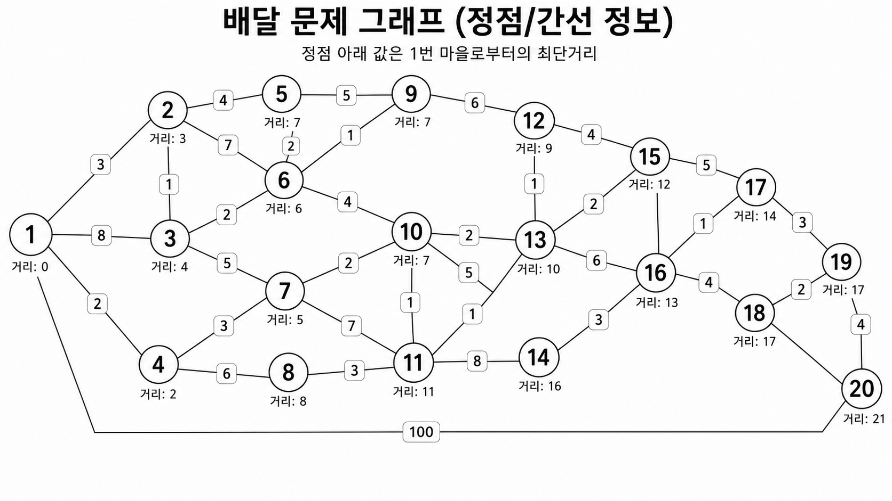

# 다익스트라 알고리즘
> 다익스트라에 대해서

# 다익스트라 알고리즘
다익스트라 알고리즘은 동적 계획법과 그리디 방식을 조합하여 만든 정점(그래프에서)에서 정점까지의 거리를 빠르게 구하기 위한 알고리즘입니다.

특징으로는
- 우선순위 큐에 (거리, 정점)을 저장합니다.
- 우선순위 큐를 기반으로 값을 꺼내서 가장 빠르게 갈 수 있는 노드를 갱신해 나갑니다.

크게 위의 2가지 규칙을 이용하여 빠르게 최적해를 찾아나가는 알고리즘입니다.


## 사용 조건
다익스트라 알고리즘의 주요 사용 조건은 3가지가 존재합니다.
- 음수 가중치 불가 (정점에서 정점간의 이동 비용이 음수이면 안됨)
- 단일 출발점 (출발지가 딱 정해져있어야합니다.)
- 양방향 이동 가능

# BFS(디큐)와 우선순위 큐
다익스트라 알고리즘을 구현하면 BFS와 비슷하게 리스트에 값을 넣은뒤 그 리스트에 더 이상 찾을 값이 없을 때까지 찾는 모습은 BFS와 비슷합니다.

결정적인 차이가 있다고 한다면 다익스트라 알고리즘은 **정점간의 거리가 동일하지 않은 경우**에 사용한다는 점입니다.

이 때문에 `deque`를 사용하는 BFS와 다르게 이미 정점에서의 거리를 갱신하는 경우를 줄이는 `heapq`를 사용하게 됩니다.

# 시간복잡도
다익스트라는 아래에서 코드로 확인 가능하지만 주요 작업이 2가지가 존재합니다.
- 간선 확인하기 (`if curr_dist > town_dist[curr_town]`)
- `heapq`에 넣거나 빼기 (`town_dist[town] = new_dist; heapq.heappush(heap, (new_dist, town))`)

여기에서 노드가 최단거리로 확정되면 그 노드와 연결된 간선들을 확인하는데 이렇게 되면 모든 간선을 한번씩 확인하는 것과 비슷한 결과를 놓습니다. 방향이 없기 때문에 `간선 수*(2+)` 정도의 작업 횟수를 가지는데 상수는 의미 없기 때문에 `O(E)`로 표현합니다. (`E=간선`, `V=정점`)

#### [중요]
> 여기에서 정점까지의 거리가 갱신되면 계속 확인 작업이 계속될 수 있다 생각할 수 있는데 여기에서 `heapq`를 이용해서 가장 빠른 간선을 먼저 확인하기 때문에 갱신되는 경우가 많지 않습니다.

또한 힙에 존재하는 원소 수를 기준으로 `heapq`는 이진 힙 구조이기 때문에 `pop`과 `push`는 약 `log2 V` 정도의 시간이 걸립니다. 여기에서 간선 수에 비례해서 이 횟수가 많아지기 때문에 `O(E log2 V)`라고 표현합니다.

최종적으로 상수를 뺴어 `O(E)`와 `O(E log2 V)`가 합쳐져 `O(E log2 V)` 정도의 시간복잡도를 가집니다.

# 코드
```python
# 프로그래머스 배달 문제
# 레벨 2 문제
# https://school.programmers.co.kr/learn/courses/30/lessons/12978


# 마을 50개 이하
# 도로는 2000개 이하
# 
# road는 [[마을1, 마을2, 거리], ...]
# 
# K는 500_000 이하

# # # # # [풀이 전략] # # # # #
# 
# 1. 각 노드까지 걸리는 시간에 대해서 먼저 모두 탐색한다음에 저장한다 
#   (마을번호를 인덱스로하는 리스트를 만들어 리스트에 거리를 저장한다)
# 
# 2. 순회하며 K보다 작은 마을을 모두 선택한다 
# 
# # # # # # # # # # # # # # # 
# 
# 일단 위 작업을 하려면 모든 노드까지의 거리를 알아야한다.
# 
# 다익스트라 알고리즘을 사용하면 
# 0. 길이 N(마을 개수)짜리 배열 만들기 (500_000으로 초기화)
# 1. 시작 노드 잡기 (우선순위 큐(힙)에 넣기)
# 2. 우선순위큐를 다 쓸때까지 적은 방향을 계속 탐색/갱신 해나간다.
# 
# # # # # [문제점과 해결] # # # # #
# 
# 문제에서 리스트를 무작위로 먼저 주기때문에 이를 먼저 정리할 필요가 있다.
# 
# 리스트 형태로 만들어 마을의 인덱스 번호에 [(갈수있는 마을, 비용), ...] 형태로 정리하고 시작하면 될 것 같다.
# 
# # #           [끝]        # # #

import heapq
# deque를 써도 풀리긴 하지만 이러면 불필요한 갱신 (1. town_dist[town] = new_dist 2. deque(리스트)에 추가해주기)이 늘어나기 때문에 heapq를 사용한다.
from collections import deque

def solution(N, road, K, alg_type: str = "heapq"):
    answer = 0

    # 0. 길이 N+1짜리 배열 만들기 (시작이 1이라서)
    # 최대 길이로 설정해놓기
    town_dist = [500_001 for _ in range(N+1)]
    town_dist[1] = 0

    town_road = [[] for _ in range(N+1)]
    # 마을별로 연결되어있는 길들 정리하기
    for [a, b, r] in road:
        town_road[a].append((r, b))
        town_road[b].append((r, a))
    
    # 가장 짧은것부터 사용할 자료구조로 heapq 사용하기
    # 짧은걸 먼저 쓰면 거리 갱신 비용이 덜 들 수 있음

    # 시작은 항상 1이기 때문에 1로 시작
    left_towns = None
    if alg_type == "heapq":
      left_towns = [(0, 1)]
    else:
       left_towns = deque([(0, 1)])


    while left_towns:
        # 들어오면 값 꺼내기 (기본이 최소힙)
        curr_dist, curr_town = None, None
        if alg_type == "heapq":
          curr_dist, curr_town = heapq.heappop(left_towns)
        else:
          curr_dist, curr_town = left_towns.popleft()
        
        


        # town_road에서 갈 수 있는 길들 모두 순회하기
        for dist, town in town_road[curr_town]:
            new_dist = curr_dist+dist
            # 다음 동네의 기존 비용보다 적으면 
            if new_dist < town_dist[town]:
                # 갱신하고 새로 계산해주기
                town_dist[town] = new_dist
                # 그리고 다시 계산 대상에 넣어주기
                if alg_type == "heapq":
                  heapq.heappush(left_towns, (new_dist, town))
                else:
                  left_towns.append((new_dist, town))
    
    # [확인용 로그]
    for index, dist in enumerate(town_dist):
        if dist < 500_001:
            print(f"마을{index:2d}: {dist}")

    # [방향 확인용 로그]
    for index, tr in enumerate(town_road):
       print(f"마을 {index} 상황")
       for r, t in tr:
          print(f"- 마을 {t}까지 {r}")
      
          
          
       

    # 순회하면서 가능한 개수 찾기
    for dist in town_dist:
        if dist <= K:
          answer+=1
            

    return answer

if __name__=="__main__":
    import time
    # N = 5
    # road = [[1,2,1],[2,3,3],[5,2,2],[1,4,2],[5,3,1],[5,4,2]]
    # K = 3

    # N = 6
    # road = [[1,2,1],[1,3,2],[2,3,2],[3,4,3],[3,5,2],[3,5,3],[5,6,1]]
    # K = 4

    N = 20
    road = [
        [1, 2, 3],
        [1, 3, 8],
        [1, 4, 2],

        [2, 5, 4],
        [2, 6, 7],
        [3, 6, 2],
        [3, 7, 5],
        [4, 7, 3],
        [4, 8, 6],

        [5, 9, 5],
        [6, 9, 1],
        [6, 10, 4],
        [7, 10, 2],
        [7, 11, 7],
        [8, 11, 3],

        [9, 12, 6],
        [10, 12, 2],
        [10, 13, 5],
        [11, 13, 1],
        [11, 14, 8],

        [12, 15, 4],
        [13, 15, 2],
        [13, 16, 6],
        [14, 16, 3],

        [15, 17, 5],
        [16, 17, 1],
        [16, 18, 4],
        [17, 19, 3],
        [18, 19, 2],
        [19, 20, 4],

        # 더 짧은 우회 경로 / 중복 경로
        [2, 3, 1],
        [5, 6, 2],
        [8, 10, 1],
        [12, 13, 1],
        [15, 16, 1],
        [1, 20, 100]
    ]
    K = 15

    d = {
       "heapq": 0,
       "deque": 0
    }
    for alg_type in ["heapq", "deque"]*2:
      start = time.time()
      for i in range(100):
        print(solution(N, road, K, alg_type=alg_type))
      d[alg_type] = d[alg_type] + time.time()-start
    print(d)
```

## 출력 예시 (제출 시에는 주석 적용해야함)
```
# 맨 아랫부분만 선택
마을 1: 0
마을 2: 3
마을 3: 4
마을 4: 2
마을 5: 7
마을 6: 6
마을 7: 5
마을 8: 8
마을 9: 7
마을10: 7
마을11: 11
마을12: 9
마을13: 10
마을14: 16
마을15: 12
마을16: 13
마을17: 14
마을18: 17
마을19: 17
마을20: 21
마을 0 상황
마을 1 상황
- 마을 2까지 3
- 마을 3까지 8
- 마을 4까지 2
- 마을 20까지 100
마을 2 상황
- 마을 1까지 3
- 마을 5까지 4
- 마을 6까지 7
- 마을 3까지 1
마을 3 상황
- 마을 1까지 8
- 마을 6까지 2
- 마을 7까지 5
- 마을 2까지 1
마을 4 상황
- 마을 1까지 2
- 마을 7까지 3
- 마을 8까지 6
마을 5 상황
- 마을 2까지 4
- 마을 9까지 5
- 마을 6까지 2
마을 6 상황
- 마을 2까지 7
- 마을 3까지 2
- 마을 9까지 1
- 마을 10까지 4
- 마을 5까지 2
마을 7 상황
- 마을 3까지 5
- 마을 4까지 3
- 마을 10까지 2
- 마을 11까지 7
마을 8 상황
- 마을 4까지 6
- 마을 11까지 3
- 마을 10까지 1
마을 9 상황
- 마을 5까지 5
- 마을 6까지 1
- 마을 12까지 6
마을 10 상황
- 마을 6까지 4
- 마을 7까지 2
- 마을 12까지 2
- 마을 13까지 5
- 마을 8까지 1
마을 11 상황
- 마을 7까지 7
- 마을 8까지 3
- 마을 13까지 1
- 마을 14까지 8
마을 12 상황
- 마을 9까지 6
- 마을 10까지 2
- 마을 15까지 4
- 마을 13까지 1
마을 13 상황
- 마을 10까지 5
- 마을 11까지 1
- 마을 15까지 2
- 마을 16까지 6
- 마을 12까지 1
마을 14 상황
- 마을 11까지 8
- 마을 16까지 3
마을 15 상황
- 마을 12까지 4
- 마을 13까지 2
- 마을 17까지 5
- 마을 16까지 1
마을 16 상황
- 마을 13까지 6
- 마을 14까지 3
- 마을 17까지 1
- 마을 18까지 4
- 마을 15까지 1
마을 17 상황
- 마을 15까지 5
- 마을 16까지 1
- 마을 19까지 3
마을 18 상황
- 마을 16까지 4
- 마을 19까지 2
마을 19 상황
- 마을 17까지 3
- 마을 18까지 2
- 마을 20까지 4
마을 20 상황
- 마을 19까지 4
- 마을 1까지 100
16
{'heapq': 0.5523145198822021, 'deque': 0.45577573776245117}
```

### GPT가 그려준 간선도


힙 큐가 살짝 더 빠릅니다. (마을이 적은편이라 그런것 같습니다.)
## 해결 인증
