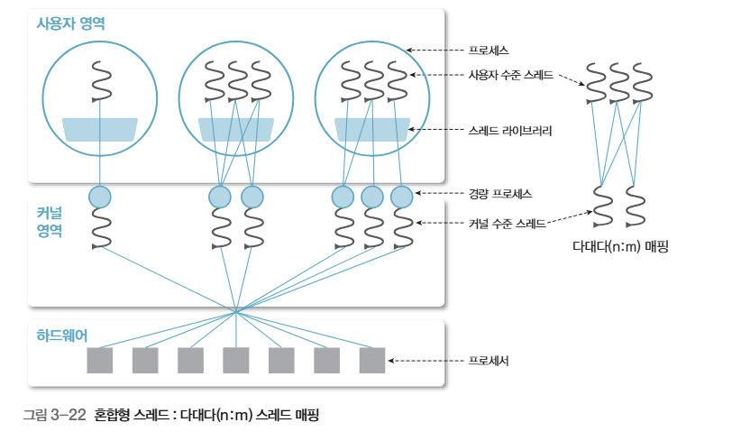
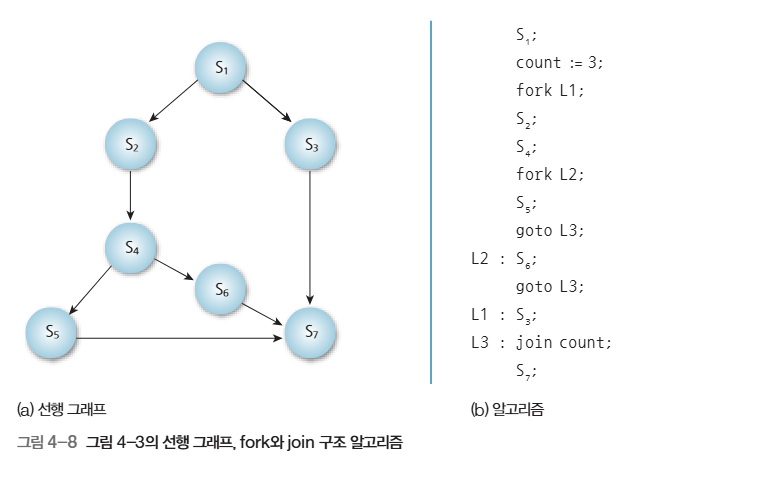
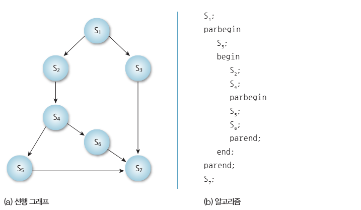

# 프로세스관리
이번에 그림으로 보는 운영체제를 읽는데 프로세스와 해당 프로세스에서 사용하는 공유 자원에 대한 정리를 하려 합니다.

## 프로세스
프로세스는 디스크에서 메모리에 프로세스의 허가 하에 메모리에 적제되며, 이때 PCB라는 프로세스 제어 블럭이 운영체제의 커널 메모리에 생겨 이를 관리할 수 있게 됩니다.

PCB에는 아래와 같은 정보가 존재합니다.
- 프로세스 ID
- 프로세스 상태
- 우선순위
- 프로그램 카운터
- 레지스터 값
- 메모리 위치 정보
- 다음 PCB 포인터

위에서 PCB 포인터를 통해 큐 형태로 묶여서 순서대로 실행이 되거나 우선순위에 따라 여러 큐가 순서대로 실행되는 방식으로 프로세스가 실행되게 됩니다.

### 스레드
스레드 또한 TCP라는 스레드 제어 블록으로 저장되며 형태는 아래와 같습니다.
- 스레드 ID
- 스레드 상태
- 프로그램 카운터
- 스택 포인터
- 레지스터 값
- 우선순위
- 스케줄링 정보

일반적으로 현대 OS에서의 CPU 스케줄링 단위는 스레드로 이루어져 있습니다. 위에서 말한 실행 큐의 경우에도 프로세스 대신 스레드가 들어가는 경우가 많습니다.

스레드는 크게 2종류가 존재하는데, 커널 수준 스레드로 운영체제가 직접 다루는 스레드를 말하며, 사용자 수준 스레드의 경우에는 사용자 메모리에 저장되는 사용자 수준의 스레드 라이브러리를 통해 스케줄링 되게 됩니다. 일반적으로 커널 수준 스레드가 현대 OS에서 쓰입니다.

일반적으로 `사용자 프로세스[내부에 사용자 수준 스레드들]` 에서 스레드들끼리 조합하여 `경량 프로세스[커널 수준 스레드]`를 만들어 이를 순서대로 실행하며 CPU의 자원 할당을 실행해주게 됩니다.



## 병행 프로세스
병행 프로세스는 여러 프로세스가 같은 시간대에 실행되는 것처럼 처리되는 상태를 말합니다.

이 기술은 다중 프로그래밍 기술을 만드는 핵심 기술 중 하나입니다. 이는 프로세스 여러개가 반복적으로 돌아가며 실행되는 상태를 말합니다.

### 선행 그래프
선행 그래프는 작업들 사이의 먼저 실행되어야하는 관계를 나타내는 그래프입니다.


### fork/join

`fork`를 통해 이후의 실행 흐름이 여러개로 나누는 것을 나타내며 `join`을 통해 실행 흐름이 다 기다릴 때 까지 기다려야 한다는 것을 말합니다.



### 병행 문장
병행 문장은 여러 문장을 동시에 실행하라고 표현하는 방식으로 아래와 같은 문법이 존재합니다.
- `prebegin`: 실행 흐름이 나뉜다는 의미
- `begin`: 2개 이상의 실행 흐름 작업이 시작된다는 의미
- `parend`: 위의 작업들이 끝나는 것을 기다린다는 의미입니다. 
- `end`: `begin`의 작업이 끝났다는 의미입니다.




## 프로세스의 상호 배제
프로세스간의 동일한 위치에 존재하는 자원에 접근할 경우에는 계산 및 저장하는 과정이 맞물리면 무결성이 깨질 수 있기 때문에 이를 막아주는 알고리즘을 사용합니다.

해당 공통으로 접근할 수 있는 자원을 한 작업 단위씩만 접근 가능하게 한 영역을 **임계 구간**이라고 부릅니다.

이를 지키기 위한 방식으로는 아래와 같은 것들이 존재합니다.
- 데커의 알고리즘: 소프트웨어 방식
- TetAndSet(TAS): 하드웨어 명령어 방식
- 세마포: 운영체제 동기화 도구
- 모니터: 고급 언어 수준 동기화 도구

### 데커의 알고리즘
두 프로세스가 동시에 임계 구역에 접근하지 못하게 하는 소프트웨어 기반 상호배제 알고리즘으로 변수만을 이용한 논리적 접근 방지 방식입니다.

이는 `boolean waiting[2]`이라는 들어가고 싶다는 표시를 하는 프로세스들의 플래그들의 리스트와 누구의 차례인지를 나타내는 `int turn = 0`을 통해 접근을 제어합니다. 이 2가지가 모두 충족되어야 접근을 허가해주며, 작업이 끝나면 다른 프로세스에게 차례를 넘겨주는 방식입니다.

> 데커의 알고리즘은 이론적으로 중요하짐나 구현이 복잡하며 프로세스 2개만 사용 가능, 바쁜 대기 라는 특성에 의해 그대로 사용하지 않습니다.

### TestAndSet (테스) 명령어
**TestAndSet**은 하드웨어가 제공하는 원자적 명령어 입니다. **원자적**이란 중간에 다른 연산이 접근할 수 없어 무결성을 보장할 수 있음을 말합니다.

일반적인 코드의 형태는 다음과 같습니다.
```C
boolean TestAndSet(boolean *lock) {
  boolean old = *lock;
  *lock = true;
  return old;
}

//////////////////////////////////////////

lock = &global_lock

while (TestAndSet(&lock)) {
    // 바쁜 기다림
}

// 임계구역

lock = false;
```
이를 통해서 현재 `lock = true`인 동안 작업을 넘어갈 수 없으며 `lock`가 `false`가 되는 순간 `return false`를 통해 임계 구역으로 진입하며 `lock`가 `true`가 되어 다른 프로세스에서는 접근할 수 없는 상태가 됩니다.

> TAS 또한 구현이 단순하며 여러 프로세스에도 적용 가능, 하드웨어적으로 보장한다는 장점이 있지만 바쁜대기와 스핀락으로 인한 기아상태 가능성이 있는 단점이 있습니다.

### 세마포
운영체제가 제공하는 동기화 도구로 공유자원에 접근 가능한 프로세스 수를 정수값 (0이상의 양수)로 관리합니다.

이는 signal(V)와 wait(P)연산으로 이루어지며, 자원을 사용하려 할 때 공간이 남아있으면 자원 수를 줄이고 사용하며, 작업이 끝난 후에는 signal을 통해 자원의 수를 1 늘려줍니다.

자원의 수가 1이면 뮤텍스처럼 사용이 가능합니다.

> 세마포어는 상호 배제에 사용 가능하며 프로세스 동기화에 사용 가능하지만 wait/signal 순서를 반드시 잘 지켜야한다는 번거로움이 존재합니다.
### 모니터
모니터는 세마포보다 더 추상화된 동기화 기법으로 `wait`와 `signal`을 사용자가 직접 다룰 필요 없이 특정 함수들에서 자동으로 적용시켜주는 방식입니다.

이는 조건변수를 통해 버퍼가 비어있을 경우에는 데이터를 꺼내지 못하게 하며 프로세스를 재워두거나 버퍼가 가득 찬 경우에 생산자가 `signal`을 쓰지 못하고 기다리게 할 수 있습니다.

> 이는 세마포에 비해서 실수를 없애준다는 장점이 있지만 사용하기 위해서는 언어나 운영체제에서 모니터 개념을 지원해야한다는 점이 존재합니다.

