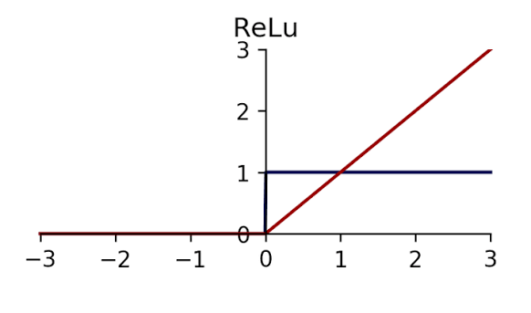
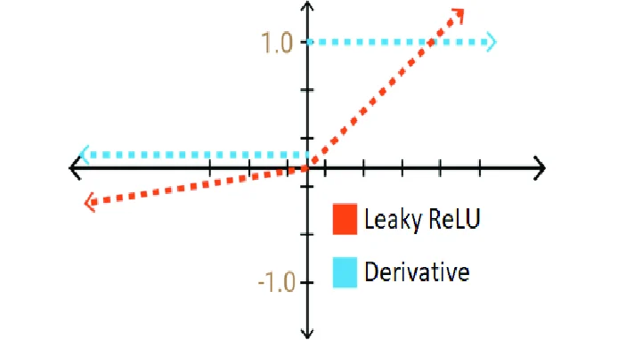
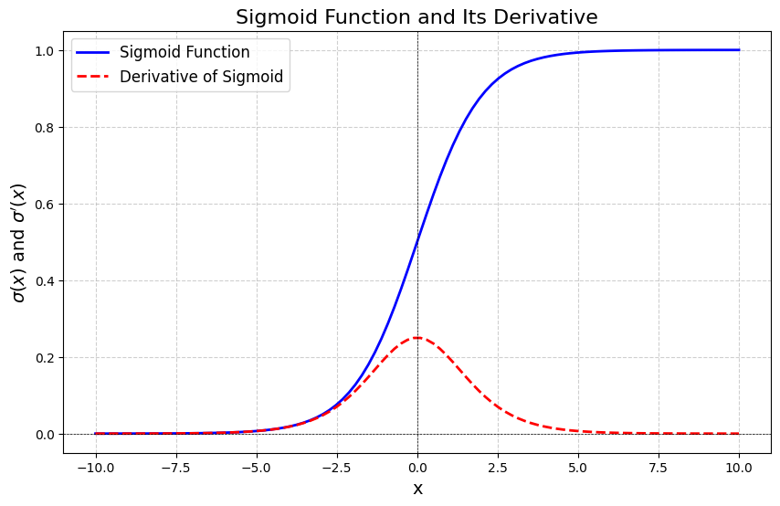
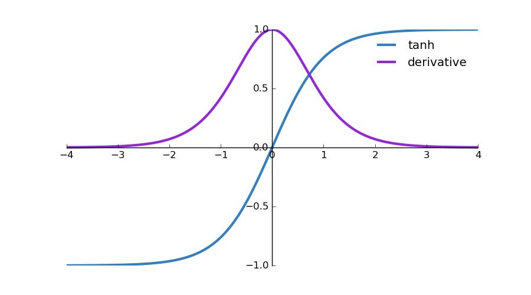
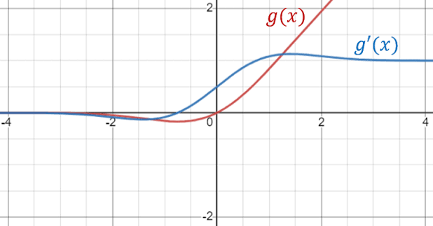
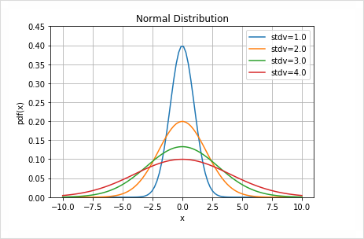

# 여러 활성화 함수
> 이번에는 여러 활성화 함수를 살펴보며 좋은 활성화 함수를 직관적으로 판단할 수 있게 되는 것을 목표로 정리하였습니다.

## ReLU
가장 기본적인 활성화 함수로 `Rectified Linear Unit`의 약자입니다. 한글로 직역하면 교정 선형 유닛 입니다.

다음과 같은 모습을 가졌습니다.

$$
f(x) = \operatorname{max}(0, x) 
$$

또한 미분시 형태는 다음과 같습니다.

$$
\frac{\partial}{\partial x}f(x) = 
\begin{cases}
0 & (x \le 0) \\
1 & (x > 0) \\
\end{cases}
$$

<!--  -->

여기에서 `x=0`은 수학적으로 미분 불가능하지만 PyTorch에서는 0으로 처리해줍니다.

이때 ReLU는 모든 요소들의 값에 대해서 함수를 적용해주며 이를 통해 의미 의미적으로 불필요한 음수 결과값들을 모두 `0`으로 변환해줍니다.

PyTorch에서는 다음과 같은 형식으로 사용할 수 있습니다.

```python
relu = torch.ReLU(inplace=False)

relu(X)
```

이때 `inplace` 옵션은 텐서 `X` 값에 직접 덮어씌울지 아니면 새로운 값을 반환할지에 대한 설정값입니다.

특징으로는 학습 파라미터, Buffer가 없으며 추론시에도 동작의 변화가 존재하지 않습니다.

**장점**으로는 양수 영역에서 미분값이 `1`이라는 점으로 가중치에 대한 학습률에 영향을 미치지 않습니다. 또한 계산이 매우 단순하여 기본 선택지로 쓰기 좋습니다. 이 덕분에 양수 영역에서 Saturation 현상이 존재하지 않습니다.

**단점**으로는 음수 영역에서의 미분 결과가 `0`으로 이전 가중치에 대한 학습률 적용을 막을 수 있습니다. 이는 다른 결과값에 대한 가중치의 학습률 누적으로 항상 문제가 되진 않지만 이런 현상이 지속적으로 발생하면 학습이 원활하게 진행되지 않을 수 있습니다.

## Leaky ReLU
**Leaky ReLU**는 **ReLU**의 핵심 문제였던 음수 영역에서의 출력과 미분값이 `0`이라는 부분을 개선한 함수입니다.

수식은 다음과 같습니다.

$$
f(x) = 
\begin{cases}
x & (x > 0) \\
\alpha x & (x \le 0)
\end{cases}
$$

미분은 다음과 같이 생겼습니다. ($\alpha$는 작은 양수를 말합니다.)

$$
\frac{\partial}{\partial x}f(x) = 
\begin{cases}
1 & (x > 0)\\
\alpha & (x \le 0)
\end{cases}
$$



PyTorch에서는 다음과 같이 사용이 가능합니다

```python
leaky_relu = nn.LeakyReLU(
  negative_slope=0.01,
  inplace=False
)
```

여기에서 `negative_slope = α` 입니다.

> LeakyReLU 또한 학습 값이 존재하지 않는 파라미터입니다.

해당 모듈의 장점은 **ReLU**의 장점에 음수 영역을 일부 유지하여 다시 양수로 이동할 가능성을 두지만 음수를 유지하여 기존 ReLU의 강한 `sparsity`(희소성)을 만들지 못하며 $\alpha$ 값을 직접 정해야하여 튜닝을 할 필요가 있습니다.

## PReLU
`Parametric ReLU`의 약자로 **Leaky ReLU**에서 사람이 정하는 음수 영역 기울기 $\alpha$를 파라미터로 만들었습니다.

수식과 미분 도함수 형태는 LeakyReLU와 동일합니다.

파이썬 코드는

```python
nn.PReLU(
  num_parameters=1,
  init=0.25 # 초기 alpla
)
```

당연한 **특징**으론는 내부에 학습 가능한 Parameter가 존재하여 
- 역전파의 대상이 됨
- `eval` 시에 미분 결과가 생기지 않음

과 같은 효과가 생깁니다.

주요 인자로는 채널을 몇개로 나누어 $\alpha$를 만들 것인지를 나타내는 `num_parameters`가 존재합니다. `num_parameters=1`이면 모든 채널이 동일한 $\alpha$를 공유합니다.

해당 모듈의 **강점**은 자동화가 잘 된 점으로 음수를 없애지 않으며 사람이 하는 튜닝까지 대신 해준다는 점이며

**단점**은 동일하게 희소성 문제와 연산이 조금 더 생길 수 있다는 점입니다.

> 파라미터를 맞춘다고 해서 항상 좋은 것은 아니며 오히려 자유도가 늘어 과적합 등에 의해 일반화 성능이 낮아질 수 있다는 것을 유의해야합니다.

## Sigmoid
이 또한 유명한 활성화 함수로 입력값을 `0~1` 사이의 값으로 수정합니다.

수식은 다음과 같습니다.

$$
\sigma(x) = \frac{1}{1+e^{-x}}
$$

미분 시에는 다음과 같이 변형됩니다.

$$
\frac{\partial}{\partial x}\sigma(x) = \sigma(x)(1-\sigma(x))
$$

그래프는 다음과 같은 **가로로 늘린 S** 자 형태를 가집니다.



이떄 $\operatorname{Sigmoid}$ 함수의 최대 미분 결과는 `0.25`로 **최대 단점**인 Saturation 현상이 심하게 일어날 수 있습니다.

이전에도 사용한 단어이지만 Saturation은 한글로 포화를 의미하며 머신러닝에서는 미분값이 `(0, 1)` 범위에서 지속적으로 누적되어 학습이 굉장히 작은 값으로 적용되는 것을 말합니다.

이는 $\operatorname{Sigmoid}$ 의 도함수에서 절댓값이 커질수록 미분결과가 매우 작아지게 됩니다.

PyTorch의 Sigmod 또한 간편하게 사용이 가능합니다.

```python
sigmoid = nn.Sigmoid()

sigmoid(X)
```

따라서 해당 모듈은 출력 결과가 이전 결과를 잘못 변환시키기 쉽기 때문에 사용에 유의해야합니다.

하지만 이전 출력이 `logits`인 경우에는 적극 도입을 고려해볼만도 합니다.

또한 **특이사항**으로는 미분값이 **BCE** 손실함수와 매우 잘 맞는다는 점입니다.

$$
\frac{\partial}{\partial p}\operatorname{BCE}(p) \cdot \frac{\partial}{\partial x}\operatorname{Sigmoid}(x) = \frac{\sigma(x)-target}{\sigma(x)(1-\sigma(x))} \cdot \sigma(x)(1-\sigma(x)) = \sigma(x) - target
$$

## Tanh
$\operatorname{Tanh}$는 $\operatorname{Sigmoid}$와 비슷하게 입력을 압축하지만 출력 범위가 다릅니다.


수식형태:

$$
\operatorname{Tanh}(x) = \frac{e^x - e^{-x}}{e^x + e^{-x}}
$$

미분형태:

$$
\frac{\partial}{\partial x}\operatorname{Tanh}(x) = 1-\operatorname{Tanh}^2(x)
$$



> $\operatorname{Tanh}$ 또한 $\operatorname{Sigmoid}$와 같이 `vanishing gradient` 문제가 존재합니다.

파이썬 코드:

```python
tanh = nn.Tanh()

tanh(X)
```

인자, 파라미터, 버퍼, 추론 시 변경사항 모두 존재하지 않으며 **특징**으로는 `zero-centered` 함수로 양수와 음수 정보를 모두 표현할 수 있습니다.

**장점**으로는 출력을 `-1~1`로 제한할 수 있으며 중앙 근처에서는 `gradient`가 안정적이라는 점이며

**단점**으로는 큰 절댓값 영역에서는 Saturation 현상이 일어날 수 있다는 점입니다.

## GELU
**GELU**는 `Gaussian Error Linear Unit`의 약자로 한글로 직역하면 `가우시안 오류 선형 변환 유닛` 정도로 말할 수 있을 것 같습니다.

$$
\operatorname{GELU}(x) = x\Phi(x)
$$

미분:

$$
\frac{\partial}{\partial x}GELU(x) = \Phi(x) + x\phi(x)
$$



> $\Phi$는 표준 정규분포의 누적포함수(CDF)를 말합니다. (이는 표준정규분포에서 지정한 값보다 작은 값이 나올 확률을 말합니다. )




PyTorch에서의 사용 또한 단순합니다.

```python
gelu = nn.GELU(
  approximate="none"
)

gelu(X)
```

이때 `approximate="none"`는 정확한 $\operatorname{GELU}$ 계산을 말하며 `approximate="tanh"`은 $\operatorname{Tanh}$기반 근사식을 사용하겠다는 의미를 가집니다.

**장점**으로는 매우 부드러운 곡선 형태의 활성화 함수로 미분 흐름 또한 부드럽게 이어지며 $\operatorname{Transformer}$계열에서 자주 사용된다고 합니다. 또한 작은 음수는 어느정도 보존될 수 있습니다.

**단점**으로는 ReLU보다 계산량이 더 많습니다.