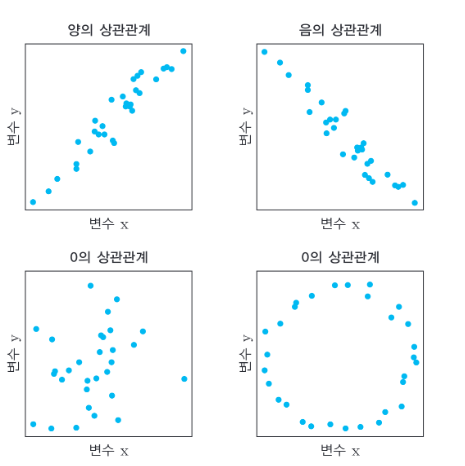
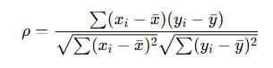
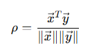
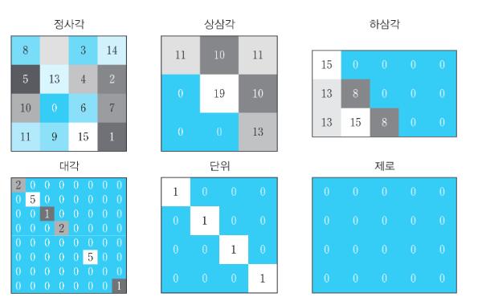
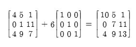

# 벡터 응용
> 데이터 분석에서의 벡터

앞장에서는 기저, 독립성, 부분공간, 투영 등에 대해서 공부하였습니다. (저는 직교 벡터 분해의 원리가 기억이 안 나서 복습을 한 번 더 했네요 ;~;)

이번 장에서는 벡터와 벡터 연산이 데이터 과학에서 어떻게 사용되는지를 배웁니다.

## 상관관계와 코사인 유사도
상관관계는 통계와 머신러닝에서 가장 근본적이면서 중요한 분석 방법입니다. 상관계수는 두 변수 사이의 선형 관계를 정량화한 하나의 숫자입니다. 상관계수의 데이터들은 `-1`~`1`의 범위를 가지며 `-1`에 가까울수록 반대 방향의 관계, `1`에 가까울수록 같이 움직이는 특성을 `0`의 경우에는 벡터의 경우에는 선형 관계가 없다는 뜻과 같이 전혀 관계없는 관계임을 나타냅니다.

파이썬에서는 이 관계를 `[np/pd].corr()` 과 같이 쉽게 행렬의 형태로 확인할 수 있습니다.

1장에서는 내적이 상관계수와 관련이 있고 내적의 크기는 데이터 내의 수치값의 크기와 관련이 있다고 하였는데 여기에서 수치값의 크기에 따른 영향도를 없애기 위해 정규화할 필요가 있습니다.

평균 중심화는 각 데이터 값에서 평균값을 뺀 뒤, 벡터의 내적을 노름의 곱으로 나누게 되면 됩니다.

이는 해석을 해보자면 두 변수 벡터가 얼마나 같은 방향으로 움직이는지를 보는 공식입니다.

기본적으로 피어슨 상관계수 공식은 다음과 같습니다.

여기에서 분자는 두 벡터의 내적이며, 분모는 벡터 길이의 곱이 됩니다. 또한 이는 두 벡터의 코사인 유사도와 동일한 식이 됩니다.

따라서 피어슨 상관계수는 평균 중심화된 코사인 유사도라는 사실을 알 수 있습니다.

## 시계열 필터링과 특징 탐지
내적은 시계열 필터링에도 사용됩니다. 필터링은 본질적으로 특징 탐지 기법입니다. 필터링은 본질적으로 템플릿이 시계열 신호와 일치하는 특징을 찾습니다. 이렇게 필터링된 결과는 또 다른 시계열이 되며 이를 통해 신호의 특성이 커널의 특성과 얼마나 일치하는지 알 수 있습니다. 매끄러운 변동, 날카로운 에지, 특정 파형 모양 등과 같은 특정 기준에 최적화되도록 커널을 신중하게 구성합니다.

> 여기에서 말하는 템플릿은 시계열 데이터 안에서 찾고 싶은 특정한 모양을 나타내는 짧은 기준 패턴을 말합니다. 예를 들면 증가하는 모양, 위아래로 진동하는 모양 등이 있습니다. 커널은 실제 계산에 쓰는 작은 필터 벡터를 이야기합니다. 커널을 통해 템플릿을 찾을 수 있습니다.

커널과 시계열 신호 사이의 내적을 계산하는 것이 필터링 메커니즘입니다. 하지만 필터링할 때 일반적으로 지역 특징을 탐지해야 하고, 커널은 일반적으로 전체 시계열보다 훨씬 짧습니다. 따라서 커널과 동일한 길이의 짧은 데이터 조각과 커널 사이의 내적을 계산함으로써 내적이 높을수록 원하는 패턴에 가깝다는 결론을 내릴 수 있습니다. (이를 수학적으로 합성곱이라고 합니다.)

여기에서 데이터가 갑자기 변화하는 것과 같은 부분을 에지라고 하며, 이를 평활화하기 위해서 이후 벡터를 사용합니다.

## k-평균 클러스터링
k-평균 클러스터링은 그룹 중심까지의 거리를 최소화하도록 다변량 데이터를 상대적으로 적은 수(k)의 그룹 또는 범주로 분류하는 비지도 기법입니다.

이의 구현 방식은
1. K개의 중심점을 임의로 정합니다.
2. 각 데이터를 가장 가까운 중심점에 배정합니다.
3. 각 그룹의 평균 위치로 중심점을 다시 이동합니다.
4. 다시 각 데이터를 가장 가까운 중심점에 배정합니다.
5. 위 과정을 중심점이 거의 바뀌지 않을 때까지 반복합니다.

이를 통해서 K개의 클래스를 만들어내는 비지도 학습 기법입니다.

# 행렬, 파트 1
행렬은 벡터를 한 차원 더 끌어올린 것입니다. 행렬은 매우 다채로운 수학적 객체입니다.

방정식, 기하학적 변형, 시간에 따른 입자의 위치, 재무 기록 등 무수히 다양한 정보를 행렬에 저장할 수 있습니다. 데이터 과학에서는 행렬을 관측치 행과 특징 열을 가진 데이터 테이블로 간주하곤 합니다.

행렬은 **A** 또는 **M**과 같은 굵은 대문자로 표시합니다. 행렬의 크기는 (행, 열) 규칙으로 나타냅니다.

### 특수 행렬
행렬의 수는 무한합니다. 행렬의 숫자를 구성하는 무한한 방법이 있기 때문입니다. 그러나 다소 적은 특성만으로 행렬을 설명할 수 있으며, 이 특성으로 행렬은 어떠한 군 또는 범주에 속하게 됩니다. 특정 연산에서 등장하는 범주도 있고 범주마다 유용한 속성을 가지고 있기 때문에 꼭 알아야 합니다.

어떤 범주의 행렬은 너무 자주 사용되어 Numpy 함수가 있기도 합니다.

- 난수행렬: 일반적으로 가우스와 같은 분포로부터 무작위로 추출된 숫자를 가진 행렬입니다.
- 정방 행렬과 비정방 행렬: 정방 행렬의 행 수는 열 수와 같습니다. `R^(N x N)` 행렬입니다. 비정방 행렬은 정방 행렬이 아닌 것을 의미합니다. 비정방 행렬의 행 수가 열 수보다 많으면 높다고 하고 열 수가 많으면 넓다고 합니다.
- 대각 행렬: 행렬의 대각은 왼쪽 위에서 오른쪽 아래로 내려가는 원소들입니다. 대각 행렬은 모든 비대각 원소가 0인 행렬을 말합니다. (대각 원소는 0 또는 0이 아닌 값을 가질 수 있는 유일한 원소입니다.) `np.diag()`는 행렬을 넣을 경우에는 대각 원소를 뽑으며, 벡터를 넣을 경우에는 대각 행렬을 만듭니다.
- 삼각 행렬: 삼각행렬은 주 대각선의 위 또는 아래가 모두 0입니다. 0이 아닌 원소가 대각선 위에 있으면 행렬을 `상삼각 행렬`이라 하고 0이 아닌 원소가 대각선 아래에 있으면 `하삼각 행렬`이라고 합니다.

- 단위 행렬: 행렬 또는 벡터에 단위 행렬을 곱하면 동일한 행렬 또는 벡터가 되는 행렬입니다. 이는 과거 [포스팅](https://hurwan.tistory.com/14)에서 공분산을 다룰 때 이야기했었습니다. (개념이 어려워서 좀 까먹긴 했지만 써 본 기억은 나네요 ;~;) 아무튼 행렬계의 숫자 1처럼 곱하면 같은 행렬 또는 벡터가 되며 주대각선이 1인 정방 대각 행렬입니다.
- 영행렬: 모든 원소가 0인 행렬입니다.

### 행렬 수학
#### 덧셈과 뺄셈
덧셈과 뺄셈의 경우에는 벡터와 마찬가지로 같은 위치의 원소들 끼리 합하거나 뺍니다.

#### 행렬의 이동
벡터와 마찬가지로 행렬에서도 스칼라를 더할 수 없습니다. 그러나 파이썬에서는 브로드캐스팅을 통해 가능합니다. 하지만 선형대수학 연산은 아닙니다.

선형대수학에서는 정방행렬에 스칼라를 추가하는 방식이 있는데 이를 **행렬 이동**이라고 합니다. 대각에 상숫값을 더하는 것과 같이 `단위행렬 * 스칼라` 방식으로 구현됩니다.

행렬을 이동하면 대각 원소만 변경되고 나머지는 그대로입니다. 데이터 과학 분야에서는 행렬의 수치적 안정성을 높이고 이동의 효과를 보면서 행렬의 가능한 많은 정보를 보존하기 위해 상대적으로 적은 양을 이동합니다. (이후 장에서 다룬다고 합니다.)

정확히 얼마나 이동해야 하는지는 머신러닝, 통계, 딥러닝, 제어공학 등 여러 분야에서 연구 중입니다.

> 행렬의 **이동**은 두 가지 매우 중요한 응용이 있습니다. 행렬의 고윳값을 찾는 메커니즘과 모델을 데이터에 적합시킬 때 행렬을 정규화하는 메커니즘입니다.

> 찾아보니 고유값의 정의는 `Av = λv`인데 `Av - λv = (A - λI)v = 0`이며 여기에서 `v`가 0이 아닌 해를 가지려면 `det(A-λI) = 0`를 가져야한다 해서 이부분에서 고유 행렬을 통한 이동을 말하는 것으로 보입니다.

> 모델 정규화의 경우에는 `X^T X` 과정에서 행렬이 불안정할 때 해당 `λI` 값을 더하면 대각선 값이 조금 커져서 행렬이 더 안정화된다고 합니다.

#### 스칼라 곱셈과 아다마르 곱
이 두 가지 유형의 곱셈은 벡터와 마찬가지로 행렬에서도 원소별로 동작합니다. 아다마르곱은 `ndarray`의 `A*B`로 이루어집니다. `A@B`는 행렬곱입니다.

## 표준 행렬 곱셈 
A(n, m), B(m, k)의 행렬을 A의 행 x B의 열 순서대로 A를 기준으로 B의 열을 모두 곱하는 방식으로 값을 나열해 나갑니다. 결과는 `(n, k)`가 됩니다. A의 열과 B의 행의 개수가 동일해야 연산이 가능합니다.

### 행렬 - 벡터 곱셈
표준 행렬 곱셈과 동일한 메커니즘으로 동작하지만 여러 분야에서 응용되며 행렬과 벡터 곱셈의 결과는 항상 벡터입니다.

> **행렬과 벡터의 곱셈에서 벡터는 항상 `열벡터`여야 합니다.**

행렬-벡터 곱셈은 여러 곳에서 응용됩니다. 

- 통계에서 모델 예측 데이터값은 설계 행렬에 회귀 계수를 곱해서 구하며 이는 `Xβ`로 표기합니다. 
- 주성분 분석에서는 데이터 집합 Y의 분산을 최대화하도록 특징 중요도 가중치의 벡터를 얻을 수 있고 `(YᵀY)v = λv`로 나타냅니다. (v는 특징 중요도 벡터, 고유벡터입니다.)
- 이미지 좌표 변환에서 점의 좌표를 벡터로 둔 뒤, 변환 행렬을 곱하여 회전, 확대, 축소, 이동과 같은 변환을 행렬곱으로 처리할 수 있습니다. (`T*p`이며 T가 변환 행렬, p가 점의 좌표 벡터입니다)

> 가장 중요한 것은 고유벡터로 보이며 향후 다룬다고 합니다.
