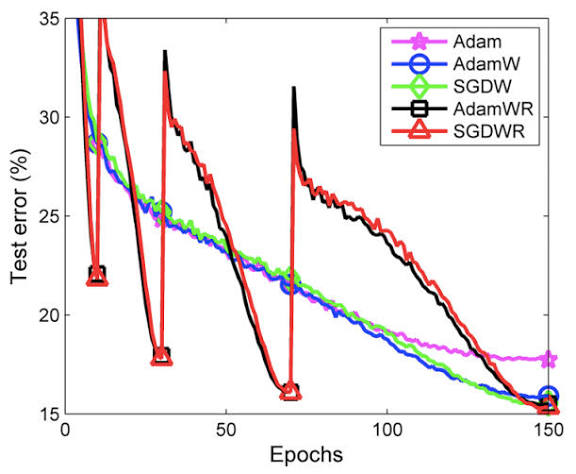

# [머신러닝] 규제
> 이번에는 규제에 대해서 글을 작성해보겠습니다.

이번에 $\operatorname{AdamW}$를  알아보던 중 $\operatorname{Weight\,decay}$ 또한 규제 방식이라는 점을 알고 규제가 그냥 레이어에서만 일어나는 것이 아니구나 하고 알게되어서 조금 더 알아보고자 글을 작성합니다.

## 규제가 무엇인가
규제의 의미는 다음과 같습니다.

> 모델이 학습 데이터에 지나치게 맞춰지는 것을 막고, 더 일반화 되는 해를 선택하도록 학습에 제약이나 편향을 주는 모든 방법

여기에서 제가 이전에 알던 규제는 $L1$, $L2$ 규제를 말했습니다.

이는 모두 손실함수에 규제식을 추가하여 구현하는 방식입니다. ($L1$은 릿지(절대평균), $L2$는 라쏘(제곱 평균)을 말합니다.)

여기에서 $L2$ 규제가 보통 미분에 쉬운 형태를 제공하기 상대적으로 많이 사용됩니다.

$$
L_{1.Lasso} = L(w) + \lambda \sum_i {w_i^2}
$$

$$
L_{2.Ridge} = L(w) + \lambda \sum_i |w|
$$

이를 통해 특정 가중치에 대해서 미분을 할 시에 그 가중치의 크기만큼 추가로 학습률을 가해주는 규제 방식을 말합니다.

릿지 미분:

$$
\frac{d}{dw_i} L_{2.Rigge} = \frac{d}{dw_i} L(w) + 2 \lambda w_i
$$

SGD 최적화 학습률 적용

$$
w_i = w_i - \eta \frac{\partial L_{2.Ridge}}{\partial w_i}
$$

의 형태를 가지게 됩니다.

바로 이어서 **Weight decay**를 알아보겠습니다.

## Weight decay
위 수식에서 $L_{2.Ridge}$를 따로 설명하지 않고 $L$이라고 하며 $w_i$ 또한 $w$로 표현하겠습니다.

이때 최적화 수식은 다음과 같이 만들어지게 됩니다. (SGD)

$$
w = w - \eta \frac{\partial L}{\partial w}
$$

이렇게 되면 특정 $\operatorname{batch}$ 의 $Loss$가 매우 크거나 매우 작을 경우에 가중치가 지나치게 흔들릴 수 있습니다.

이는 $Adam$과 $AdamW$를 사용할 때의 $Loss$ 를 확인하여 더 직관적으로 확인할 수 있습니다.

<!--  -->

### Adam
Adam은 이전에도 포스팅으로 다루었지만 `Adaptive Moment Estimation`의 약자입니다.

Adam의 수식은 다음과 같습니다. ($\beta$=기억 비율($\beta_1$은 보통 `0.9`, $\beta_2$는 보통 `0.99`), $g$=기울기, `모멘텀`=`관성에 가까운 아이디어`)

방향 누적 - 1차 모멘텀:

$$
m_t = \beta_1 m_{t-1} + (1-\beta_1)g_t
$$

크기 누적 - 2차 모멘텀:

$$
v_t = \beta_2 v_{t-1} + (1-\beta_2)g^2_t
$$

Bias correction - 초기 값 보정 (초기값은 `0`인 문제 해결):

$$
\hat{m_t} = \frac{m_t}{1-\beta^t_1}
$$

$$
\hat{v_t} = \frac{v_t}{1-\beta^t_2}
$$

> 위 `Bias correction`을 이용하여 $t$가 커질수록 분모가 1에 근접하여 보정을 없애주게 됩니다.

실제 파라미터 업데이트:
